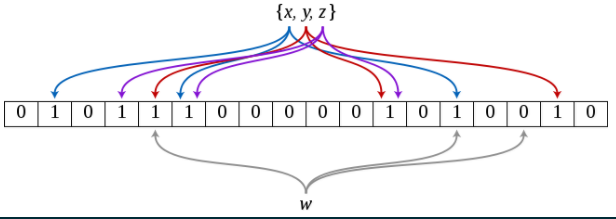
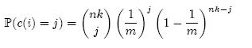
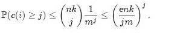
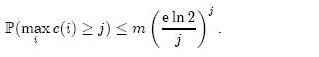
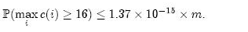

<style>
img {
    width: 680px;
    padding-bottom: 1rem;
}
</style>

布隆过滤器在很多场景中都有应用，如根据发件人过滤垃圾邮件、避免已浏览视频的重复推荐、避免分布式缓存中不存在key的访问穿透，等等，布隆过滤器发挥了非常大的作用，布隆过滤器其实也存在很多的变体。本文就来结合作者业务中遇到的问题、布隆过滤器的应用来详细了解下布隆过滤器的原理及应用。

# 布隆过滤器

描述布隆过滤器之前，首先描述下背景，经常遇到“**快速查询、插入**”等操作的场景，这个时候第一时间想到的可能是set、map数据结构，因为它的时间复杂度为O(1)，是首选的数据结构。但是当**要记录的数据量非常大时，set、map可能并不是一种合适的选择**。

假如我们有一个短视频推荐的场景，用户每次拉取短视频列表时都只返回用户没有看过的短视频，短视频通过短视频id（uint32）唯一标识，假如我们用map来存储，一个短视频id就需要4字节，假如一个用户一天可以观看50个短视频，1个月就是1500个，1年就是18000个，这样一个用户1年就需要占用存储72KB，假如我们有100w用户，那就是72GB，这些信息是要放在内存里面进行计算的，什么样的机型才可以拥有72GB大小的内存啊？要尽量做到“低成本、高性能”的方案设计，这种选型是有问题的。

布隆过滤器（bloom filter），其实就是一种折中的设计方案。内存是按字节寻址，但是1个字节是8位，存储1个短视频id，比如值1，1bit就可以表示的情况下却需要多占用31个bit，岂不是极大的浪费？**布隆过滤器的底层存储其实也就是一段连续的内存空间，所有的查询、插入操作都转换成对bit的查询、写入操作。比如要写入一个短视频id，将通过多轮hash(短视频id)计算出多个bit offset，如b1~b8，然后存储操作就转换为将b1~b8全部设置为1，查询操作就转换为查询b1~b8是否全部为1**。



**布隆过滤器，以接近O(1)的性能进行查询、插入操作，但是由于hash碰撞的存在，会引入一定的误差率**。存在这样的问题，本来短视频id NNN没有存储，但是却由于多轮hash(NNN)得到的b1~b8与其他某个短视频id MMM计算得到的b1~b8完全相同，更可能由于之前存储多个短视频id A、B、C、D时将b1~b8设置为1，此时就会导致判断NNN已存储。这种情况就引入了“误差率”的概念。

**误差率**：
布隆过滤器现在要存储N个元素，存储指定元素e时，先进行多轮hash计算得到b1~bn，然后依次检查offset为b1~bn的bit位是否已经设置为1，如果全部为1则表示布隆过滤器中已存储该元素。当不全为1时认为没有存储过元素e，将b1~bn设置为1。
由于写入操作时，我们总是遵循test、set的方式，所以当我们逐次将N个元素写入布隆过滤器时，假如test时发现元素已存储，这种情况下一定是由于hash碰撞引起，引入了误差。
**所以如果要求写入N个元素却只成功写入了M个元素（M<=N），误差率=(N-M)/N**。

**优缺点**：
优点：速度快，又节省存储空间。
缺点：存在一定的误差 && 不支持删除操作。

如果应用场景允许一定的判定误差，例如短视频推荐场景、信息流推荐场景等，那么布隆过滤器也不失为一种合适的选择。**刚才提到set、map占用内存空间大，那么布隆过滤能占用多少呢，这里就涉及到误差率和存储成本之间的权衡了**。

# 误差率 & 存储空间

误差率，一般是根据应用场景或者产品体验、产品表现来指定的，如用布隆过滤器记录用户观看过的短视频id误差率不超过1/1000。

其实指定了误差率之后，一般也就可以确定存储1个这样的短视频id所需要的大致bit数量了，简称bpe（bits per element），`double bpe = - (log(error) / (ln(2)^2))`，但是到底需要多少bit数量（bpe是浮点型），还需要进一步确定，`int hashes = (int)ceil(ln(2) * bpe)`，这表名要计算得到hashes个hash值，然后用这个值对布隆过滤器内存空间bits数量取模，从而得到hashes个bit offset。

```c
double denom = 0.480453013918201;                 // ln(2)^2
double bpe = -(log(error) / denom);
int hashes = (int)ceil(0.693147180559945 * bpe);  // ln(2)
```

假如希望存储entries个元素的话，在满足上述误差率的情况下，布隆过滤器需要分配内存空间为`int bits = (int)(bpe * entries)`。

```c
int bits = (int)(bpe * entries)
```

# murmurhash算法

前面描述了在预期误差率的情况下，存储一个元素所需要的平均存储空间是多少bpe，以及实际存储时需要设置的bits数量，也就是需要计算的hash轮数。现在描述下hash算法，murmurhash是现在比较常用的一种hash算法，不少开源的布隆过滤器实现都是采用了murmurhash算法来实现。

murmurhash算法的名字来源于它的两个重要操作MU（multiply）以及R（Rotate），它在设计上并不是为了密码学上增加单向加密的难度，所以它不适用于安全领域。如果是向做一个快速的hash且希望hash碰撞满足预设指标的话，murmurhash是一个不错的hash算法。

详细信息可以参考wikipedia，点击查看 [MurmurHash算法](https://en.wikipedia.org/wiki/MurmurHash)。

# 多分区布隆过滤器

上述描述了一个布隆过滤器的大致原理、如何确定误差率以及bpe和hash轮数、依赖的hash算法等，在实际应用中，我们可能会遇到更多的问题。

仍以短视频推荐场景为例，假定我们设计容量是为每个用户记录最近访问过的2000个短视频，假定需要的存储空间是m，随着时间的推移，布隆过滤器中的bit=1的bits越来越多，我们不能将所有的bits写的过多，更不能写满，以为会导致误差率急剧升高，甚至超过预设的误差率。

那么写多少bits算是合理的呢？这个可以通过实测进行计算，看看写了多少bits后误差率升高到预设值，当布隆过滤器所有bits的1/2都是1时可以看做是“写满”的标识。这个时候该如何操作呢？

1）一种方式是清空布隆过滤器（全部设为0），但是会导致用户最近看过的短视频被重复拉取到，会直接影响用户体验。

2）另一种思路是，布隆过滤器内部存储由一块固定内存修改为可动态增加的多块分区（slice）形式，当一个slice写满，创建一个新的slice用来执行写入操作，查询操作在新、旧slice同时查询，任一个slice命中则认为命中。等新的slice也写满时清空旧的，继续用来写入，也可以继续创建新的slice。这种带来了查询操作耗时稍微增加，存储占用有所增加，但是可以避免对用户体验造成影响，对于推荐这种要求保证用户体验的场景，特别是保证不重复观看同一个内容，这种思路也是可取的。

3）还需要考虑的一个问题是，产品策略是随时会进行调整的，当产品希望进一步降低误差率时，该如何操作呢？可以创建一个新的布隆过滤器实例来适配错误率调整，并增加一个过渡期，在这个过渡期内，新旧两个布隆过滤器实例同时执行查询，新布隆过滤器负责写入，等过渡期结束之后，废弃旧的布隆过滤器，新的布隆过滤器单独工作。这样可以动态支持产品策略调整，不足是误差率在过渡期内可能会发生短暂波动。

在上述2）3）思路的基础上，在项目开发中我设计开发了一个bloom实例支持多分区的布隆过滤器，并提供了序列化、反序列化能力，是对普通布隆过滤器的一种改进型设计，感兴趣的可以参考，点击查看 [一种改进的布隆过滤器实现](https://github.com/hitzhangjie/bloomfilter)。

# 计数布隆过滤器

上述所描述的布隆过滤器是不支持删除操作的，但是某些情境下我们是有删除需求的（这里我们就不举例了），如果要增加删除的能力，还需要额外增加一些overhead。

考虑一下，**标准的布隆过滤器不能支持删除操作的原因，很简单，就是因为要clear的bits可能同时被多个元素所使用了，直接clear bits将影响到对其他已存储元素的判断逻辑**。那么又想删除当前元素，又不影响到共用该bits的其他元素，怎么办？

判断内存对象是否被使用经常通过引用计数的方式来解决，**布隆过滤器也可以借助引用计数的方式来标志某个bits是否是否被使用**。我们为每个bit位额外维护一个引用计数值，当该bit被set为1时，引用计数+1，当该bit被clear为0时，引用计数-1。这样就解决了直接clear该bit所带来的问题。

有一个非常重要的点，要回忆一下，我们数据结构选型不选用set、map是为了节省内存存储空间，现在我们却为每一个bit来额外分配了一个引用计数值，这里的值又要占用一定的存储空间。这不是又绕回以前了吗？

这里就要考虑下引用计数值占用bits数量的问题了，这里也可以引出另一种布隆过滤器变体了，`Counting Bloom Filter`，简称`CBF`。CBF将标准的布隆过滤器位数组的每一位扩展为一个小的计数器（Counter），在插入元素时给对应的k（k为哈希函数个数）个Counter的值分别加1，删除元素时给对应的k个Counter的值分别减1。Counting Bloom Filter通过多占用几倍的存储空间的代价，给Bloom Filter增加了删除操作。下一个问题自然就是，到底要多占用几倍呢？


我们先计算第i个Counter被增加j次的概率，其中n为集合元素个数，k为哈希函数个数，m为Counter个数（对应着原来位数组的大小）：



上面等式右端的表达式中，前一部分表示从nk次哈希中选择j次，中间部分表示j次哈希都选中了第i个Counter，后一部分表示其它nk – j次哈希都没有选中第i个Counter。因此，第i个Counter的值大于j的概率可以限定为：



上式第二步缩放中应用了估计阶乘的斯特林公式：


在Bloom Filter概念和原理一文中，我们提到过k的最优值为(ln2)m/n，现在我们限制k ≤ (ln2)m/n，就可以得到如下结论：



如果每个Counter分配4位，那么当Counter的值达到16时就会溢出。这个概率为：



这个值足够小，因此对于大多数应用程序来说，4位就足够了。

# 其他布隆过滤器变体

由于现实应用场景多样，布隆过滤器变体也非常多。维基百科中列出了很多布隆过滤器变体，例如：

- Cache Filtering
- Avoiding False Positives in a Finite Universe
- Counting filters
- Decentralized aggregation
- Data synchronization
- Bloomier filters
- Compact approximators
- Stable Bloom filters
- Scalable Bloom filters
- Spatial Bloom filters
- Layered Bloom filters
- Attenuated Bloom filters
- Chemical structure searching

感兴趣的可以参考维基百科中的相关描述，这里权做抛砖引玉了，点击查看 [布隆过滤器](https://en.wikipedia.org/wiki/Bloom_filter)。

# 布隆过滤器设计实现

作者在工作过程中，写过一个C++版本的分段式的布隆过滤器，支持指定误差率来推算容量，并能支持后期的扩容需求，感兴趣请点击[hitzhangjie/bloomfilter](https://github.com/hitzhangjie/bloomfilter)。