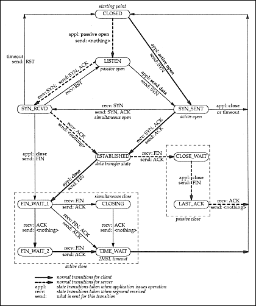

# 问题背景

**tcp client: write to a half-closed tcp connection!**

这里探讨一下这个问题，Write to a closed tcp connection的问题。在深入讨论这些问题之前，首先要了解tcp state diagram，为此文末特地附上了经典的tcp状态转换图。

我们的场景是这样的，tcp server已经启动，然后tcp client主动建立连接请求，连接成功建立后，tcp client并不立即发送数据而是等待一段时间之后才会发送数据（这种在client端的tcp连接池中非常常见），tcp server端为了防止连接被滥用，会每隔30s钟检查一下tcp连接是否空闲，如果两次检查都发现tcp连接空闲则主动将连接关闭。

# 原因分析

此时tcp server端会调用`conn.Close()`方法，该方法最终会导致传输层发送tcp FIN包给对端，tcp client这边的机器收到FIN包后会回一个ACK，然后呢？tcp client不会继续发FIN包给tcp server吗？不会！仅此而已。问题就是这么诞生的，什么问题呢，tcp client仍然可以发包，但是`n, err := tcpconn.Write(...)`这个时候并不会检测到`err != nil`，只有等到`n, err := tcpconn.Read(...)`的时候才会发现err为io.EOF，这个时候才能判断得知tcp server已经把连接销毁了。

从RPC框架角度而言，希望为client维护的tcp连接池是高效可用的，所以想对上述情况下的客户端连接进行检测，避免连接池中存在上述被tcp server关闭的连接。

再简单总结下tcp server、tcp client两端的不同处理逻辑：

- 从tcp server的视角来看，

  tcp server调用的conn.Close()，对应的是系统调用close，tcp server端认为它已经彻底关闭这个连接了！

- 从tcp client的视角来看，

  这个连接是我主动建立的，我还没有给你发送FIN包发起关闭序列呢，因此这个连接仍然是可以使用的。tcp client认为tcp server只是关闭了写端，没有关闭读端，因此tcp client仍然是可写的，并且socket被设置成了nonblocking，conn.Write()仍然是成功返回的，返回的err == nil。但是当真正传输层执行数据发送的时候，tcp server端认为这个连接已销毁，因此会返回RST！这个时候上层go代码因为已经返回已经感知不到写的时候存在错误，这个RST会将tcp client端的socket标记为已关闭。下次tcpconn.Read的时候就能感知到io.EOF错误了，如果再发起一次tcpconn.Write也可以立即返回错误。

# 关于close与shutdown

假如tcp server调用的不是conn.Close()，而是conn.CloseWrite()，这个对应的系统调用shutdown(SHUT_WR)，那只表示写端关闭，这个时候tcp client发送数据过去，tcp server端返回的就不是RST了，而是正常的ACK，因为tcp server端也认为这个连接只是关闭了写端。

本质上来说，内核在处理系统调用close、shutdown的时候对套接字的处理是有差异的，close的时候对fd引用计数减1，如果引用计数为0了，那么就直接销毁套接字，认为对应的连接不再有效了（所以收到tcp client发来的数据会回RST）。但是shutdown(SHUT_WR)的时候，不会减引用计数，内核并不会直接销毁套接字，虽然也会发FIN包，但也只是认为这个连接是写端关闭、读端正常，所以还可以正常接收数据！

# RPC框架关心这个问题

问题出现：

对于上层应用程序来说，conn.Write()返回nil就认为是返回成功了，但是实际包并没有发送出去，所以后续等待接收响应的时候conn.Read()就会返回io.EOF错误显示对端连接已关闭。

假如满足下面几个条件，那么tcp client请求tcp server失败的概率就会很大了！

-   tcp client请求tcp server是通过连接池来实现的；
-   tcp client请求tcp server并不频繁的情况下；
-   tcp server又存在主动销毁空闲连接的时候；

如何避免这里的问题呢？在go里面tcp client中的连接池实现，可以定期地检查tcp连接是否有效，实现方法就是conn.Read()一下，如果返回的是io.EOF错误则表示连接已关闭，执行conn.Close()并重新获取连接即可。conn.Write()是不会返回这个io.EOF错误的，会想上面的场景来看，tcp client端现在还认为tcp连接是有效的呢，所以conn.Write()是肯定不会返回io.EOF错误的。

# go网络库为什么这么设计

这里再延伸一下，为什么go里面conn.Write()的时候不去检查一下连接是否已关闭呢？比如显示地conn.Read()一下？这要考虑tcp的设计宗旨了，tcp本身就是支持全双工模式的，tcp连接的任意一端都有权利关闭读端或者写端，所以从go api设计者的角度来看，conn.Write()就只是单纯地认为我这段tcpconn的写端未关闭即可！对端是否写关闭根本无需考虑，而从更通用的角度来考虑，有些服务端逻辑上可以只收请求不回响应。为了通用性，conn.Write()不可能去检查对端是否写关闭！

那从一个网络框架设计或者一个应用程序开发者角度来说呢？我们关心一个请求是否能拿到对应的响应！如果我们要避免这个问题，以c、c++为例，我们完全可以借助epoll_wait来轮询是否有EPOLLRDHUP事件就绪，有就认为连接关闭销毁就可以了，或者轮询EPOLLIN事件就绪接着read(fd, buf, 0)返回0==EOF就可以了。但是每次write之前都这样检查一下，还是很蛋疼的，要陷入多次系统调用，而且即便在epoll_wait返回之后、write之前这段时间内，仍然对端可能会发一个FIN包过来！所以说这样也并不能一劳永逸地解决问题！

# 如何更好地解决问题

**再回到问题的起点，其实我们不想关心这些网络细节，我们只想关心，我发送出去的请求是否得到了可靠的响应！**

失败重试！失败后重试一次、两次已经成为了大家写代码时候的常态，但是一个网络框架，是否应该减少这种负担？可能上面我们讨论的情形在线上环境中并不多见，但它确实是一个已知的问题！如果请求量比较大，连接不会因为空闲被关掉，那么这个问题出现的概率很少，但是假如请求量确实不大，这个问题就会凸显出来了。

## 连接池连接活性检测优化

为此我们想了一种改良的方法来检测是否出现了对端关闭连接的情况，思路是这样的，因为不方便再去poll类似的EPOLLIN、EPOLLRDHUP事件，这里再从连接池获取空闲连接时，借助系统调用`n, err := syscall.Read(fd, buf)`直接去非阻塞读一下，如果返回err == nil 并且  n==0，那么就可以判定对端连接写关闭（refer to poll/fd_unix.go:145~180, fd.eofError(n, err)）。

```go
func (nci *NConnItem) readClosed(conn net.Conn) bool {

	var (
		readClosed bool
		rawConn    syscall.RawConn
		err        error
	)

	f := func(fd uintptr) bool {
		one := []byte{0}
		n, e := syscall.Read(int(fd), one)

		if e != nil && e != syscall.EAGAIN {
			// connection broken, close it
			readClosed = true
		}
		if e == nil && n == 0 {
			// peer half-close connection, refer to poll/fd_unix.go:145~180, fd.eofError(n, err)
			readClosed = true
		}
		// only detect whether peer half-close connection, don't block to wait read-ready.
		return true
	}

	switch conn.(type) {
	case *net.TCPConn:
		tcpconn, _ := conn.(*net.TCPConn)
		rawConn, err = tcpconn.SyscallConn()
	case *net.UnixConn:
		unixconn, _ := conn.(*net.UnixConn)
		rawConn, err = unixconn.SyscallConn()
	default:
		return false
	}

	err = rawConn.Read(f)
	if err != nil {
		return true
	}

	if readClosed {
		return true
	}

	return false
}
```

如果我们利用tcp全双工能力，实现client、server的全双工通信模式，一边发送多个请求、一边接收多个响应，假如接收响应的时候发现io.EOF，那么后续的发送直接返回失败就行了。但是假如网络抖动的情况下，这种全双工通信模式容易出现失败激增的毛刺。

这种情境下，貌似UDP会是更好的选择，当然也要考虑服务端是否支持UDP。

# 在RPC级别支持重试对冲

还有一种更优雅的做法，在RPC框架设计上支持interceptor扩展，包括前置interceptor、后置interceptor，比如grpc框架的interceptor是以递归的形式形成了一个链条，前面interceptor的完成驱动后一个执行，最后的interceptor驱动真正的RPC方法执行。

我们可以在interceptor层面上支持重试对冲，比如本文提及的失败重试，我们可以不用过度优化tcp连接池连接活性检测，而是将关注重点放在如何更好地解决失败后的重试上：

-   立即重试
-   重试次数
-   指数退避
-   etc

RPC方法中，在tcpconn.Write发送请求成功后，继续通过tcpconn.Read读取响应，此时读取到io.EOF则返回错误，此时驱动该RPC方法执行的重试interceptor会根据配置的重试策略进行重试，从而更优雅地解决这里write closed tcpconn的问题。

# 附录

**1 测试tcp server `close`空闲连接**

mac下测试方法：

- 服务端：nc -kl 5555 -w 2
- 客户端：go run client.go，client.go代码如附录3。

linux下测试方法：

- 服务端：nc -kl 5555 -i 2（与mac下参数不同，效果相同，都是2s后close连接）
- 客户端：go run client.go，client.go代码如附录3。

**2 测试tcp server `shutdown(SHUT_WR)`空闲连接**

服务端：go run server.go

**3 测试代码server.go+client.go**

file server.go

```go
package main

import (
	"fmt"
	"net"
	"os"
	"time"
)

func init() {
	log.SetFlags(log.LstdFlags | log.Lshortfile)
}

func main() {
	listener, err := net.Listen("tcp4", ":5555")
	if err != nil {
		fmt.Println(err)
		os.Exit(1)
	}

	for {
		conn, err := listener.Accept()
		if err != nil {
			fmt.Println(err)
			continue
		}

		go func() {

			go func() {
				time.Sleep(time.Second * time.Duration(2))
				tcpconn, ok := conn.(*net.TCPConn)
				if !ok {
					fmt.Println(err)
					return
				}
				tcpconn.CloseWrite()
			}()

			time.Sleep(time.Second * time.Duration(4))

			buf := make([]byte, 1024)
			n, err := conn.Read(buf)
			if err != nil {
				fmt.Println(err)
				return
			}

			fmt.Println("read bytes size:%v, data:%s", n, string(buf))
		}()
	}

}
```

file: client.go

```go
package main

import (
	"os"
	"net"
	"time"
)

func main() {
	strEcho := "Halo"
	servAddr := "localhost:5555"
	tcpAddr, err := net.ResolveTCPAddr("tcp", servAddr)
	if err != nil {
		println("ResolveTCPAddr failed:", err.Error())
		os.Exit(1)
	}

	println("connection established")
	conn, err := net.DialTCP("tcp", nil, tcpAddr)
	if err != nil {
		println("Dial failed:", err.Error())
		os.Exit(1)
	}
	
    // sleep until connection closed
	time.Sleep(3000 * time.Millisecond)

	// first write to half-closed connection
	time.Sleep(3000 * time.Millisecond)
	_, err = conn.Write([]byte(strEcho))
	if err != nil {
		println("Write to server failed:", err.Error())
		os.Exit(1)
	}
	println("writen to server = ", strEcho)

	// second write to half-closed connection
	time.Sleep(3000 * time.Millisecond)
	strEcho = "Halo2"
	_, err = conn.Write([]byte(strEcho))
	if err != nil {
		println("Write to server failed:", err.Error())
		os.Exit(1)
	}

	println("writen to server = ", strEcho)

	conn.Close()
}
```

**4 c++版的tcp client**

一个类似上述go版tcp client的c++版实现，看看要多少代码吧。

```c++
#include <stdio.h>
#include <stdlib.h>
#include <errno.h>
#include <string.h>
#include <netdb.h>
#include <sys/types.h>
#include <netinet/in.h>
#include <sys/un.h>
#include <sys/socket.h>
#include <sys/unistd.h>
#include <fcntl.h>
#include <signal.h>
#include <arpa/inet.h>
#include <string.h>
#include <sys/epoll.h>

#define MAX_EVENTS 1024

static int processClient();

int main(int argc, char *argv[])
{
    int fd;
    int ret;

    struct sockaddr_in addr = { 0 };
    struct in_addr x;
    inet_aton("127.0.0.1", &x);
    addr.sin_family = AF_INET;
    addr.sin_addr = x;
    addr.sin_port = htons(5555);

    int set = 30;
    int i = 0;
    int fdFlag = 0;

    int epollFd = epoll_create(MAX_EVENTS);
    if (epollFd == -1)
    {
        printf("epoll_create failed\n");
        return -1;
    }

    struct epoll_event ev;      // epollʼþ½ṹÌ 
    struct epoll_event events[MAX_EVENTS];  // ʼþ¼à¶ÓÐ 

    // connect to server
    fd = socket(AF_INET, SOCK_STREAM, 0);
    if (fd == -1)
    {
        printf("error:%s\n", strerror(errno));
        return -1;
    }
    // set timer is valid ?
    //setsockopt(fd, SOL_SOCKET, SO_KEEPALIVE, &set, sizeof(set));

    // set socket non block?
    if ((fdFlag = fcntl(fd, F_GETFL, 0)) < 0)
        printf("F_GETFL error");
    fdFlag |= O_NONBLOCK;

    if (fcntl(fd, F_SETFL, fdFlag) < 0)
        printf("F_SETFL error");

    //  connect to server
    ret = connect(fd, (struct sockaddr *)&addr, sizeof(addr));
    if (ret == -1)
    {
        if (errno == EINPROGRESS)
        {
            printf(" connect error:%s\n", strerror(errno));
            //return -1;
        }
        else
        {
            printf(" connect error:%s\n", strerror(errno));
            return -1;
        }
    }

    // epoll watch socket EPOLLOUT
    ev.events = EPOLLOUT;
    ev.data.fd = fd;
    if (epoll_ctl(epollFd, EPOLL_CTL_ADD, fd, &ev) == -1)
    {
        printf("epoll_ctl:server_sockfd register failed");
        return -1;
    }

    int nfds;

    // check whether tcpconn established, howto? write-ready!
    while (1) {
        nfds = epoll_wait(epollFd, events, MAX_EVENTS, -1);
        if (nfds == -1) {
            printf("start epoll_wait failed");
            return -1;
        }
        if (nfds == 0) {
            continue;
        }
        if (events[0].events & EPOLLOUT) {
            printf(" connection is established\n");
            break;
        }
    }
    
    // sleep 3 seconds, before wakeup let the server close connection!
    // run `nc -kl 5555 -w 1` to start a tcp server.
    sleep(3);

    char sendbuf[512] = { 0 };
    char recvbuf[5120] = { 0 };
    int count = 0;

    // check whether epoll_wait can detect half-open tcpconn
    ev.events = EPOLLIN | EPOLLET | EPOLLRDHUP;
    ev.data.fd = fd;
    if (epoll_ctl(epollFd, EPOLL_CTL_MOD, fd, &ev) == -1)
    {
        printf("epoll_ctl:server_sockfd register failed\n");
        return -1;
    }
    while (1) {
        nfds = epoll_wait(epollFd, events, MAX_EVENTS, -1);
        if (nfds == -1) {
            printf("start epoll_wait failed\n");
            return -1;
        }
        if (nfds == 0) {
            printf("epoll_wait: no events ready\n");
            continue;
        }
        int i = 0;
        for (i=0; i<nfds; i++) {
            /*
            if (events[i].events & EPOLLRDHUP) {
                printf(" epoll_wait: EPOLLRDHUP, peer close connection\n");
                close(events[i].data.fd);
                return -1;
            }
            */
            if (events[i].events & EPOLLIN) {
                printf(" epoll_wait: read-ready\n");
    
                memset(recvbuf, 0, sizeof(recvbuf));
                count = recv(events[i].data.fd, recvbuf, sizeof(recvbuf), 0);
                printf("read bytes size:%d, data:%s\n", count, recvbuf);
                if (count == -1)
                {
                    /* If errno == EAGAIN, that means we have read all data.
                       So go back to the main loop. */
                    if (errno != EAGAIN)
                    {
                        printf("read error\n");
                        close(events[i].data.fd);
                        return -1;
                    }
                }
                else if (count == 0)
                {
                    /* End of file. The remote has closed the connection. */
                    close(events[i].data.fd);
                    printf("tcpconn is closed by peer\n");
                    return -1;
                }
            }
        }
    }


    // when write-ready, send data to server
    // when read-ready, read data from server
    int token_length = 5;
    char *token_str = "12345";
    char *ch = "yumgkevin";
    char socketId[10] = { 0 };

    while (1)
    {
        nfds = epoll_wait(epollFd, events, MAX_EVENTS, -1);
        if (nfds == -1)
        {
            printf("start epoll_wait failed");
            return -1;
        }

        for (i = 0; i < nfds; i++)
        {
            /* 
               if ((events[i].events & EPOLLERR) || (events[i].events &
               EPOLLHUP) || (!(events[i].events & EPOLLIN)) ||
               (!(events[i].events & EPOLLOUT)) ) { printf("enter 1");
               fprintf (stderr, "epoll error\n"); close (events[i].data.fd);
               continue; } */
            if (events[i].events & EPOLLOUT)
            {
                printf("write-ready, send data to server\n");
                memset(sendbuf, 0, sizeof(sendbuf));
                memset(socketId, 0, sizeof(socketId));

                strcpy(sendbuf, token_str);
                strcat(sendbuf, "hellow, world");
                strcat(sendbuf, ch);
                sprintf(socketId, "%d", events[i].data.fd);
                strcat(sendbuf, socketId);
                strcat(sendbuf, "\r\n");

                ret = send(events[i].data.fd, sendbuf, strlen(sendbuf), 0);
                if (ret == -1)
                {
                    if (errno != EAGAIN)
                    {
                        printf("error:%s\n", strerror(errno));
                        close(events[i].data.fd);
                    }
                    continue;
                }
                printf("send buf content is %s, size is %d\n", sendbuf, ret);
                // add revelant socket read event
                ev.data.fd = events[i].data.fd;
                ev.events = EPOLLIN | EPOLLET;
                epoll_ctl(epollFd, EPOLL_CTL_MOD, events[i].data.fd, &ev);
            }
            else if (events[i].events & EPOLLIN)
            {
                printf("read-ready, read data from server\n");
                count = 0;
                memset(recvbuf, 0, sizeof(recvbuf));
                count = recv(events[i].data.fd, recvbuf, sizeof(recvbuf), 0);
                if (count == -1)
                {
                    /* If errno == EAGAIN, that means we have read all data.
                       So go back to the main loop. */
                    if (errno != EAGAIN)
                    {
                        printf("read error\n");
                        close(events[i].data.fd);
                    }
                    continue;
                }
                else if (count == 0)
                {
                    /* End of file. The remote has closed the connection. */
                    close(events[i].data.fd);
                    continue;
                }
                printf("receive data is:%s", recvbuf);
                // add revelant socket write event
                ev.data.fd = events[i].data.fd;
                ev.events = EPOLLOUT;
                epoll_ctl(epollFd, EPOLL_CTL_MOD, events[i].data.fd, &ev);
            }
        }
    }

    // close socket
    close(fd);

    return 0;
}
```

**5 tcp状态转换图**
