这阵子上班在同事之间走动比较多，发现基本上已经人手一台mac，但是对系统的配置、使用却大不同。也有新同学估计是windows转过来的，适应起来也有困难。听物资管理的同事提起过，有同学因为不习惯mac重新换机器的也不少。


前几天生日，买了台新设备送自己（原本打算买Aprilia 150，先放放），恰好生日前一天到。刚好也在做一些配置的事，就把过程中觉得比较有分享价值的整理分享下。

回想起16年参加工作刚领工资那个月，兴冲冲地买了mbp，端端正正的16:10屏幕，细腻的分辨率，舒服的键盘，人性化的键盘灯，灵敏的触控板……哇，硬件完美，这就是我想要的工具。试用了一天之后，发现很难适应。狂吐槽，经常拿它和Linux桌面做对比，过了一段时间的调教，发现还是可以的。


自己老设备也没使用time machine来做快照，没那么大硬盘分区了，而且有很多垃圾，还是干干净净从头来一遍吧，也把过程中值得分享的记录下（尽量做到合适的归类）。


**1 Spotlight**

以前，搜索引擎是大家了解信息的主要入口，搜索、热门词条等，spotlight是一个类似的东西，它提供了一个入口让用户可以快速触达待访问的内容，可能是启动一个应用程序，进入一个文件路径，打开一个文件，翻译一个单词，进行一段科学计算，执行一个工作流，全文搜索，OCR搜索你的网页批注……网络搜索……


听起来很美好是吧，这个玩意也不是什么新鲜的东西，在Windows、Linux上都有类似的工具，比如KDE上按键F2 进入搜索基本上是同样的效果，Unity、GNOME上都有类似的，特别是XBuntu上对spotlight进行了高度“抄袭”。

调整原因：默认command+space是启动spotlight，与输入法切换冲突

调整推荐：快捷键调整成 command+/，这个组合键简单，又避免冲突

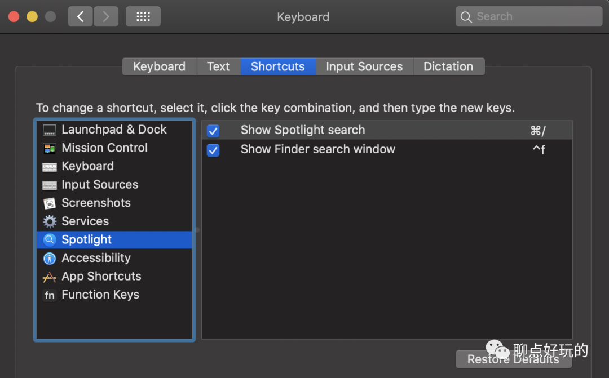


**2 Launchpad**

Launchpad有点类似于windows下的开始菜单，这里可以搜索安装的应用程序，和windows相比一个好点的地方是，可以对应用进行分组，现在Android、iOS都支持，大家应该不陌生，好处就是避免了冗长的程序列表，定位也更快。


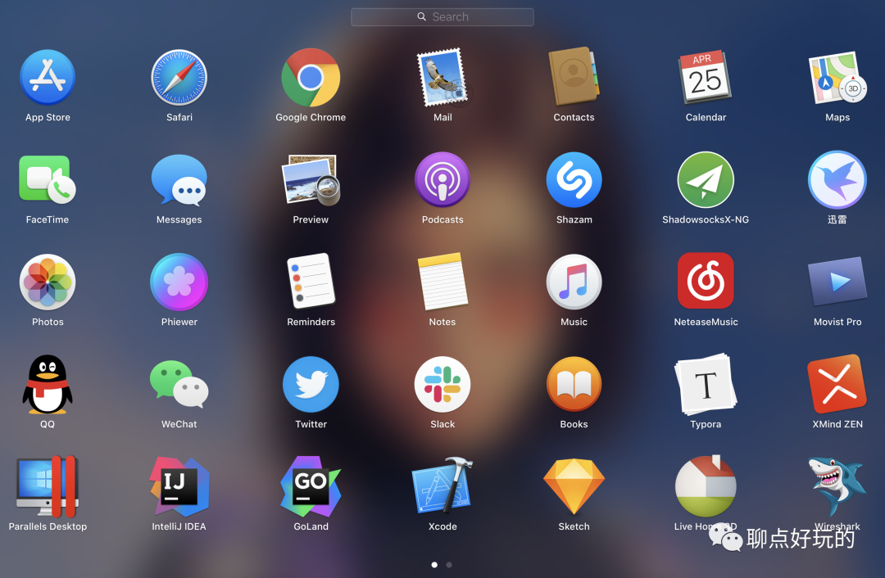

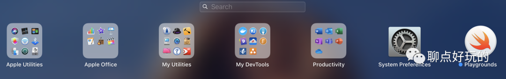

因为有了Spotlight、Alfred（下面会提到），Launchpad并不算是一个高频操作，所以我把Option按键用来分配组合键，Option+W。

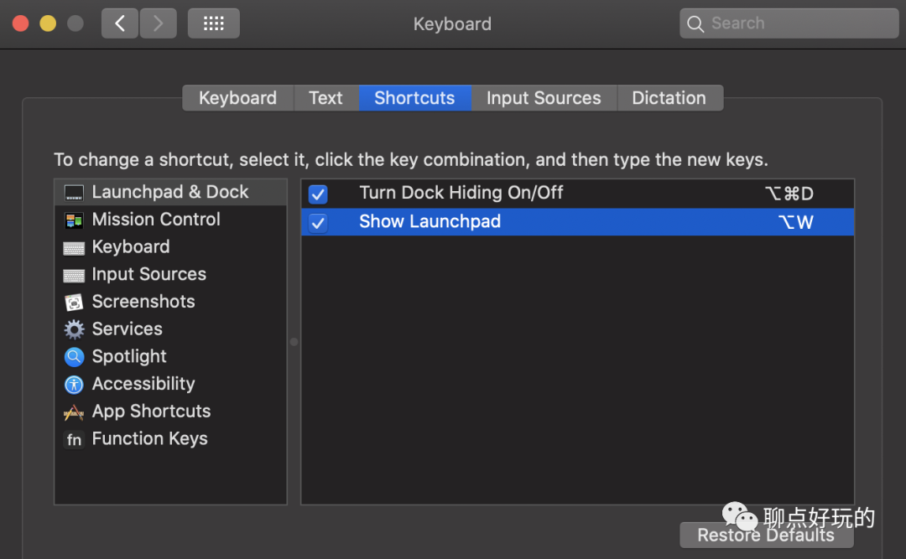

另外，Launchpad偶尔会抽风，将应用顺序、组合全部搞的错乱，这个也不用怕，安装Launchpad Manager来管理Launchpad布局，并将最新布局导出到icloud进行备份，如果哪天抽风了，拿出来恢复一下就可以。CleanMyMac扫描大文件的时候偶尔会干掉Launchpad对应的数据文件，从CleanMyMac的搜索路径里屏蔽掉就可以了。


**3. Desktops**

现代的桌面操作系统都支持多任务，一边听着音乐，一边写着文档等等，这是常有的事情，然而每个人理解的多任务可能不太一样。


可能有的用户真的没那么多任务要处理，也就是一边公放着音乐，一遍斗地主，诸如此类，那一个桌面可能就够了。但是，多任务也可能是下面这样的，甚至更多。如果真的只能通过Alt+Tab来切换简直是噩梦。

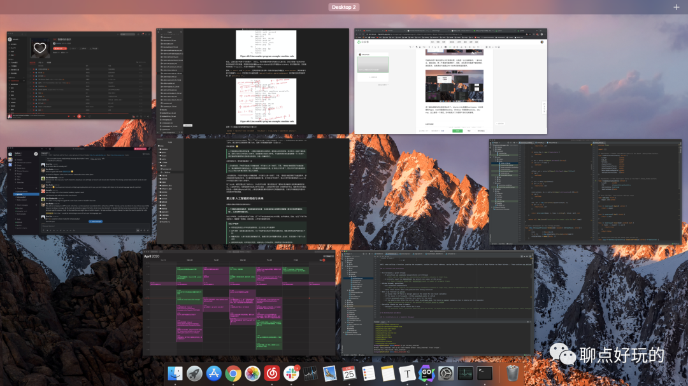

多个虚拟桌面的好处就体现出来了，Ubuntu Unity里面的workspace，KDE里面的Pages，macOS里面的Desktop，Windows 10里面的taskview，anyway，总之都是一个意思，无非就是为了方便用户进行任务管理。按照任务类别适当将任务组织到不同的Desktop，并按照就近原则将常用的任务放在切换时更快速访问到的Desktop，是个比较好的做法。

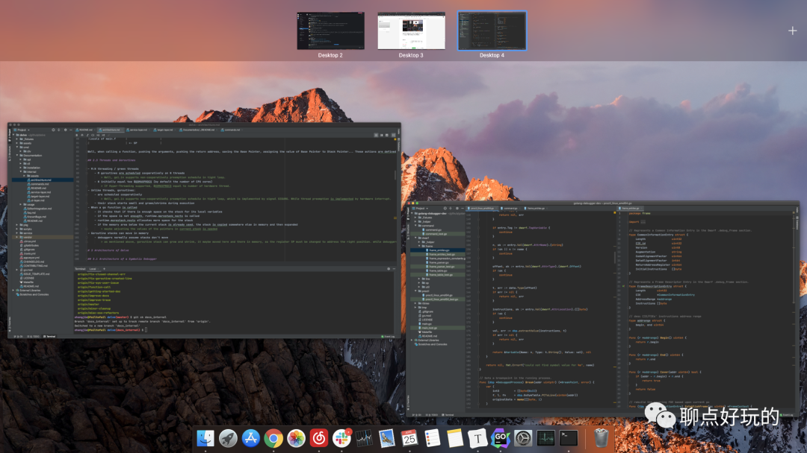

通过触控板可以方便地在上述虚拟Desktop间进行切换，也可以将窗口移动到其他的Desktop。说到这里就不得不提触控板、窗口拖动、快捷键的设置，嗯，这里先只讲快捷键设置吧。

快捷键快速切换Desktop，默认改成了Ctrl+Command+ Left Arrow，其实用触控板也可以，至于为什么想用快捷键？可能电脑大小比例不符合人体工程学，经常性地触控板左右滑动之后，会感觉手腕很累……所以键盘、触控板交替着用，会舒服一点。


如果左右切换都嫌累，嫌麻烦，拖拽窗口到其他Desktop就更麻烦了，比如有的时候你在Desktop1打开了一个编辑器，但是你后面意识到它应该移动到其他Desktop2中去（KDE里面有种更好的管理方式叫Activity），那你就得手动移动过去，问题是如果Desktop2中窗口比较多，你移动过去发现，唉，移动错了，应该移动到Desktop3中去，然后你又开始拖动……

效率是什么，效率就是短小精悍，让响应跟上思维的速度，这种看似不起眼的事情，我是不愿意让它悄悄消耗掉自己的时间。如果支持快捷键快速将一个窗口移动到另一个Desktop会方便一点，因为快捷键可以连续触发，而不用再次拖拽来个位移。KDE里面pages管理，是有考虑到这些的，macOS里面没有，当然也可以做到，只不过嘛就要自己动手了。

Hammerspoon（下文会提到）是针对macOS提供的一个可扩展的工具，通过lua脚本封装了大多数的macOS系统编程接口，如果你想定制化一些操作，只要看着hammerspoon的文档写lua脚本就可以了，论一个开发者的好处。

写这么一段lua脚本，放置到~/.hammerspoon目录下，就支持快捷键Shift+Ctrl+Cmd+Arrow Keys来快速移动窗口了，至于为什么选择这个快捷键，习惯，KDE下面多年养成的习惯。

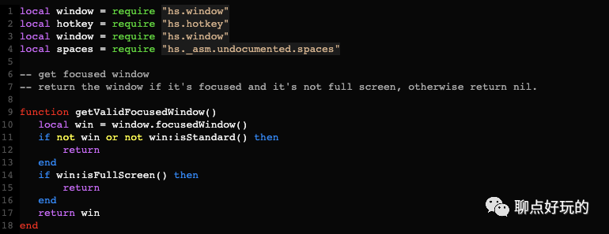


**4 Trackpad**

触控板还需要设置吗，要设置，适合自己的才是最好的。

Tap to click，点选这个勾上，这样就不用每次“按”一下才触发单击操作。


Scroll direction: Natural，这个滚动方向，现在虽然不用鼠标了，但是习惯养成了。比如浏览网页的时候，想从页面底部回到顶部，或者希望向上滚动，我想的是，把页面往下拽一下页面顶部的位置就展示在眼前了。这里的natural滚动方向我就很难适应，有相似的可以取消勾选。


我不想知道自己干什么的时候该用几根手指，我只想完成想干的事情。所以我几乎都设置成了四指操作，有的最多只有三指的，那就三指好了，反正四指也可以触发，去掉这些记忆负担。


使用触摸板拖动窗口，默认设置是先点按窗口标题栏，按住不放，再一只手将其拖动，这个操作很不方便，设置下可以直接三指窗口拖动。现实场景中，一般我是通过hammerspoon自定义脚本来完成的：最大化、最小化、居中、左半屏、右半屏等。但是，移动窗口的需求还是有的。


**5 Keyboard**

键盘设置，默认键盘设置，对经常需要文字编辑工作的朋友来讲不算友好，主要有几个方面我觉得要调整。


**中英文切换方面**

搜狗输入法用了很多年，也是国内厂商比较早支持Linux的全拼输入法，对其印象很好，而且支持个人词库同步，这么多年录入的词库也是愿意继续使用的主要原因，没有使用系统自带的拼音输入法。

搜狗输入法shift按键支持快速在中英文之间进行切换，这个想必大家都知道。作为一名开发者，快速在中英文之间进行切换是常有的事，但是切换输入法也要细分场景。

比如现在要准备写一大段代码了，那可能这段时间内全是英文比较好，那按shift切换成英文就不太合适，因为一不小心再按下shift可能会让我误输入中文；

再比如现在准备切成中文写几行注释，写完立即接着写代码，那可能按shift切换就比较合适；

再比如编辑期间涉及到窗口切换，比如去参考下文档、资料……然后回来接着继续刚才的工作，你会发现输入法中英文你已经不记得了，如何确保现在输入英文或中文；

这都是影响文字编辑效率的问题，我是这么解决的，也很简单：

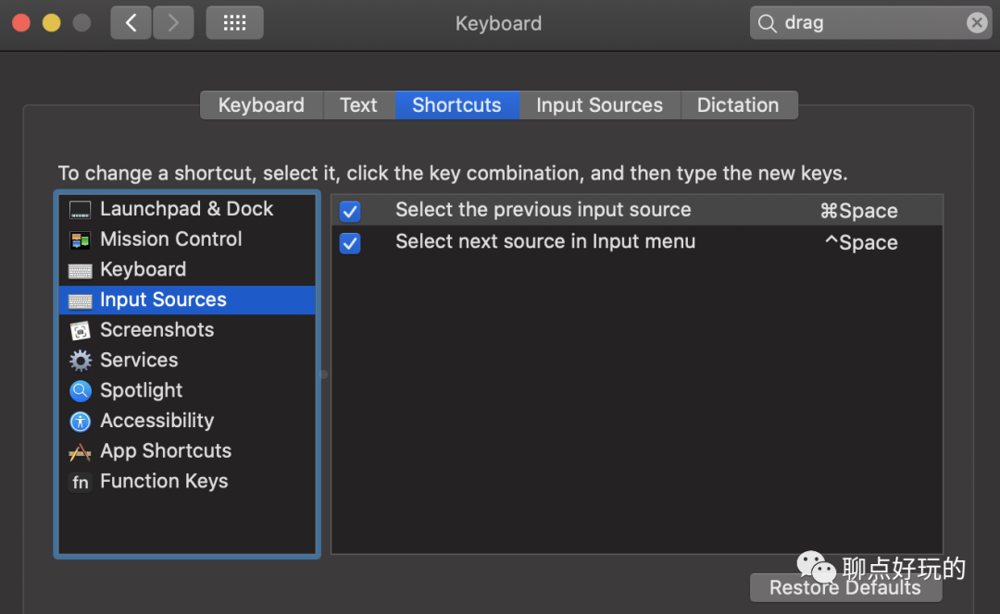

Command+Space执行切换时，总是会将搜狗切换到中文输入法，而Ctrl+Space不一定，还有另一个区别，前者进行输入法切换时，如果按键释放时间稍长，会提示当前正切换到的输入法名称。一举三得！

**文字输入速度方面**

影响文字输入的，不仅有实际的击键速度、准确率，还有这玩意。Key Repeat、Delay Until Repeat这两个选项一个是用于控制按键重复重发的速率，一个是用于控制按键初始延迟，默认值是考虑到用户误输入的情景，减小了前者，增大了后者。

不过，对有特殊需求的开发者、文字工作者，可能就没那么友好了，直接将Key Repeat调到最大，Delay Until Repeat调到最低。

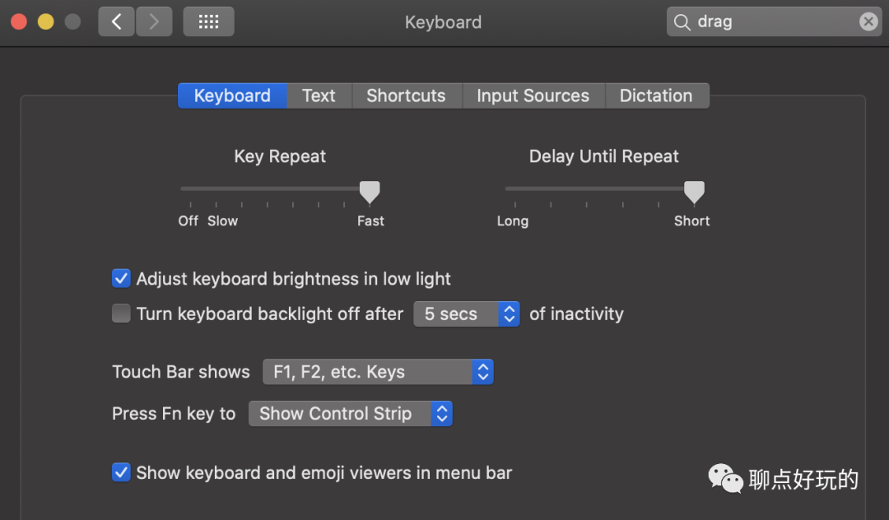

修改完成后，如果感觉还是不满意，那只能通过defaults命令来修改配置了，不对这里的设置进行优化，会让Vim党很抓狂，绝对暴躁的起来（想象下hjkl怎么玩）。

```bash
defaults write NSGlobalDomain KeyRepeat -int 3
defaults write NSGlobalDomain InitialKeyRepeat -int 12
defaults write -g ApplePressAndHoldEnabled -bool false
```


**快捷键方面**

新版的mbp都带了touchbar，touchbar有时候有用，有时候没用，对实际经常需要用到F1~F12快捷键的同学来说，touchbar还真有点没那么实用。所以touchbar上面默认显示F1, F2, etc. Keys。

截屏操作：算是个比较常用的快捷键吧，一个是截屏指定区域到剪贴板，一个是截屏指定区域保存到本地。


Finder搜索：Finder中搜索文件也是常见操作？不会吧，已经有spotlight了，但是打开Finder应该是个常见操作，但是macOS没有提供这样的快捷键，可以通过这里的Show Finder search window来代替下，快捷键保持了与windows一致，Ctrl+F。

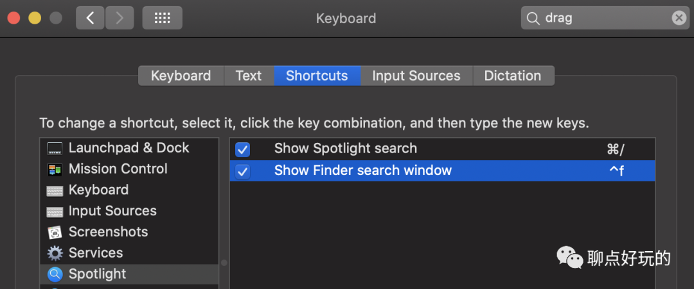

那如果真的只想快速打开Finder新窗口呢？比如Option+E打开Finder窗口，定位到home目录？一样可以通过hammerspoon lua脚本搞定。

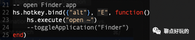

再或者，通过Ctrl+Cmd+T打开一个新的终端，也可以通过hs lua脚本搞定。

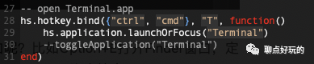

嗯，还有个不得不提的问题，那就是Command+H这个快捷键，macOS下默认是Hide Window，这个不行，我在IDE里面希望用这个快捷键来唤出API说明信息，你给我隐藏了不行。那怎么办，把这个Command+H快捷键重新映射，不让它执行系统默认的操作。一样的通过hs lua脚本来完成。


当用户按下Command+H这个动作的时候，实际上应用程序看到的是Command+M，一般Command+M应用程序没这个快捷键的话，也就没有任何动作，就屏蔽掉了“Hide Window”这个动作，如果你真的想通过Command+H来唤出API说明的话，那么只要将这个动作绑定到Command+M上就可以了。

此外，还有很多应用程序也需要定制快捷键，Chrome提供的默认快捷键真的是反人类，让我觉得要多长几只手才够用，4个按键分布在一只手的区域，怎么按过来，或者我的手指能多拐几个弯？哈哈，搞不了，必须改。

但是普通应用程序快捷键，可能会有很多，怎么同步呢？几十个肯定是有的！对照着老的机器全部设置一遍也不是不行，问题是不想这么机械地搞一遍呢。macOS里面要一个菜单名一个菜单名这样的录入，才能再绑定快捷键。并不是说只是重新换个快捷键组合就完事，所以这还是体力活。

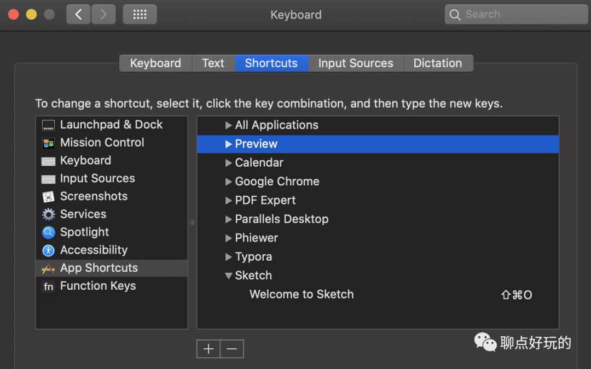

这里先在老机器上，通过defaults find命令找到用户所有的快捷键设置，比如：

```bash
defaults find NSUserKeyEquivalents

Found 1 keys in domain 'abnerworks.Typora': {
    NSUserKeyEquivalents =     {
        Articles = "\\Uf706";
        Code = "@k";
        "Code Fences" = "@^k";
        "File Tree" = "\\Uf704";
        "Focus Mode" = "@$f";
        "Full Screen" = "\\Uf70e";
        Outline = "\\Uf705";
        "Rename..." = "$\\Uf709";
        Search = "@^f";
        "Source Code Mode" = "@r";
        "Toggle Sidebar" = "\\Uf707";
        "Typewriter Mode" = "@$t";
    };
}
Found 1 keys in domain 'com.apple.Preview': {
    NSUserKeyEquivalents =     {
        Bookmarks = "@3";
        "Hide Markup Toolbar" = "@^m";
        "Hide Sidebar" = "@0";
        "Highlights and Notes" = "@2";
        "Show Markup Toolbar" = "@^m";
        "Show Sidebar" = "@0";
        "Table of Contents" = "@1";
    };
}
Found 1 keys in domain 'com.google.Chrome': {
    NSUserKeyEquivalents =     {
        "Always Show Bookmarks Bar" = "^$b";
        "Close Window" = "@w";
        "Developer Tools" = "\\Uf70f";
        Downloads = "^j";
        "Force Reload This Page" = "\\Uf708";
        "New Incognito Window" = "^i";
        "Open Location..." = "\\Uf709";
        Redo = "@y";
        "Reload This Page" = "@r";
        "Reopen Closed Tab" = "^$t";
        "Show Full History" = "^h";
    };
}
...
```

把这个导出来，写一个bash脚本，用defaults write命令来更新系统中应用的默认设置：

```bash

#!/bin/bash
defaults write Apple Global Domain NSUserKeyEquivalents ' {

        "Enter Full Screen" = "\\Uf70e";
        "Exit Full Screen" = "\\Uf70e";
        Hyperlink = "@l";
        Minimize = "~^\\U2193";
    
}'
defaults write com.apple.Preview NSUserKeyEquivalents ' {

        Bookmarks = "@3";
        "Hide Markup Toolbar" = "@^m";
        "Hide Sidebar" = "@0";
        "Highlights and Notes" = "@2";
        "Show Markup Toolbar" = "@^m";
        "Show Sidebar" = "@0";
        "Table of Contents" = "@1";
    
}'
defaults write com.google.Chrome NSUserKeyEquivalents ' {

        "Always Show Bookmarks Bar" = "^$b";
        "Close Window" = "@w";
        "Developer Tools" = "\\Uf70f";
        Downloads = "^j";
        "Force Reload This Page" = "\\Uf708";
        "New Incognito Window" = "^i";
        "Open Location..." = "\\Uf709";
        Redo = "@y";
        "Reload This Page" = "@r";
        "Reopen Closed Tab" = "^$t";
        "Show Full History" = "^h";
    
}'
defaults write abnerworks.Typora NSUserKeyEquivalents ' {

        Articles = "\\Uf706";
        Code = "@k";
        "Code Fences" = "@^k";
        "File Tree" = "\\Uf704";
        "Focus Mode" = "@$f";
        "Full Screen" = "\\Uf70e";
        Outline = "\\Uf705";
        "Rename..." = "$\\Uf709";
        Search = "@^f";
        "Source Code Mode" = "@r";
        "Toggle Sidebar" = "\\Uf707";
        "Typewriter Mode" = "@$t";
    
}'
...
killall cfprefsd
```

在新机器上，把bash脚本执行下就可以了，so easy! 下次如果有需要拿来重跑下就可以，应用程序快捷键设置很快就能搞定。

快捷键到这里就差不多了。


**6 效率工具**

**Hammerspoon**

Hammerspoon，前面不止一次提到了，它的强大自不必多言，看文档https://www.hammerspoon.org/docs/index.html，支持的操作涉及到了系统的方方面面，只要会看着文档拼积木就可以。我用它来实现复杂的键映射处理、窗口管理、桌面管理等定制的操作。

对普通用户没那么友好，但是一些难搞的问题，特别是个人的定制化，往往也要自己来搞了，用它撸几行代码就可以搞定。

**Alfred**

Alfred，是一个非常好的效率工具，可以说它和Spotlight有异曲同工之妙，我们前面先提了Spotlight的原因是，如果你认同Spotlight的价值，那么花时间去探索Alfred才有意义。

Alfred在Spotlight功能的基础上，提供了额外的定制能力，它能干什么呢？

**定制Web Search**

这样你就可以通过关键字快速打开（浏览器收藏夹是个好东西，但绝不是最好的东西），然后输入的关键字会被当做搜索参数传入，例如让google帮你搜索，当然也可以当做浏览器收藏夹来用。


**定制Workflow**

iOS上面的捷径，大家体验过没，大致上是一样的东西，macOS上本身是有Automation的，Alfred的好处就是提供了一个统一的管理、可视化配置、同步配置，而且还要比较好的用户生态，你可以搜索到他人贡献的workflow，也可以自己写。

比如下面gist是一个支持gist搜索、创建的workflow，当你想使用以前积累的代码snippet，或者创建新的备用的时候，非常方便。


再比如，这是一个强密码生成器，想靠人肉记住的密码都算不上什么强密码，安全的做法就是随机生成一个，连自己也不知道是什么，然后交给keychain来管理。

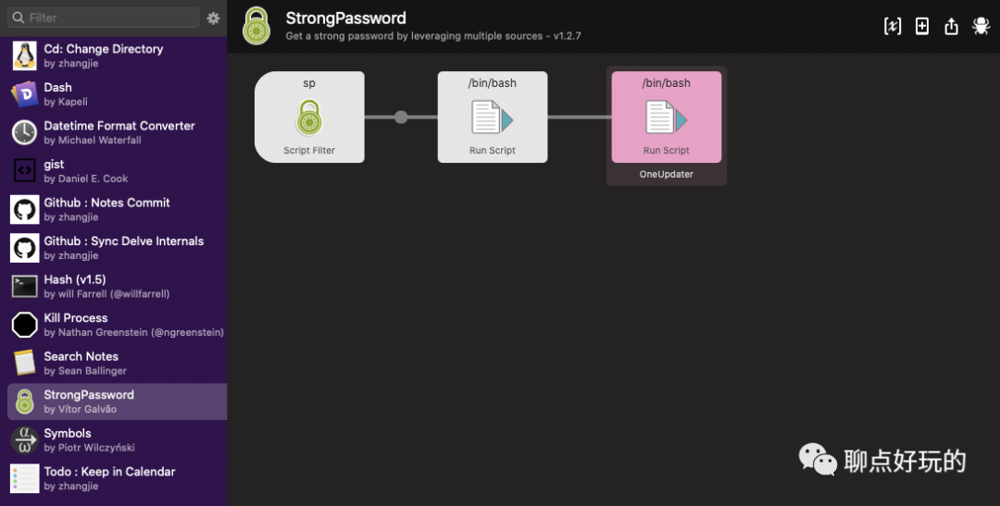

时间久了，这里的设置就会比较多，如果涉及到多台设备的话，如何同步也需要考虑。这里不建议使用icloud此类进行存储，因为一旦出现多台设备Alfred版本不一致，有可能因为无法正常解析配置而重建配置，到时候如果icloud同步了多台设备上的数据，就玩完了（遇到过一次）。

建议通过github等支持版本管理的第三方平台进行配置托管，我现在是通过github 仓库进行版本管理。


**7 浏览器**

浏览器你选哪款？iOS设备我选Safari，macOS我选Chrome，为啥，我当然想全部用Safari，移动端Safari体验比Chrome强太多，电脑上不行，没那么多extensions、apps来扩展浏览器功能，Chrome在桌面上很强大。

我的常用扩展列表，屏蔽广告、代理、油猴扩展脚本、vim党专属vimium。之前有个同学问我你的百度页面怎么没广告啊，因为被Adblock屏蔽了啊。油猴上脚本多的了不得，下载视频啊等等等。

我比较喜欢vimium，它让我可以用vim的操作方式来操作Chrome页面。比如：

x: 关闭当前标签页

yt: 创建新标签页

/: 开始页面内搜索

hjkl：页面内上下左右滚动

gg：回到页面顶部

f: 将页面中超链接全部高亮显示，并按字母编号，然后你可以通过编号触发链接，网页浏览的时候可以忘掉触摸板了

i：直接进入搜索框，tab在多个文本框之间切换

...


当然Chrome Web Store里面也有一些离线可以使用的Apps，想象一下ChromeBook能搞起来就知道Web Store里面应用有多丰富。

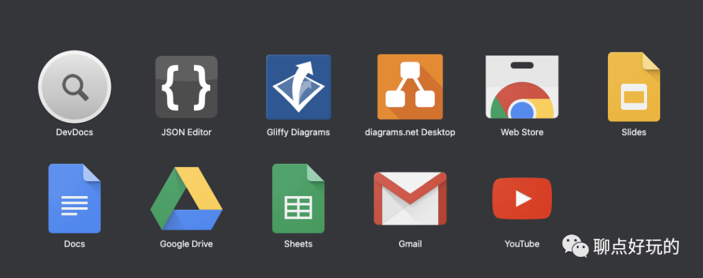

当然你也可以自己写插件、应用，以开发者模式离线加载使用，也可以发布到Web Store。比如我自己写了个插件分屏阅读代码。


上述一些配置优化方面的分享，对macOS的普通用户、高频用户、开发者等，应该都是通用的，这里分享一下，也欢迎大家分享自己的一些使用心得、技巧。

关于开发相关的一些特定配置，后面有时间了整理后再分享。