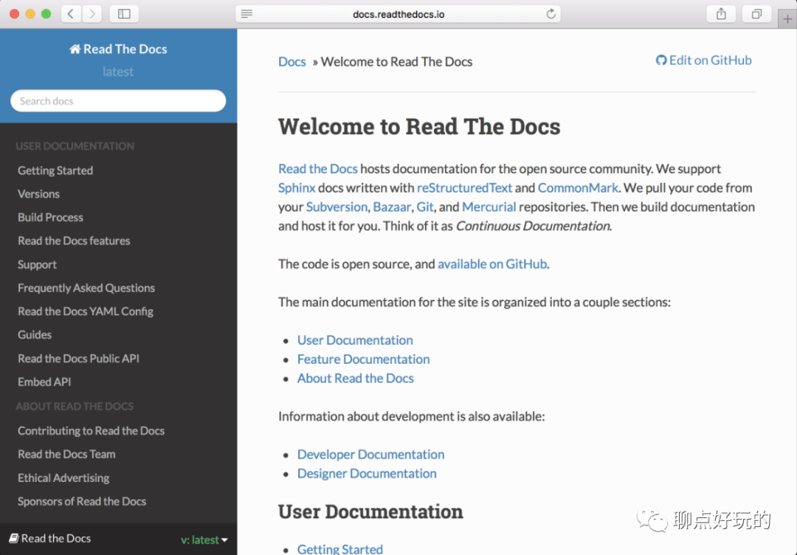
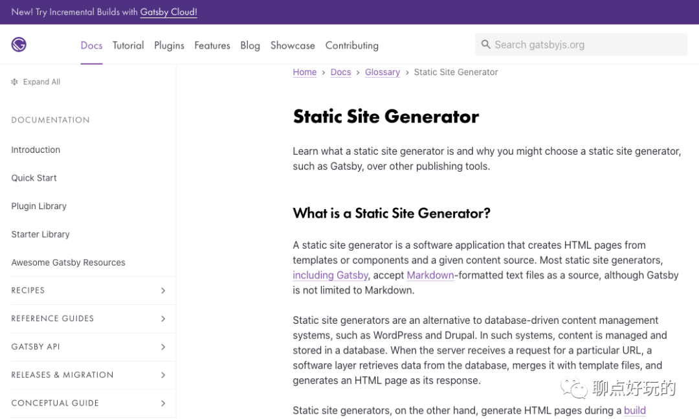

Hugo 是一个静态站点生成器，是评测最快的静态站点生成器，采用golang编写，依赖bep、spf13、friends这几个第三方库来实现。Hugo是一个不错的静态站点生成器，类似的还有readthedoc、gitbook、jekyll、gatsby等等，谈谈我对这几个流行的站点生成器的看法。

### **jekyll**

jekyll，是我使用的第一个静态站点生成器，用于我的 github pages， 它有比较丰富的主题，这个是我当时选择的一个原因，我可以专心于文档的编写，文档也是markdown格式。但是由于它对markdown的支持比较鸡肋，比如缺乏对图片引用、图表、plantuml、flowchart等的良好的支持，最终让我觉得通过jekyll来维护一个静态站点比较痛苦。

### **gitbook**

gitbook，是我平时经常使用的一个编辑工具吧，特别是涉及到类似书籍章节的大量内容组织的时候，现在依旧是我常用的编辑工具之一。gitbook-cli是其配套的一个工具，现在已经不再更新、维护，离线编辑已经不再被支持，现在转为线上服务。我还是比较倾向于离线编辑，不得不寻求其他可替代方案。

### **readthedoc**

见名知意，readthedoc确实比较用来写技术文档，其本身也是为了给python写api文档的，其用来构建类似的技术文档、手册还比较合适，但是用来构建一个更通用点的静态站点的话就有些不合适，不管多大的屏幕，它展示的区域总是那么小，有点死守每行N个字符的味道。

### **gatsby**

这个也是一个比较好用的静态站点生成器，网上也有很多它和hugo的对比，由于我对背后的实现js等不太熟悉，而我本人也经常有些定制化的修改需求，我还是有可能会去改下源码为自己所用的，所以选型阶段直接放弃。

### **mkdocs**

mkdocs和gitbook类似，使用都比较简单，但是其风格定制化比较难操作，如果你对它的默认风格不太满意，又想定制主题，而不想沾染什么前端相关的工作，mkdocs可能并不一定合适。

### **hugo**

hugo的支持、维护、更新都还不错，生态也不错，也有很多使用hugo的公司、团队、个人用它来维护自己产品、个人的文档、博客等等，也有比较丰富的主题可供选择。hugo的好处是它的主题是完整的，包括各种各样的插件，可以体验、下载安装、应用中意的主题，后续切换主题也比较方便。而且hugo也提供了一些命令行操作来快速发布静态站点。还有就是对golang的偏爱，意味着我可以在有需要的时候了解其实现，修改其源码进行定制化，或者做贡献。

综合上述考虑和对比，现在呢，我更倾向于使用hugo来作为接下来的静态站点生成器。