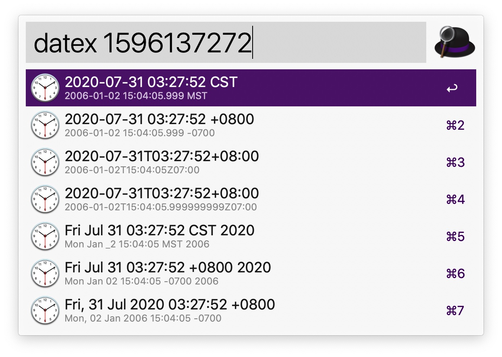

<style>
    img {
        width: 680px;
    }
</style>

# 本文简介
该workflow主要是为了对 "时间戳" && "格式化日期+时间字符串" 进行快速转换，方便使用。

开发人员，经常会涉及到时间相关的转换操作，有个趁手的工具还是很有必要的。

我平时使用alfred比较多，自然就想通过workflow的方式来实现，当然用hammerspoon、pet等其他工具也可以。

alfred workflow和alfred本身的交互是通过管道方式进行连接的：
- alfred将用户输入的信息转发给匹配的workflow；
- workflow对接收到的参数进行处理，并将处理的结果按照指定格式输出到stdout；
- alfred读取stdout中的数据作为响应展示到用户界面；

这里主要使用了awgo来编写workflow，实现逻辑可以参考下代码，逻辑很简单。下面主要介绍下如何使用。

# 如何安装？

下载项目下 [workflow/Date Formats Go.alfredworkflow](https://raw.githubusercontent.com/hitzhangjie/alfred-datetime-workflow/master/workflow/Date%20Formats%20Go.alfredworkflow)，双击即可安装。

# 如何使用？

1. 运行 `datex` 唤起workflow  


2. 常用转换操作: 获取当前时间对应的Unix时间戳，以及格式化字符串  
`datex now`，将当前时间转换为时间戳以及格式化后的字符串(多种日期格式)。  
可以用上下键移动进行选择，当按下回车键时，会将对应的结果拷贝到剪贴板，方便粘贴使用。


3. 常用转换操作: 将时间戳转换为对应的格式化字符串  
以时间戳1596137272为例，`datex 1596137272`，此时会将时间戳转换为格式化后的字符串。  
选择、复制数据操作类似。


4. 常用转换操作: 将格式化字符串转换为时间戳，或其他格式  
以字符串`2020-07-30`为例，`datex 2020-07-30`，此时会先将其与候选的格式化字符串进行匹配。  
并转换成一个有效的时间戳。 然后再根据此时间戳，转换为其他格式对应的字符串。选择、复制数据操作类似。


这大致就是该workflow的使用方式。

关于日期时间格式转换的workflow，github上已经有几个比较好的实现了，轮子不好用就得自己造。
- 实现对timezone支持不好;
- 采用的时间格式不符合国人习惯;
- 掌握awgo开发alfred workflow以后可以写更多效率工具;

希望这个小工具能帮助到有需要的同学，也给准备开发alfred workflow或使用awgo开发workflow的同学提供一个示例。

# 如何实现？

## 流程图梳理下逻辑

先画个流程图，简单理下思路，思路理清楚了，写代码就快了。


## alfred.workflow编排

好，理清楚思路之后，我们开始尝试对worklow进行编排，如下所示：


workflow中包含2个节点：
- 节点1，是一个script filter，我们可以配置一个关键字datex来激活它，当然还可以继续输入参数。激活该script filter之后，它将调用我们编写的时间转换程序alfred-datetime-workflow，程序返回的结果将在alfred界面上进行展示，展示的样式是列表。如我们输入datex now，将显示现在的时间戳以及其他格式的datetime字符串。      


- 节点2，是Copy to Clipboard，它干什么呢？节点1中显示了列表之后，用户选择一个列表项+回车之后，选中的列表项对应的参数值将被传递给该节点作为参数，Copy to Clipboard就是将参数拷贝到剪贴板；

>如果希望在workflow各节点中传递参数，则可以通过 `workflow.Var(envname, value)` 来设置变量，通过 `workflow.Config.Get${Type}(envname)` 来获取变量。

好的，下面来看下这里的时间转换程序怎么写，怎么与alfred衔接起来。

## alfred.workflow时间转换程序

这里的时间转换程序，可以是任意语言编写构建的二进制程序，也可以是shell脚本，都可以，只要能解析alfred传递的输入参数、返回alfred指定格式的结果就可以。awgo这个库简化了和alfred交互的部分，我们用这个库主要是简化和alfred数据格式的衔接。

主体逻辑很简单，实例化awgo.Workflow，然后注册回调函数，等待用户输入后唤醒执行。这里的回调函数，就是这里的run方法，在该方法内部完成时间的转换逻辑即可。

```go
package main

import (
	aw "github.com/deanishe/awgo"
)

func main() {
	workflow = aw.New()
	workflow.Run(run)
}
```

## 实现时间转换逻辑

前面我们给出的流程图，大部分是run方法的逻辑，照着流程图来写代码逻辑，基本上一遍完成。so easy!

```go
package main

import (
	...
	aw "github.com/deanishe/awgo"
)

var (
	workflow *aw.Workflow

	icon = &aw.Icon{
		Value: aw.IconClock.Value,
		Type:  aw.IconClock.Type,
	}

	layouts = []string{
		"2006-01-02 15:04:05.999 MST",
		"2006-01-02 15:04:05.999 -0700",
		time.RFC3339,
		time.RFC3339Nano,
		time.UnixDate,
		time.RubyDate,
		time.RFC1123Z,
	}

	moreLayouts = []string{
		"2006-01-02",
		"2006-01-02 15:04",
		"2006-01-02 15:04:05",
		"2006-01-02 15:04:05.999",
	}

	regexpTimestamp = regexp.MustCompile(`^[1-9]{1}\d+$`)
)

func run() {

	var err error

	args := workflow.Args()

	if len(args) == 0 {
		return
	}

	defer func() {
		if err == nil {
			workflow.SendFeedback()
			return
		}
	}()

	// 处理 now
	input := strings.Join(args, " ")
	if input == "now" {
		processNow()
		return
	}

	// 处理时间戳
	if regexpTimestamp.MatchString(input) {
		v, e := strconv.ParseInt(args[0], 10, 32)
		if e == nil {
			processTimestamp(time.Unix(v, 0))
			return
		}
		err = e
		return
	}

	// 处理时间字符串
	err = processTimeStr(input)
}

func processNow() {

	now := time.Now()

	// prepend unix timestamp
	secs := fmt.Sprintf("%d", now.Unix())
	workflow.NewItem(secs).
		Subtitle("unix timestamp").
		Icon(icon).
		Arg(secs).
		Valid(true)

	// process all time layouts
	processTimestamp(now)
}

// process all time layouts
func processTimestamp(timestamp time.Time) {
	for _, layout := range layouts {
		v := timestamp.Format(layout)
		workflow.NewItem(v).
			Subtitle(layout).
			Icon(icon).
			Arg(v).
			Valid(true)
	}
}

func processTimeStr(timestr string) error {

	timestamp := time.Time{}
	layoutMatch := ""

	layoutMatch, timestamp, ok := matchedLayout(layouts, timestr)
	if !ok {
		layoutMatch, timestamp, ok = matchedLayout(moreLayouts, timestr)
		if !ok {
			return errors.New("no matched time layout found")
		}
	}

	// prepend unix timestamp
	secs := fmt.Sprintf("%d", timestamp.Unix())
	workflow.NewItem(secs).
		Subtitle("unix timestamp").
		Icon(icon).
		Arg(secs).
		Valid(true)

	// other time layouts
	for _, layout := range layouts {
		if layout == layoutMatch {
			continue
		}
		v := timestamp.Format(layout)
		workflow.NewItem(v).
			Subtitle(layout).
			Icon(icon).
			Arg(v).
			Valid(true)
	}

	return nil
}

func matchedLayout(layouts []string, timestr string) (matched string, timestamp time.Time, ok bool) {

	for _, layout := range layouts {
		v, err := time.Parse(layout, timestr)
		if err == nil {
			return layout, v, true
		}
	}
	return
}
```

## 导出alfred.workflow

开发、测试、验证，一切ok之后，就可以在alfred内部将workflow整个导出了，导出后的文件以*.alfredworkflow作为扩展名，这个文件是可以拿来分发的文件，使用者直接双击就可以安装使用。

# awgo试用小结

这是使用awgo编写的第一个workflow程序，整体感觉来说，开发者可以专注于功能的实现，不用过度关注alfred数据格式方面的问题。

alfred本身很强大，支持各种各样的workflow算子，awgo到底能支持到什么程度，这个还要在后续使用中逐渐探索。

感兴趣的话，不妨一试，至少比写apple script脚本、bash脚本等要方便多了。
