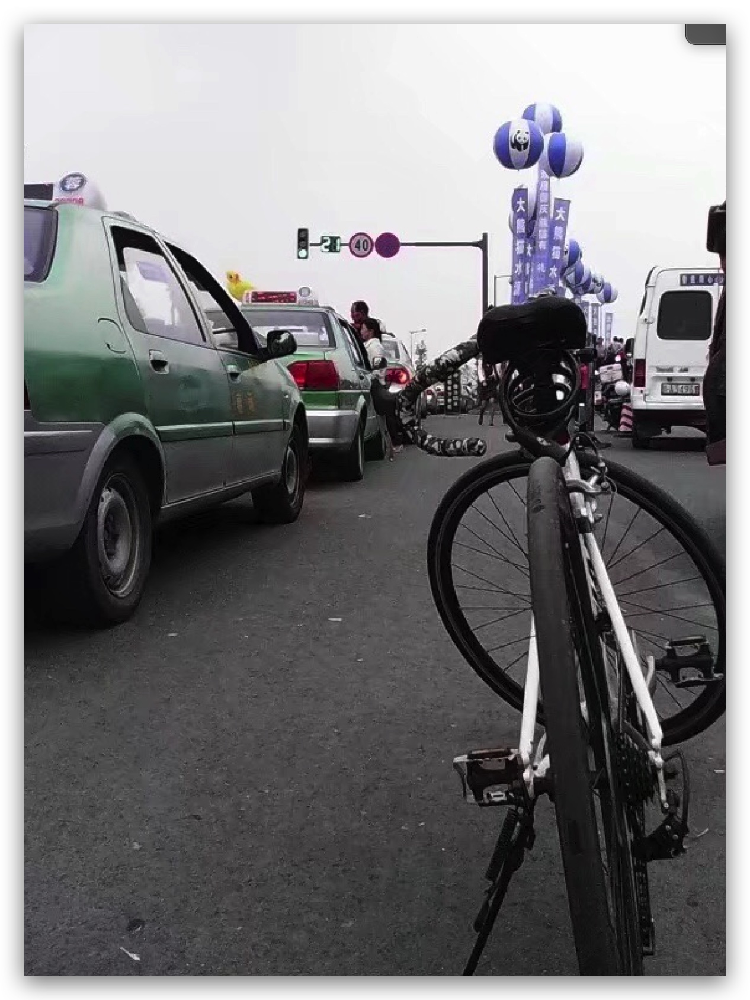

19年5月底，时长感觉身体疲倦，想锻炼下身体，我想买辆自行车骑着上班。左看右看，还是想买一辆公路赛自行车，太享受那种“破风”的感觉了。左看右看，看上了Giant OCR 5700，买的时候这两自行车已经几近停产了，但是因为它黑白色的涂装，实在是太招人喜欢了，简单又不失美感。几乎没什么犹豫的，就买了一辆，然后几天之后收到车，自己组装完毕，满心欢喜。

将其立在落地窗边，忍不住这么看那么看，真的是太漂亮了，这里还保留了一张刚开始组装好后的照片。

其实，这并不是我买的第一辆公路赛自行车，本科读书时，就买了一辆，那时候下课没事、周末的时候，就喜欢骑车去跑个环海路、逛逛这座小城、探探周边的校园，很是惬意。直到现在，我还依稀记得沿着环海路骑行时的场景，那扑面而来带着点腥味的海风，那静谧又干净的大马路，那一望无边的大海，听着海浪拍打着海滩、岩石，吹着海风，就这么走啊走，真想一直这么走下去……

  

    
  

  

    
  

读研究生时，又买了一辆，时不时就围着学校、九眼桥、大熊猫繁育基地等周边地方来一圈。成都市区热闹非凡，交通也堵，骑着车从图书馆附近的东门窜出，到九眼桥听听急流的水声，感受下那股潮湿的新鲜，心情就会很舒畅。这辆车骑了没多久，被小偷偷走了，那几年真的是不停地换自行车，买了丢丢了买。随着共享单车的兴起，我想学校周边的小偷们应该没什么可偷的了吧。

  

    
  

  

    
  

为什么几番买公路赛自行车呢？看它的造型，每个男同学应该都会喜欢它线条中透出的那股动感吧！另外，和我的性格也有关系，我比较喜欢独行。骑上它，想去哪就去哪，不用担心堵车，不用担心错过公交、地铁，骑行在大街小巷、公园绿道等等，就尽情享受和自然融为一体的那种快感吧。骑车一时爽，一直骑车一直爽，哈哈！

骑车虽然有时候不太舒服，但是爽还是挺爽的。现在我每天从宝安体育馆附近出发，到腾讯万利达大厦上班，沿途9公里左右，交通状况好的话大概25分钟左右能到。如果是交通不好的情况呢，多等上几个红绿灯，那可能要40分钟左右。我们中心下班有点晚，很多时候都是11点左右才下班，有的时候走到半夜之后的也不少。那么晚了，相比打车，我还是愿意骑车回家。那种被汗水浸透、长时间带来的身体素质的提升、想冲就能冲的体能，让整个人都会很兴奋，心情也好。所以，尽管那么晚了，我还是选择骑车回家。当然，这里是深圳，深圳的夜晚灯火通明……

附上两个上班、下班路上的视频，哦，对了，配上一副好的蓝牙耳机，会更让你获得骑行的乐趣。我用的是韶音 Aftershokz AS 650，这是一款骨传导耳机，可以让你在路上感知到周边环境的重要声音，比如骑车喇叭声等等，完全入耳的设计在这种场景下有点不安全。最开始有个同学觉得，1200块钱买这个”音质”的耳机有点不值，嗯，我追求的不是音质，我想要的是感觉（追求音质我有BOSE）……PS，Aftershokz AS 650之前丢了一个，现在已经是第二个了。

附上上下班路上的两个视频，感受一下骑行带来的快感：

  

    <iframe class="fixsize" src="https://www.youtube.com/embed/92ESzQfp0VI" frameborder="0" allow="accelerometer; autoplay; encrypted-media; gyroscope; picture-in-picture" allowfullscreen></iframe>
  

  

    <iframe class="fixsize" src="https://www.youtube.com/embed/NbVSX_jaKoY" frameborder="0" allow="accelerometer; autoplay; encrypted-media; gyroscope; picture-in-picture" allowfullscreen></iframe>
  

