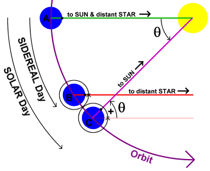

我相信很多人都是时间管理大师，几乎所有人都知道生活中如何运用时间，但是我相信很多人并不知道这个世界的时间是如何工作的。

## 你了解时间吗

如果不相信，那我问几个问题，看读者知道不？

- 你听说过石英晶体吗？
- 你听说过晶振振荡周期吗？
- 你听说过时钟中断吗？
- 你听说过计时电路吗？
- 你听说过时钟漂移吗？
- 你听说过铯原子钟吗？
- 你听说过BIH这个机构吗？
- 你听说过闰秒吗？
- 你听说过NTP协议吗？
- etc.

如果，你不能一一回答上述问题，那这个地球上的时间是如何工作的，你可能并不太清楚 :)。

我们日出而出、日落而息，我们规划工作事项，我们协调重要工作，我们安排计算机程序精密协作……时间是非常重要的，以至于我们生物进化过程中形成了“生物钟”来适应，它无影无形，它无处不在。

## 我们如何测量时间的

### 凭感觉不靠谱

先介绍下，我们试如何测量时间的。这并不像大多数人想象的那样简单，烧一炷香？个时辰，或者来个沙漏一只椰子鸡炖熟了，这个有一定的实用价值，但是非常不精确，对于精度要求较高时更是如此。

### 天文学测量方式

自动17世纪机械钟发明以来，我们就一直在用天文学的方法测量时间。每天太阳都是从东方地平线上升起，然后升到天空的最高处，最后再落到西边。太阳到达天空中的最高点时，称为“**中天**”（transit of the sun），它在每天正午达到最高点。两次连续的太阳中天之间的时间称为一个“**太阳日**”（solar day）。因为每天都会有24小时，每小时都有3600s，所以一个“**太阳秒**”（solar second）被精确定义为 1/86400 个太阳日。


那么平均太阳日的几何算法，则可以由下图所示：



ps：有些人想为什么不地球自转一周算1天？其实这就是上图中的“**恒星日**”（sidereal day），以遥远的恒星为参考物，每天转到这个方位算是一个恒星日。但是我们自然万物向阳而生，以太阳这颗大恒星作为参考系似乎是更合理的计时方法。

在20世纪40年代，科学家们证实了地球的自转周期并非常数（const value，固定值）。由于潮汐摩擦和大气的阻力，地球的自转速度正在变慢。基于对远古时代珊瑚的生长图案的研究，低质学家现在相信，在3亿年前每年大约有400天（太阳日）。年的长度（地球绕太阳一周的时间）被认为是不变的，那么每天的时间就简单地边长了。除了这种长期变化趋势，也存在一点长短的短期变化，这可能是是由于地球地核层熔岩的剧烈沸腾而引起的。

这些发现，促使天文学家们在计算天的长度时要测量很多天的长度，然后再对它们取平均值，最后除以86400得到的结果称为“**平均太阳秒**”（mean solar second）。

### 物理学测量方式

1948年的时候，原子钟诞生，它使更精确地测量时间成为可能。原子钟不受地球的摆动和振动的影响，而是通过铯133原子的跃迁来计时。物理学家从天文学家的手中接管了计时的工作，定义1秒是铯133原子做9192631770次跃迁所用的时间。选择9192631770是为了是原子秒与引入原子秒那一年的平均太阳秒相等。

目前世界上大约有50个实验室拥有铯133原子钟。每个实验室都定期向巴黎的BIH（Bureau International Heure）报告其时钟滴答数。BIH将这些值平均起来产生“**国际原子时间**”（international atomic time，简称TAI）。这样TAI就是铯133原子钟从1958年1月1日午夜（起始时间）以来被9192631770除后的平均滴答数。

尽管TAI相当稳定，并且任何人只要愿意，都可以买到一只铯原子钟，但是它仍然存在一个严重的问题，那就是86400个TAI秒比现在一个平均太阳日要少3微秒（因为平均太阳日越来越长了）。使用TAI计时将意味着多年以后，中午会出现地越来越早，直到最终出现在凌晨（太阳还不知道在哪睡觉，TAI秒却显示已经中午了）。

### UTC与闰秒

人们也许早晚会注意到这些变化，今后可能将会发生与1582年古罗马教皇Pope Gregory十三世宣布从日历中删除10天时类似的情况。这一事件导致了街头暴动，因为地主要收一个整月的地租，银行家要收一个整月的利息，而雇主拒绝向雇员支付他们没有工作的那10天的工资，这里只是提到了其中的几个冲突。在一些新教区，人们拒绝任何与教皇法令相关的事情，有长达170年不接受罗马教皇颁布的日历。

BIH通过引入“**闰秒**”（leap second）来解决这个问题，避免以后出现类似罗马教皇一次删10天日历的情况，也避免造成世界范围内难以协调、预料的灾难。闰秒什么意思呢，即当TAI和太阳秒计时之间的差增加到800微秒的时候就要使用一次闰秒。闰秒的使用如下图所示。即在箭头指向的时刻处，TAI和太阳秒相差超过阈值时，在UTC中应用一次闰秒，使得UTC保持同步。


**这种修正，产生了一种时间系统，该时间系统基于恒定长度的TAI秒，并力求和太阳的运动保持一致，它被称为“**统一协调时间**”（universal coordinated time，简称UTC）**。UTC是现代人计时的基础。它从根本上取代了原有的标准“**格林尼治天文时间**”（greenwich mean time），格林尼治天文时间是一种天文时间。

### 闰秒的"阴暗面"

值得一提的是，闰秒有正有负，因为地球自转受很多因素影响，有时变快有时变慢（显然我们很难直观察觉到），不同的时间段内情况也不同，比如从1972年到2020年平均每21个月就有一次闰秒出现，但是有的时间段内则没有闰秒。

- 闰秒为正的情况，UTC时间戳可能会出现这样的时间序列：23:59:59 -> 23:59:60 -> 00:00:00
- 闰秒为负的情况，UTC时间戳可能会出现这样的时间序列：23:59:59 -> 23:59:58 -> 00:00:00

对于计算机系统中的石英晶体，由于其精度的问题，会导致时间上出现偏差（过快或过慢都有可能），计算机系统通过NTP协议（network time protocol）与时间服务器（time server）进行通信来同步最新的时间。当出现闰秒时，NTP服务器一般会告知客户端出现了闰秒（通过Leap Indicator告知客户端），客户端收到后要进行适当的处理，当然不同的操作系统处理方式不一样。

但是不管怎么样，很多应用程序都是使用Unix时间戳（没有考虑闰秒的）来作为应用程序中的时间的，如果操作系统贸然插入1s或者减去1s都会对时间敏感的应用造成严重后果。用户先后发起了两个操作，修改订单、下单请求，请求里面都带有时间戳，但是如果取消订单时因为闰秒的原因导致时间向过去跳了1s，造成服务端看来用户是先下单，后修改订单，那么将导致订单修改失败（通常是下单后无法修改的）。

ps: 比这个问题严重的多的场景多的是，当然健壮的系统会考虑采用逻辑时钟等手段来解决，如向量时钟，这里不多说了。

为了避免应用程序处理这个闰秒问题的复杂性，屏蔽不同操作系统的差异，有些大厂会自建NTP服务器，在收到上游NTP服务器的闰秒事件时，会通过leap smear的方式，将这个闰秒事件的影响均匀地打散到接下来的时间里，使得时间一直是只增不减的。这样公司内部从自建NTP服务器上同步过去的时间虽然可能会有点点不那么精准，但是却很有效地解决了闰秒可能带来的潜在的灾难。

Google内部就是借助leap smear的方式来做的，当接收到通知某天有闰秒出现，自建NTP服务器（修改代码支持leap smear）将闰秒打散到全天，保证时间慢慢增加，内部服务器都用这个时间，就不用处理闰秒带来的跳变的问题了。Amazon采取了类似的方式，稍有不同，以及其他的一些做法，可以参考维基百科。

鉴于UTC引入leap second所带来的的问题，比如对计算机系统、分布式系统等等，国际会议也在讨论要不要考虑更好的方式，比如应用程序中希望使用精确时间时总是使用TAI，而在希望人类可读的场景下将其转换成UTC显示。其实Google采用的leap smear的方式也是一种比较好的实践。

## 计算机如何测量时间的

### 计算机的物理时钟

计算机中有一个计时电路，尽管通常使用“时钟”这个概念，但是用“计时器（timer）”更恰当一点。计算机的计时器通常是一个精密加工的石英晶体，石英晶体在其张力限度内以一定的频率振荡，这个频率取决于晶体本身如何被切割及其受到的张力的大小。

有两个寄存器与每个石英晶体相关联，一个是计数器（counter），另一个是保持寄存器（holding register）。石英晶体的每次振荡使计数器-1，当减为0时则触发一个中断；然后，计数器从保持寄存器中重新装入初始值。每次中断称为一个时钟滴答。

系统初次启动时，通常要求用户输入日期和时间，然后将它们转换成某一个已知起始时间后的时钟滴答次数，并将它存储在存储器中。许多计算机都有一个特殊的电池支持的CMOS RAM，其目的是为了以后启动时不再需要输入日期和时间。

时钟每滴答一次，就产生一个时钟中断，时钟中断服务程序就使存储在存储器里面的时间值+1。用这种方法进行（软）时钟计时。

ps：多CPU系统中，每个CPU都有自己的时钟。

大家了解到我们现在已经用原子钟测量时间了，我们不禁要问，这个晶振振荡周期规律么、精准吗？不精准！时间久了，计算机的物理时钟时间与世界真实时间就有了偏差，称之为”**时间偏移**“（time skew）。

别担心，我们还有计算机网络，我们可以让计算机通过计算机网络与时间更精准的服务器进行通信，来同步时间。

### 网络时间协议NTP

我们可以让自己的服务器与时间服务器（time server）进行通信完成时间的同步。时间服务器可以精确地提供当前时间，因为它装备了一个WWV接收器或一个精确的时钟。

ps: WWV（shortwave radio station）接收器，使得安装有该设备的接收器可以通过GPS全球定位系统来同步时间，声称误差在20~35ns误差范围内，可以说是相当精确了。GPS卫星上也是安装的原子钟。如果想了解如何借助GPS全球定位系统实现时间同步，可以自行查阅相关资料，这里不再展开。

当然，问题是，何时与该服务器联系，消息延时会使得报告的时间过时，这里有个技巧，就是给消息带上时间戳，好让我们对消息的传输延时做出很好的估计。比如像下图这样：


要求client A、server B发送接收消息时都带上当时时刻的时间信息，这样我们就可以大致算出client A发送请求到server B接收的传输时延为T2-T1，同理可知server B发送响应给client A的传输时延为T4-T3，我们有理由相信这两次传输的时间应该相差无几，为了让传输时延影响更小，就取平均值作为传输时延吧。然后基于T3这个响应的时间点，我们相信T3是NTP server的准确时间，所以就可以计算出当前client A同步到的时间为：

```
T = T3 + ((T2-T1)+(T4-T3))/2
```

这个很好理解。

不要高兴太早，我们还需要意识到一个问题，就是**时间不允许后退的问题**。时间一旦出现后退，对无数的电子设备、计算机系统而言将是十足的灾难。

这里的同步到的时间T相对本地当前时间而言，是更快的话，直接设置当前时间为T就行了？似乎没问题。那如果是慢了呢？直接调慢行吗，前面说了，不行，这回让时间倒退。

实际上，计算机系统可以采用一种逐步调整的方式。比如，假设计时器设置为每秒产生100个中断。正常情况下，每个中断将添加10ms，当减慢时，每个中断例程只添加9ms，直到校正完成为止。同样的，通过在每个中断中添加11ms，时钟也可以逐步往前调快。

网络时间协议在服务器之间创建了两条连接，比如上面讲了A可以参考B的时间调整自己的时间，原则上B也可以参照A的调整自己的呀！是这样吗，如果B上面装了WWV接收器或者原子钟，那么一个拥有精确时间的NTP去参考一个靠普通石英晶体维护时间的NTP，这不是犯傻吗？怎么解决这个问题呢？

NTP服务器也是分层的，通常拥有WWV接收器或者原子钟的，称为1层服务器，那0层是谁？OK，0层指的是时钟本身。其他k层（k>1）服务器可以参考k-1层的服务器来完成时间同步，反过来则不行。如果一个NTP服务器是k层服务器，另一个服务器是k+2层服务器，其如果通过k层服务器调整后，它将从k+2层变为k+1层。

NTP中还是有很多重要的特性的，并不是像我们想象的那么简单，感兴趣的话可以参考相关资料。

## 如何解决时间漂移问题

前面我们介绍了测量时间的方式，从经验主义，到天文学测量，到物理学测量，以及兼顾物理学、天文学的测量，方式也一步步更加精确、完善、实用。我们还谈到了计算机系统中的时间系统是如何更新的。想必大家感觉对于这个星球上的时间系统的工作原理更清晰了。

这里还有个问题，就是时间漂移问题。尽管我们前面提及了精确测量时间、时间同步协议等尽可能保证时间准确的方式，但是效果也是”尽可能”让其精确，我们还是不能百分百地保证全球所有电子设备、分布式系统中节点的时间是完全一致的，甚至是同一个计算机但是是多处理器系统中的多个时钟也不是完全一致的。

这回带来什么问题呢？如果运行其上的系统，依赖“时间”对操作顺序执行先后做判断，那这样的系统很可能是存在问题的。

在分布式系统设计中，一般会采用“逻辑时钟”、“向量时钟”等方式来代替真实时钟，来作为操作顺序执行先后的判断依据。这里的内容有很多，后面我们有机会再单独写一篇文章来介绍。

## 总结

本文开头给大家泼了点冷水，很可能让部分读者对自信了解的时间没了信心 :) ，然后我们介绍了时间测量方式的一些演变，以及计算机系统中如何保持时间的同步，最后又抛出了另一个值得深思的问题，如何解决时间漂移问题在多处理器系统、分布式系统中带来的时序相关的问题。

相信大家对时间有了一个更深的认识，也希望激发了大家对时间的进一步思考吧。

参考文献：

1. [leap second](https://en.wikipedia.org/wiki/Leap_second#:~:text=A%20leap%20second%20is%20a,term%20slowdown%20in%20the%20Earth's)
2. [five different ways handle leap seconds](https://developers.redhat.com/blog/2015/06/01/five-different-ways-handle-leap-seconds-ntp/)
3. [what is a leap second](https://www.timeanddate.com/time/leapseconds.html)
4. [leapsecond.com](http://leapsecond.com/java/gpsclock.htm)
5. [interesting info on leap second](https://www.youtube.com/watch?v=5VfcFXj2ZCs)
6. [gps network time synchonization](https://www.masterclock.com/support/library/gps-network-time-synchronization)


