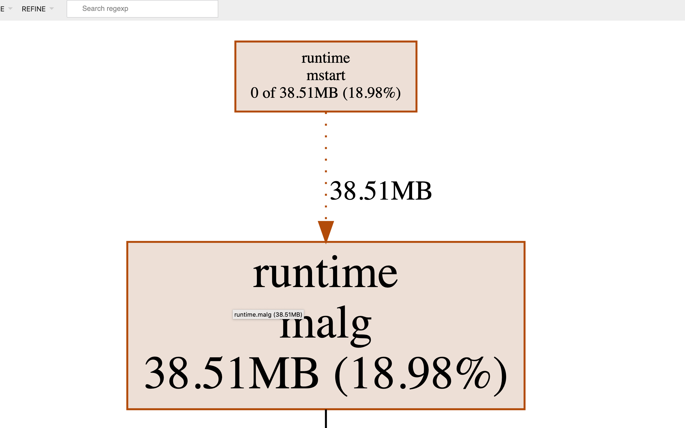
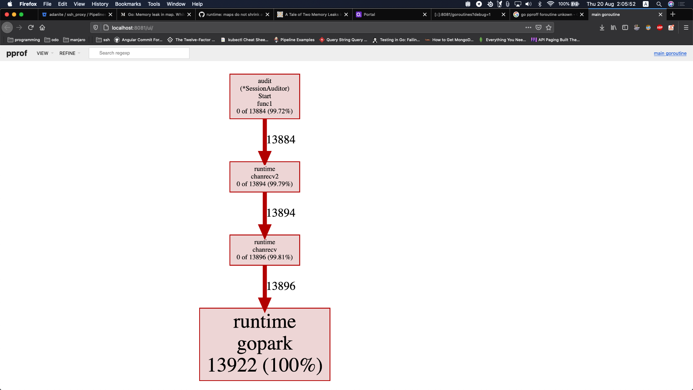

<style>
	.myimg {
		width: 680px;
		padding-bottom: 1rem;
	}
</style>

前几天有同学反馈了cgo内存泄露问题，自己也针对这个问题探索了一番，算是为以后解决类似问题提前攒点经验吧。也趁机整理了一下go开发过程中内存泄露问题的一些常用排查方法，也希望对新接触go的同学有所帮助。整理之余，bcc工具之丰富也让我有点惊讶，也希望对自己日后的工作有所帮助吧。

## 内存泄漏

内存泄露，一个老生常谈的问题，但即便是老手也会犯一些低级错误。如果没有可靠的研发流程保证在测试阶段发现问题，问题就容易被带到线上。计算资源始终是有限的，问题也不会因为资源充裕就消失不见，产生影响只是时间问题。影响有多大，就要结合场景来说了。

内存泄漏，最可能的影响就是内存申请失败。但实际上操作系统更聪明，结合系统整体负载情况，它会为每个进程计算一个oom_score，并在内存资源紧张时选择一个合适的进程杀死并回收内存资源，see [how does the oom killer decide which process to kill first](https://unix.stackexchange.com/a/153586/95211)。

所以，内存泄露的最终结果，大概率会被操作系统kill，通常进程挂掉后，确认其是否是因为oom问题被kill，可以通过查看 `/proc/messages` 来确认是否有对应日志。有的话，那就坐实了oom killed（但是被oom killed的进程不一定意味着存在内存泄露）。

## 服务质量

结合运维手段的变化，来看看是否内存泄漏问题对服务质量造成的影响。

-   传统人工方式，通过感知告警、人为介入这种方式，效率低，要十几分钟；
-   通过虚拟机自动化部署的方式，感知异常自动重启虚拟机，耗时大约要分钟级；
-   通过docker容器化部署的方式，感知异常自动重启容器，耗时大约在秒级；

看上去现代运维方式一定程度上可以缓解这个问题，是，这也要分情况：

-   如果内存泄露的代码路径不容易被触发，那可能要跑很久才能触发oom kill，如一周；但是如果代码路径在关键代码路径上，且请求量大，频繁触发内存泄露，那可能跑个几分钟就会挂掉；
-   跟每次内存泄露的内存大小也有关系，如果泄露的少，多苟活一阵子，反之容易暴毙；
-   进程一旦挂掉，这段时间就不能响应了，服务的健康监测、名字服务、负载均衡等措施需要一段时间才能感知到，如果请求量大，服务不可用依然会带来比较大的影响。

服务质量保证是不变的，所以别管用了什么运维手段，问题终究是问题，也是要解决的。

## Go内存泄漏

### 垃圾回收

自动内存管理减轻了开发人员管理内存的复杂性，不需要像C\C++开发者那样显示malloc、free，或者new、delete。垃圾回收借助于一些垃圾回收算法完成对无用内存的清理，垃圾回收算法有很多，比如：引用计数、标记清除、拷贝、分代等等。

Go中垃圾回收器采用的是“并发三色标记清除”算法，see:

1) [Garbage Collection In Go : Part I - Semantics](https://www.ardanlabs.com/blog/2018/12/garbage-collection-in-go-part1-semantics.html)
2) [Garbage Collection In Go : Part II - GC Traces](https://www.ardanlabs.com/blog/2019/05/garbage-collection-in-go-part2-gctraces.html)
2) [Garbage Collection In Go : Part III - GC Pacing](https://www.ardanlabs.com/blog/2019/07/garbage-collection-in-go-part3-gcpacing.html)

Go语言支持自动内存管理，那还存在内存泄漏问题吗？

理论上，垃圾回收（gc）算法能够对堆内存进行有效的清理，这个是没什么可质疑的。但是要理解，垃圾回收能够正常运行的前提是，程序中必须解除对内存的引用，这样垃圾回收才会将其判定为可回收内存并回收。

### 内存泄漏场景

实际情况是，编码中确实存在一些场景，会造成“**临时性**”或者“**永久性**”内存泄露，是需要开发人员加深对编程语言设计实现、编译器特性的理解之后才能优化掉的，see：[go memory leaking scenarios](https://go101.org/article/memory-leaking.html)。

即便是临时性内存泄漏，考虑到有限的内存资源、内存申请大小、申请频率、释放频率因素，也会造成进程oom killed的结果。所以，开发人员对待每一行代码还是要心存敬畏，对待内存资源也还是要慎重。

常见的内存泄露场景，go101进行了讨论，总结了如下几种：

-   [Kind of memory leaking caused by substrings](https://go101.org/article/memory-leaking.html)
-   [Kind of memory leaking caused by subslices](https://go101.org/article/memory-leaking.html)
-   [Kind of memory leaking caused by not resetting pointers in lost slice elements](https://go101.org/article/memory-leaking.html)
-   [Real memory leaking caused by hanging goroutines](https://go101.org/article/memory-leaking.html)
-   [real memory leadking caused by not stopping `time.Ticker` values which are not used any more](https://go101.org/article/memory-leaking.html)
-   [Real memory leaking caused by using finalizers improperly](https://go101.org/article/memory-leaking.html)
-   [Kind of resource leaking by deferring function calls](https://go101.org/article/defer-more.html#kind-of-resource-leaking)

简单归纳一下，还是“临时性”内存泄露和“永久性”内存泄露：

-   临时性泄露，指的是该释放的内存资源没有及时释放，对应的内存资源仍然有机会在更晚些时候被释放，即便如此在内存资源紧张情况下，也会是个问题。这类主要是string、slice底层buffer的错误共享，导致无用数据对象无法及时释放，或者defer函数导致的资源没有及时释放。
-   永久性泄露，指的是在进程后续生命周期内，泄露的内存都没有机会回收，如goroutine内部预期之外的`for-loop`或者`chan select-case`导致的无法退出的情况，导致协程栈及引用内存永久泄露问题。

## 内存泄露排查

初步怀疑程序存在内存泄露问题，可能是因为进程oom killed，或者是因为top显示内存占用持续增加无法稳定在一个合理值。不管如何发现的，明确存在这一问题之后，就需要及时选择合适的方法定位到问题的根源，并及时修复。

### 借助pprof排查

#### pprof类型

go提供了pprof工具方便对运行中的go程序进行采样分析，支持对多种类型的采样分析：

-   goroutine - stack traces of all current goroutines
-   heap - a sampling of all heap allocations
-   threadcreate - stack traces that led to the creation of new OS threads
-   block - stack traces that led to blocking on synchronization primitives
-   mutex - stack traces of holders of contended mutexes
-   profile - cpu profile
-   trace - allows collecting all the profiles for a certain duration

#### pprof操作

现在很多rpc框架有内置管理模块，允许访问管理端口通过`/debug/pprof`对服务进行采样分析（pprof会有一定的性能开销，最好分析前将负载均衡权重调低）。

集成pprof非常简单，只需要在工程中引入如下代码即可：

```go
import _ "net/http/pprof"

go func() {
	log.Println(http.ListenAndServe("localhost:6060", nil))
}()
```

然后运行`go tool pprof`进行采样：

```bash
go tool pprof -seconds=10 -http=:9999 http://localhost:6060/debug/pprof/heap
```

有时可能存在网络隔离问题，不能直接从开发机访问测试机、线上机器，或者测试机、线上机器没有安装go，那也可以这么做：

```bash
curl http://localhost:6060/debug/pprof/heap?seconds=30 > heap.out

# sz下载heap.out到本地
go tool pprof heap.out
```

go tool pprof可以收集两类采样数据：

-   in_use，收集进程当前仍在使用中的内存；
	
	
-   alloc，收集自进程启动后的总的内存分配情况，包括已经释放掉的内存；
	

go tool pprof展示采样信息时，申请内存以“**红色**”显示，释放内存以“**绿色**”显示。

允许采样完成后打开一个浏览器页面（通过ip:port访问），交互式地查看采样结果信息，例如callgraph、flamegraph、top信息。

#### pprof示例：协程泄露


其中有2条红色的很醒目的路径，这是造成内存占用升高的主要路径，需要重点分析。以右边这条红色路径为例，最终走到了`runtime.malg`，碰到这个函数，联想前面总结的常见内存泄露场景，要有这样的意识：“这里可能涉及到goroutine泄露”，即goroutine创建了很多，但是goroutine没有正常执行结束，对应的协程使用的内存没有释放。

此时根据上述callgraph中的线索检查程序中启动goroutine的地方，以及goroutine是否有正常退出的逻辑保证，就能比较方便地定位到泄露原因了。

上述callgraph中展示了两条导致内存分配占用高的路径，但是其中左边一条可能是正常情况下的内存使用情况，而右边这条可能是异常情况。在分析阶段，我们需要有能力区分哪些内存分配是正常情况，哪些情况是异常情况。pprof提供了另外一个有用的选项`-diff_base`，我们可以在没有服务没有请求时采样30s生成一个采样文件，然后有请求时，我们再采样30s生成另一个采样文件，并将两个采样文件进行对比。这样就容易分析出请求出现时，到底发生了什么。

```bash
go tool pprof -http=':8081'           \
   -diff_base heap-new-16:22:04:N.out \
   heap-new-17:32:38:N.out
```



这样问题看起来就更非常明确了，请求出现时处理请求的过程中启动了新协程执行处理。`runtime.malg`就是创建新协程，其内部会分配协程栈，这个栈在使用过程中会动态伸缩，并在协程退出时才会被销毁。

由pprof heap确定了存在goroutine泄露问题，但我们还不知道此goroutine在何处启动的，为此，我们继续pprof goroutine。

```bash
go tool pprof -seconds=10   \
   -http=:8081              \
   http://localhost:6060/debug/pprof/goroutines
```



现在通过上述callgraph我们很容易定位到goroutine是在哪里启动的了，回到源码中进一步确认：

```go
var ticker = time.NewTicker(time.Second)

go func() {
  for {
    select {
    case <-ticker.C:
      // doSomething
    }
  }
}()

func somefunc(...) {
  ticker.Stop()
}
```

原来当前协程因为ticker.C这个chan read操作阻塞了，需要注意的是`time.Ticker.Stop()`之后，ticker.C这个chan不会被关闭，最好在执行ticker.Stop()的时候，同时设置一个通知chan，close该chan来表示ticker停止。

```go
var ticker = time.NewTicker(time.Second)
var chdone = make(chan int, 1)

go func() {
  for {
    select {
    case <-ticker.C:
      sa.read()
    case <- chdone:
    	return
    }
  }
}()

func somefunc(...) {
    ticker.Stop()
    close(chdone)
}
```

这里介绍了pprof的使用方法，pprof是每个go开发人员都应该掌握的。希望读者借助这里的示例能帮助读者了解pprof的操作、分析过程，达到灵活运用的程度还需要日常开发工作中多实践。

### 借助bcc排查

#### pprof：这个我干不了

pprof对于分析纯go程序是非常有帮助的，但是对于cgo有点无能为力，cgo部分的代码已经跳出了go内存分配器的范围，采样也没用，那cgo部分出现内存泄露该如何排查呢？

-   要确定进程是否出现了内存泄露，可以观察进程运行期间的内存占用情况，如借助top、free -m，或者其他运维平台的监控系统，一般k8s都集成了prometheus对容器运行情况进行了监视。如果内存占用随着时间延长一直增长，没有在合理的内存占用值附近稳定下来，或者已经出现了oom killed、容器重启的问题出现，则可以初步判定进程存在内存泄露；
-   继续借助pprof工具排查go程序，如果pprof可以排查出明显的内存泄露问题，则内存泄漏问题可能是纯go部分代码引起，采用前面描述的分析、定位方法来解决；
-   如果pprof工具采样之后，没有发现明显的内存泄露的端倪，且程序中存在cgo部分的代码，怀疑cgo部分的代码存在内存泄露，此时则需借助其他手段（pprof无能为力了）来进一步分析cgo部分的可能异常；

#### 库函数：hook库函数

要分析内存是否存在泄漏，也可以考虑自己hook一下库函数，自己实现这种我们就不展开讨论了。还是看看有没有趁手的好工具，能实实在在地、靠谱地帮我们解决实际问题（尽管趁手的工具也可能也是基于某种hook的能力实现的）。

#### Kernel：谁能逃脱我的法眼

内存分配操作，一般会借助一些库函数来完成，内存分配器也会做一些分配算法的优化，这里不关心这些，最终的内存申请操作还是要由操作系统来代劳，而请求内核服务的操作则是通过系统调用。

操作系统提供了一些服务，允许对运行中的进程进行观测，以Linux为例，借助ptrace系统调用+PTRACE_SYSCALL，允许我们对一个运行中的进程执行的所有系统调用进行观测，ltrace、strace就是在此基础上实现的。

eBPF（extended BPF）的前辈是BPF（Berkeley Packet Filtering），BPF是一个ByteCode VM，它的数据模型限制于packet，经常用来做一些包分析，经典的如tcpdump。eBPF相比BPF，其数据模型不再受限于单一的packet，也不再只是用来分析packet的单一功能，可以利用它将eBPF program挂到任意的tracepoint或者kprobe去执行分析处理。这一下子打开了eBPF的万花筒，使得能够对内核各个子系统做观测、做性能分析，等等。


各种测量、性能分析工具，真是亮瞎我的眼睛。

#### BCC (eBPF toolkit)：测量、性能分析

如何基于eBPF写eBPF program来完成希望的测量、分析呢，see [iovisor/bcc](https://github.com/iovisor/bcc)：

>   BCC is a toolkit for creating efficient kernel tracing and manipulation programs, and includes several useful tools and examples. It makes use of extended BPF (Berkeley Packet Filters), formally known as eBPF, a new feature that was first added to Linux 3.15.
>
>   eBPF was [described by](https://lkml.org/lkml/2015/4/14/232) Ingo Molnár as:
>
>   >   One of the more interesting features in this cycle is the ability to attach eBPF programs (user-defined, sandboxed bytecode executed by the kernel) to kprobes. This allows user-defined instrumentation on a live kernel image that can never crash, hang or interfere with the kernel negatively.
>
>   BCC makes BPF programs easier to write, with kernel instrumentation in C (and includes a C wrapper around LLVM), and front-ends in Python and lua. It is suited for many tasks, including performance analysis and network traffic control.

BCC算是一个开发套件，在它基础上开发eBPF program会更简单，该仓库内当前已经拥有了非常丰富的测量、分析工具，工具之丰富，只差我能不能全部掌握了，也想成为像[Brendan Gregg](http://www.brendangregg.com/blog/index.html)一样的性能分析专家。

>   Brendan Gregg: Understanding all the Linux tracers to make a rational decision between them a huge undertaking. (I may be the only person who has come close to doing this.)

至于如何实现一个BCC工具，则非常简单，实际上就是写一个python文件，内部一个字符串包含一个c程序，c程序内调用封装的eBPF API，看一个简单的demo：

```python
#file: hello-open-world-1.py

from bcc import BPF
program = """
#include <asm/ptrace.h> // for struct pt_regs
#include <linux/types.h> // for mode_t
int kprobe__sys_open(struct pt_regs *ctx,
char __user* pathname, int flags, mode_t mode) {
bpf_trace_printk("sys_open called.\\n");
return 0;
}
"""
b = BPF(text=program)
b.trace_print()
```

运行它：

```bash
$ sudo python hello-open-world-1.py
```

OK，BCC套件里面提供了工具memleak，用来对内存泄露进行分析，下面结合一个cgo内存泄露的示例分析，来了解下如何是使用。

建议能花点时间了解下linux tracing systems，see [linux tracing systems & how they fit together](https://jvns.ca/blog/2017/07/05/linux-tracing-systems) ，理清下kprobe/uprobe/dtrace probes/kernel tracepoints的含义及工作原理，进而才能认识到eBPF的强大之处，不再展开了，看个示例。

#### BCC：内存泄露示例

下面先看一个cgo示例工程是如何组织的，示例项目取自https://github.com/2Dou/cgo-example，您可以直接从这里下载。

```bash
c-so/
├── Makefile
├── add
│   ├── Makefile
│   ├── add.go
│   └── src
│       ├── add.c
│       └── add.h
└── main.go
```

上述工程中，add/src/下add.h/add.c实现了一个add函数，add/add.go中定义了可导出的函数`Add(a, b int) int`，内部通过cgo调用src下定义的`int add(int, int)`，add/Makefile将把add下的源文件整个编译构建打包成一个共享库文件libadd.so，供c-so/main.go调用。

c-so/main.go引用目录add下定义的package add中的Add函数，c-so/Makefile只是简单的go build编译动作，编译完成后`./c-so`运行会提示库文件libadd.so不存在，这是因为库路径加载问题，执行`LD_LIBRARY_PATH=$LD_LIBRARY_PATH:$(pwd -p) ./c-so`即可，程序正常运行。

OK，现在简单地篡改下src/add.c，将其内容修改如下，插入了一段不停申请内存的代码：

```c
#include "add.h"
#include <stdio.h>
#include <stdlib.h>
#include <unistd.h>

int add(int a, int b) {
  
  /******* insert memory leakage start ********/
  int i = 0;
  int max = 0x7fffffff;
  
  for (; i<max; i++) {
    int *p = (int *)malloc(sizeof(int) * 8);
    sleep(1);
    if (i % 2 == 0) {
      free(p)
    }
  }
  /******* insert memory leakage end ********/
  return a+b;
}
```

现在重新执行make编译之后，再次运行，程序不断地malloc但是从来不free，内存一点点被泄露，现在我们看看如何借助memleak分析内存泄露的位置：

```bash
$ /usr/share/bcc/tools/memleak -p $(pid of c-so)
```

运行一段时间以后，memleak报告了内存分配的情况，显示的是“**top10的还没有释放的内存分配**”的位置信息：


>   Trace **outstanding** memory allocations **that weren't freed**.
>
>   Supports both user-mode allocations made with libc functions and kernel-mode allocations made with kmalloc/kmem_cache_alloc/get_free_pages and corresponding memory release functions.

从memleak报告的最后一条信息来看：

-   c-so这个程序运行过程中，调用了共享库libadd.so中的add函数；
-   这个add函数执行了345+次内存分配操作，每次申请`sizeof(int)*8` bytes，总共分配了11048次内存；
-   内存分配malloc操作的位置大约就是add函数起始处+0x28的指令位置，可以通过objdump -dS libadd.so求证。

现在我们可以看到内存分配的位置、次数、内存数量，但是这个报告中报道的并非实际泄露的内存数量，比如我们也有free，怎么没有统计到呢？运行`memleak -h`查看下有哪些选项吧！

```bash
$ /usr/share/bcc/tools/memleak -p $(pid of c-so) -t
```


现在可以看到报告信息中包含了alloc entered/exited，free entered/exited，可以断定memleak也跟踪了内存释放，但是这里的报告还是不够直观，能否直接显示泄露的内存信息呢？可以但是要稍微修改下，下面看下实现，你会发现现有的报告信息也不妨碍分析。

#### bcc/memleak实现

不看下源码，总感觉心里有点虚，看下memleak这个eBPF program中的部分逻辑：

跟踪malloc：

```
int malloc_enter(struct pt_regs *ctx, size_t size)
    \-> static inline int gen_alloc_enter(struct pt_regs *ctx, size_t size)
        : 内部会更新被观测进程已分配的内存数量（sizes记录）
int malloc_exit(struct pt_regs *ctx)
    \-> static inline int gen_alloc_exit(struct pt_regs *ctx)
        \-> static inline int gen_alloc_exit2(struct pt_regs *ctx, u64 address)
            ：内部会记录当前申请的内存地址（allocs记录） 
        \-> stack_traces.get_stackid(ctx, STACK_FLAGS)
            ：记录当前内存分配动作的调用栈信息（allocs中记录）
```

跟踪free：

```bash
int free_enter(struct pt_regs *ctx, void *address)
    \-> static inline int gen_free_enter(struct pt_regs *ctx, void *address)
        ：从allocs中删除已经释放的内存地址
```

memleak周期性地对allocs进行排序，并按照sizes分配内存多少降序排列打印出来，因为memleak同时跟踪了malloc、free，所以一段时间后，周期性打印的内存分配调用栈位置，即可以认为是没有释放掉（泄露掉）的内存分配位置。


### 借助pmap/gdb排查

这也是一种比较通用的排查方式，在排查内存泄露问题时，根据实际情况（比如环境问题无法安装go，bcc之类分析工具等等）甚至可考虑先通过pmap这种方式来分析一下。总之，灵活选择合适的方式吧。

#### 内存及pmap基础

进程中的内存区域分类可以按下面几个维度来划分，如果对这个不熟，建议参考以下文章，see:

- [Memory Types](https://techtalk.intersec.com/2013/07/memory-part-1-memory-types/) 
- [Understanding Process Memory](https://techtalk.intersec.com/2013/07/memory-part-2-understanding-process-memory/)
- [Managing Memory](https://techtalk.intersec.com/2013/08/memory-part-3-managing-memory/)

|           |      Private     |    Shared     |
|:----------|:-----------------|:--------------|
| Anonymous | stack<br>malloc<br>mmap(anon+private)<br>brk/sbrk | mmap(anon+shared) |
|File-backed| mmap(fd, private)<br>binary/shared libraries | mmap(fd, shared) |

借助pmap可以查看进程内存空间分布情况，包括地址范围、大小、内存映射情况，如：

```bash
$ pmap -p <pid>      # /proc/<pid>/maps

3009:   ./blah
0000000000400000      4K r-x--  /home/fruneau/blah
0000000000401000      4K rw---  /home/fruneau/blah
00007fbb5da87000  51200K rw-s-  /dev/zero (deleted)
00007fbb60c87000   1536K r-x--  /lib/x86_64-linux-gnu/libc-2.13.so
00007fbb60e07000   2048K -----  /lib/x86_64-linux-gnu/libc-2.13.so
00007fbb61007000     16K r----  /lib/x86_64-linux-gnu/libc-2.13.so
00007fbb6100b000      4K rw---  /lib/x86_64-linux-gnu/libc-2.13.so
00007fbb6100c000     20K rw---    [ anon ]
00007fbb61011000    128K r-x--  /lib/x86_64-linux-gnu/ld-2.13.so
00007fbb61221000     12K rw---    [ anon ]
00007fbb6122e000      8K rw---    [ anon ]
00007fbb61230000      4K r----  /lib/x86_64-linux-gnu/ld-2.13.so
00007fbb61231000      4K rw---  /lib/x86_64-linux-gnu/ld-2.13.so
00007fbb61232000      4K rw---    [ anon ]
00007fff9350f000    132K rw---    [ stack ]
00007fff9356e000      4K r-x--    [ anon ]
ffffffffff600000      4K r-x--    [ anon ]
total             55132K
```

```
$ pmap -x -p <pid>   # /proc/<pid>/smaps

Address           Kbytes     RSS   Dirty Mode   Mapping
0000000000400000       4       4       4 r-x--  blah
0000000000401000       4       4       4 rw---  blah
00007fc3b50df000   51200   51200   51200 rw-s-  zero (deleted)
00007fc3b82df000    1536     188       0 r-x--  libc-2.13.so
00007fc3b845f000    2048       0       0 -----  libc-2.13.so
00007fc3b865f000      16      16      16 r----  libc-2.13.so
00007fc3b8663000       4       4       4 rw---  libc-2.13.so
00007fc3b8664000      20      12      12 rw---    [ anon ]
00007fc3b8669000     128     108       0 r-x--  ld-2.13.so
00007fc3b8879000      12      12      12 rw---    [ anon ]
00007fc3b8886000       8       8       8 rw---    [ anon ]
00007fc3b8888000       4       4       4 r----  ld-2.13.so
00007fc3b8889000       4       4       4 rw---  ld-2.13.so
00007fc3b888a000       4       4       4 rw---    [ anon ]
00007fff7e6ef000     132      12      12 rw---    [ stack ]
00007fff7e773000       4       4       0 r-x--    [ anon ]
ffffffffff600000       4       0       0 r-x--    [ anon ]
----------------  ------  ------  ------
total kB           55132   51584   51284
```

上述命令只是输出信息的详细程度不同，在我们理解了进程的内存类型、pmap的使用之后，就可以对发生内存泄露的程序进行一定的分析。

#### 排查示例：用例准备

比如现在写一个测试用的程序，目录结构如下：

```bash
leaks
|-- conf
|   `-- load.go
|-- go.mod
|-- leaks
|-- main.go
`-- task
    `-- load.go
```

file: main.go，该文件启动conf、task下的两个逻辑，conf.LoadConfig中启动一个循环，每次申请1KB内存并全部设置为字符C，task.NewTask启动一个循环，每次申请1KB内存并设置为字符T。
conf.LoadConfig循环体每次迭代间隔1s，task.NewTask循环体每次迭代间隔2s。

```go
package main

import (
    "leaks/conf"
    "leaks/task"
)

func main() {
    conf.LoadConfig("aaa")
    task.NewTask("bbb")

    select {}
}
```

file: conf/load.go:
```go
package conf

import (
    "time"
)

type Config struct {
    A string
    B string
    C string
}

func LoadConfig(fp string) (*Config, error) {

    kb := 1 << 10

    go func() {
        for {
            p := make([]byte, kb, kb)
            for i := 0; i < kb; i++ {
                p[i] = 'C'
            }
            time.Sleep(time.Second * 1)
            println("conf")
        }
    }()
    return &Config{}, nil
}
```

file: task/load.go
```go
package task

import (
    "time"
)

type Task struct {
    A string
    B string
    C string
}

func NewTask(name string) (*Task, error) {

    kb := 1 << 10

    // start async process
    go func() {
        for {
            p := make([]byte, kb, kb)
            for i := 0; i < kb; i++ {
                p[i] = 'T'
            }
            time.Sleep(time.Second * 2)
            println("task")
        }
    }()

    return &Task{}, nil
}
```

然后编译构建 `go build` 输出可执行文件 `leaks`，大家可能注意到了，我这样的写法并没有什么特殊的，是会被garbage collector回收掉的，顶多是回收快慢而已。

是的，为了方便我们解释pmap排查方法的运用，我们假定这里的内存泄露掉了，怎么个假定法呢？我们关闭gc，运行程序的时候 `GOGC=off ./leaks`.

你可以用 `top -p $(pidof leaks)` 验证下RSS飞涨。

#### 排查示例：搜索可疑内存区

比如，你发现有段anon内存区域，它的占用内存数量在增加，或者这样的区段数量再增加（可以对比前后两次的pmap输出来发现）:

```bash
$ pmap -x $(pidof leaks) > 1.txt
$ pmap -x $(pidof leaks) > 2.txt

86754:   ./leaks/leaks                                          86754:   ./leaks/leaks
Address           Kbytes     RSS   Dirty Mode  Mapping          Address           Kbytes     RSS   Dirty Mode  Mapping
0000000000400000     372     372       0 r-x-- leaks            0000000000400000     372     372       0 r-x-- leaks
000000000045d000     496     476       0 r---- leaks            000000000045d000     496     476       0 r---- leaks
00000000004d9000      16      16      16 rw--- leaks            00000000004d9000      16      16      16 rw--- leaks
00000000004dd000     176      36      36 rw---   [ anon ]       00000000004dd000     176      36      36 rw---   [ anon ]
000000c000000000  131072   98508   98508 rw---   [ anon ]     | 000000c000000000  131072  104652  104652 rw---   [ anon ]
00007f26010ad000   39816    3236    3236 rw---   [ anon ]     | 00007f26010ad000   39816    3432    3432 rw---   [ anon ]
00007f260378f000  263680       0       0 -----   [ anon ]       00007f260378f000  263680       0       0 -----   [ anon ]
00007f261390f000       4       4       4 rw---   [ anon ]       00007f261390f000       4       4       4 rw---   [ anon ]
00007f2613910000  293564       0       0 -----   [ anon ]       00007f2613910000  293564       0       0 -----   [ anon ]
00007f26257bf000       4       4       4 rw---   [ anon ]       00007f26257bf000       4       4       4 rw---   [ anon ]
00007f26257c0000   36692       0       0 -----   [ anon ]       00007f26257c0000   36692       0       0 -----   [ anon ]
00007f2627b95000       4       4       4 rw---   [ anon ]       00007f2627b95000       4       4       4 rw---   [ anon ]
00007f2627b96000    4580       0       0 -----   [ anon ]       00007f2627b96000    4580       0       0 -----   [ anon ]
00007f262800f000       4       4       4 rw---   [ anon ]       00007f262800f000       4       4       4 rw---   [ anon ]
00007f2628010000     508       0       0 -----   [ anon ]       00007f2628010000     508       0       0 -----   [ anon ]
00007f262808f000     384      44      44 rw---   [ anon ]       00007f262808f000     384      44      44 rw---   [ anon ]
00007ffcdd81c000     132      12      12 rw---   [ stack ]      00007ffcdd81c000     132      12      12 rw---   [ stack ]
00007ffcdd86d000      12       0       0 r----   [ anon ]       00007ffcdd86d000      12       0       0 r----   [ anon ]
00007ffcdd870000       8       4       0 r-x--   [ anon ]       00007ffcdd870000       8       4       0 r-x--   [ anon ]
ffffffffff600000       4       0       0 r-x--   [ anon ]       ffffffffff600000       4       0       0 r-x--   [ anon ]
---------------- ------- ------- -------                        ---------------- ------- ------- -------
total kB          771528  102720  101868                      | total kB          771528  109060  108208
```

我们注意到起始地址为`000000c000000000` 和 `00007f26010ad000`的区间，RSS内存数量涨了，这说明这里物理内存占用增加了，在明确程序存在内存泄露的前提下，这样的内存区域可以作为可疑内存区去分析一下。或者，是有连续的大内存区块，也是待分析的可疑对象，或者这样的内存区块数量比较多，也应该作为可疑的分析对象。

找到可疑内存区域之后，就尝试里面的内容导出，导出后再借助strings、hexdump等工具进行分析，通常会打印出一些字符串相关的信息，一般这些信息会帮我们联想起，这些数据大约对应着程序中的哪些数据结构、代码逻辑。

先执行 `gdb -p $(pidof leaks)` attach 目标进程，然后执行下面两条命令导出可疑内存区：

```
gdb> dump binary memory leaks.p1 0x000000c000000000 0x000000c000000000+131072*1024
gdb> dump binary memory leaks.p2 0x00007f26010ad000 0x00007f26010ad000+39816*1024
```
然后尝试用strings或者hexdump

```bash
$ strings leaks.p1

...
e[0;34m\]\W\[$(git_color)\]$(git_branch) \[\e[0;37m\]$\[\e[0m\]
SXPFD
EXPF
e[0;34m\]\W\[$(git_color)\]$(git_branch) \[\e[0;37m\]$\[\e[0m\]
SXPFD
EXPF
TTTTTTTTTTTTTTTTTTTTTTTTTTTTTTTTTTTTTTTTTTTTTTTTTTTTTTTTTTTTTTTTTTTTTTTTTTTTTTTTTTTTTTTTTTTTTTTTTTTTTTTTTTTTTTTTTTTTTTTTTTTTTTTTTTTTTTTTTTTTTTTTTTTTTTTTTTTTTTTTTTTTTTTTTTTTTTTTTTTTTTTTTTTTTTTTTTTTTTTTTTTTTTTTTTTTTTTTTTTTTTTTTTTTTTTTTTTTTTTTTTTTTTTTTTTTTTTTTTTTTTTTTTTTTTTTTTTTTTTTTTTTTTTTTTTTTTTTTTTTTTTTTTTTTTTTTTTTTTTTTTTTTTTTTTTTTTTTTTTTTTTTTTTTTTTTTTTTTTTTTTTTTTTTTTTTTTTTTTTTTTTTTTTTTTTTTTTTTTTTTTTTTTTTTTTTTTTTTTTTTTTTTTTTTTTTTTTTTTTTTTTTTTTTTTTTTTTTTTTTTTTTTTTTTTTTTTTTTTTTTTTTTTTTTTTTTTTTTTTTTTTTTTTTTTTTTTTTTTTTTTTTTTTTTTTTTTTTTTTTTTTTTTTTTTTTTTTTTTTTTTTTTTTTTTTTTTTTTTTTTTTTTTTTTTTTTTTTTTTTTTTTTTTTTTTTTTTTTTTTTTTTTTTTTTTTTTTTTTTTTTTTTTTTTTTTTTTTTTTTTTTTTTTTTTTTTTTTTTTTTTTTTTTTTTTTTTTTTTTTTTTTTTTTTTTTTTTTTTTTTTTTTTTTTTTTTTTTTTTTTTTTTTTTTTTTTTTTTTTTTTTTTTTTTTTTTTTTTTTTTTTTTTTTTTTTTTTTTTTTTTTTTTTTTTTTTTTTTTTTTTTTTTTTTTTTTTTTTTTTTTTTTTTTTTTTTTTTTTTTTTTTTTTTTTTTTTTTTTTTTTTTTTTTTTTTTTTTTTTTTTTTTTTTTTTTTTTTTTTTTTTTTTTTTTTTTTTTTTTTTTTTTTTTTTTTTTTTTTTTTTTTTTTTTTTTTTTTTTTTTTTTTTTTTTTTTTTTTTTTTTTTTTTTTTTTTTTTTTTTTTTTTTTTTTTTTTTTTTTTTTTTTTTTTTTTTTTTTTTTTTTTTTTTTTTTTTTTTTTTTTTTTTTTTTTTTTTTTTTTTTTTTTTTTTTTTTTTTTTTTTTTTTTTTTTTTTTTTTTTTTTTTTTTTTTTTTTTTTTTTTTTTTTTTTTTTTTTTTTTTTTTTTTTTTTTTTTTTTTTTTTTTTTTTTTTTTTTTTTTTTTTTTTTTTTTTTTTTTTTTTTTTTTTTTTTTTTTTTTTTTTTTTTTTTTTTTTTTTTTTTTTTTTTTTTTTTTTTTTTTTTTTTTTTTTTTTTTTTTTTTTTTTTTTTTTTTTTTTTTTTTTTTTTTTTTTTTTTTTTTTTTTTTTTTTTTTTTTTTTTTTTTTTTTTTTTTTTTTTTTTTTTTTTTTTTTTTTTTTTTTTTTTTTTTTTTTTTTTTTTTTTTTTTTTTTTTTTTTTTTTTTTTTTTTTTTTTTTTTTTTTTTTTTTTTTTTTTTTTTTTTTTTTTTTTTTTTTTTTTTTTTTTTTTTTTTTTTTTTTTTTTTTTTTTTTTTTTTTTTTTTTTTTTTTTTTTTTTTTTTTTTTTTTTTTTTTTTTTTTTTTTTTTTTTTTTTTTTTTTTTTTTTTTTTTTTTTTTTTTTTTTTTTTTTTTTTTTTTTTTTTTTTTTTTTTTTTTTTTTTTTTTTTTTTTTTTTTTTTTTTTTTTTTTTTTTTTTTTTTTTTTTTTTTTTTTTTTTTTTTTTTTTTTTTTTTTTTTTTTTTTTTTTTTTTTTTTTTTTTTTTTTTTTTTTTTTTTTTTTTTTTTTTTTTTTTTTTTTTTTTTTTTTTTTTTTTTTTTTTTTTTTTTTTTTTTTTTTTTTTTTTTTTTTTTTTTTTTTTTTTTTTTTTTTTTTTTTTTTTTTTTTTTTTTTTTTTTTTTTTTTTTTTTTTTTTTTTTTTTTTTTTTTTTTTTTTTTTTTTTTTTTTTTTTTTTTTTTTTTTTTTTTTTTTTTTTTTTTTTTTTTTTTTTTTTTTTTTTTTTTTTTTTTTTTTTTTTTTTTTTTTTTTTTTTTTTTTTTTTTTTTTTTTTTTTTTTTTTTTTTTTTTTTTTTTTTTTTTTTTTTTTTTTTTTTTTTTTTTTTTTTTTTTTTTTTTTTTTTTTTTTTTTTTTTTTTTTTTTTTTTTTTTTTTTTTTTTTTTTTTTTTTTTTTTTTTTTTTTTTTTTTTTTTTTTTTTTTTTTTTTTTTTTTTTTTTTTTTTTTTTTTTTTTTTTTTTTTTTTTTTTTTTTTTTTTTTTTTTTTTTTTTTTTTTTTTTTTTTTTTTTTTTTTTTTTTTTTTTTTTTTTTTTTTTTTTTTTTTTTTTTTTTTTTTTTTTTTTTTTTTTTTTTTTTTTTTTTTTTTTTTTTTTTTTTTTTTTTTTTTTTTTTTTTTTTTTTTTTTTTTTTTTTTTTTTTTTTTTTTTTTTTTTTTTTTTTTTTTTTTTTTTTTTTTTTTTTTTTTTTTTTTTTTTTTTTTTTTTTTTTTTTTTTTTTTTTTTTTTTTTTTTTTTTTTTTTTTTTTTTTTTTTTTTTTTTTTTTTTTTTTTTTTTTTTTTTTTTTTTTTTTTTTTTTTTTTTTTTTTTTTTTTTTTTTTTTTTTTTTTTTTTTTTTTTTTTTTTTTTTTTTTTTTTTTTTTTTTTTTTTTTTTTTTTTTTTTTTTTTTTTTTTTTTTTTTTTTTTTTTTTTTTTTTTTTTTTTTTTTTTTTTTTTTTTTTTTTTTTTTTTTTTTTTTTTTTTTTTTTTTTTTTTTTTTTTTTTTTTTTTTTTTTTTTTTTTTTTTTTTTTTTTTTTTTTTTTTTTTTTTTTTTTTTTTTTTTTTTTTTTTTTTTTTTTTTTTTTTTTTTTTTTTTTTTTTTTTTTTTTTTTTTTTTTTTTTTTTTTTTTTTTTTTTTTTTTTTTTTTTTTTTTTTTTTTTTTTTTTTTTTTTTTTTTTTTTTTTTTTTTTTTTTTTTTTTTTTTTTTTTTTTTTTTTTTTTTTTTTTTTTTTTTTTTTTTTTTTTTTTTTTTTTTTTTTTTTTTTTTTTTTTTTTTTTTTTTTTTTTTTTTTTTTTTTTTTTTTTTTTTTTTTTTTTTTTTTTTTTTTTTTTTTTTTTTTTTTTTTTTTTTTTTTTTTTTTTTTTTTTTTTTTTTTTTTTTTTTTTTTTTTTTTTT...CCCCCCCCCCCCCCCCCCCCCCCCCCCCCCCCCCCCCCCCCCCCCCCCCCCCCCCCCCCCCCCCCCCCCCCCCCCCCCCCCCCCCCC...TTTTTTTTTTTTTTTTTTTTTTTTTTTTTTTTTTT....CCCCCCCCCCCCCCCCCCCCCCCCCCCCCCCCCCCCCCCCCCCCCCCCCCCCCCCCCCCCCCCCCCCCCCCCCCCCCCCCCCCCCCC...TTTTTTTTTTTTTTTTTTTTTTTTTTTTTTTTTTTCCCCCCCCCCCCCCCCCCCCCCCCCCCCCCCCCCCCCCCCCCCCCCCCCCCCCCCCCCCCCCCCCCCCCCCCCCCCCCCCCCCCCCC...TTTTTTTTTTTTTTTTTTTTTTTTTTTTTTTTTTTCCCCCCCCCCCCCCCCCCCCCCCCCCCCCCCCCCCCCCCCCCCCCCCCCCCCCCCCCCCCCCCCCCCCCCCCCCCCCCCCCCCCCCC...TTTTTTTTTTTTTTTTTTTTTTTTTTTTTTTTTTT
...
```

or 

```bash
$ hexdump -C leaks.p1

...

0008e030  00 00 00 00 00 00 00 00  08 9d f0 00 35 43 00 00  |............5C..|
0008e040  01 00 00 00 00 00 00 00  00 00 00 00 00 00 00 00  |................|
0008e050  00 00 00 00 00 00 00 00  00 00 00 00 00 00 00 00  |................|
*
00090000  00 e0 08 00 c0 00 00 00  00 00 00 00 00 00 00 00  |................|
00090010  00 00 00 00 00 00 00 00  00 00 00 00 00 00 00 00  |................|
*
00100000  54 54 54 54 54 54 54 54  54 54 54 54 54 54 54 54  |TTTTTTTTTTTTTTTT|
*
00200000  43 43 43 43 43 43 43 43  43 43 43 43 43 43 43 43  |CCCCCCCCCCCCCCCC|
*
00400000  54 54 54 54 54 54 54 54  54 54 54 54 54 54 54 54  |TTTTTTTTTTTTTTTT|
*
00500000  43 43 43 43 43 43 43 43  43 43 43 43 43 43 43 43  |CCCCCCCCCCCCCCCC|
*
00700000  54 54 54 54 54 54 54 54  54 54 54 54 54 54 54 54  |TTTTTTTTTTTTTTTT|
*
00800000  43 43 43 43 43 43 43 43  43 43 43 43 43 43 43 43  |CCCCCCCCCCCCCCCC|
*
00a00000  54 54 54 54 54 54 54 54  54 54 54 54 54 54 54 54  |TTTTTTTTTTTTTTTT|
*
00b00000  43 43 43 43 43 43 43 43  43 43 43 43 43 43 43 43  |CCCCCCCCCCCCCCCC|
*
00d00000  54 54 54 54 54 54 54 54  54 54 54 54 54 54 54 54  |TTTTTTTTTTTTTTTT|
*
00e00000  43 43 43 43 43 43 43 43  43 43 43 43 43 43 43 43  |CCCCCCCCCCCCCCCC|
*
01000000  54 54 54 54 54 54 54 54  54 54 54 54 54 54 54 54  |TTTTTTTTTTTTTTTT|
*

...
```

通过这里的输出，假定这里的输出的一些字符串信息`CCCCCCC` or `TTTTTTTTT`是一些更有意义的信息，那它可能帮助我们和程序中的一些数据结构、代码逻辑建立起联系，比如看到这里的字符串C，就想到了配置加载conf.LoadConfig，看到字符串T，就想到了task.NewTask，然后进去追查一下一般也能定位到问题所在。

使用 gcore转储整个进程，原理类似，gcore会在转储完后立即detach进程，比手动dump速度快，对traced进程的影响时间短，但是转储文件一般比较大（记得ulimit -c设置下），core文件使用hexdump分析的时候也可以选择性跳过一些字节，以分析感兴趣的可疑内存区。

### 其他方式

内存泄露的排查方式有很多，工具也有很多，比如比较有名的valgrind，但是我测试过程中，valgrind没有像bcc那样精确地定位到内存泄露的位置，可能是我的使用方式有问题。see [debugging cgo memory leaks](https://www.youtube.com/watch?v=jiSWxpcuGPw)，感兴趣的可以自己研究下。这里就不再展开了。

## 总结

本文介绍了内存泄露相关的定位分析方法，虽然是面向go开发介绍的，但是也不局限于go，特别是ebpf-memleak的应用，应用面应该会比较广。eBPF对Linux内核版本是有严格要求的，使用过程中也需要注意，eBPF的优势在于它为观测、测量提供了强大的基础支持，所以bcc才会有那么多的分析工具，是不可多得利器。

本文也算是自己对eBPF的一个初步尝试吧，希望掌握它对自己以后的工作有帮助。开发人员手上可以用的工具不少，但是真的好用、省心的也没有那么多，如果能bcc一行代码定位到位置，我想我也不会愿意pmap、gdb gcore、gdb dump、strings+hexdump...来分析内存泄露位置，当然如果情况不允许，比如内核版本不支持bcc，那还是灵活选择合适的方式。

除了掌握上述分析方法，解决已经引入的内存泄露问题，研发流程上也应该多关注上线前测试、CR等基础的规范，尽量将一些问题前置，早发现早解决。

## 参考内容

-   memory leaking, https://go101.org/article/memory-leaking.html
-   golang memory leaks, https://yuriktech.com/2020/11/07/Golang-Memory-Leaks/#:~:text=A%20goroutine%20leak%20happens%20when,an%20out%20of%20memory%20exception.
-   finding memory leak in cgo, https://kirshatrov.com/2019/11/04/finding-memory-leak-in-cgo/
-   dive-into-bpf, https://qmonnet.github.io/whirl-offload/2016/09/01/dive-into-bpf/
-   introduction to xdp and ebpf, https://blogs.igalia.com/dpino/2019/01/07/introduction-to-xdp-and-ebpf/
-   debugging cgo memory leaks, https://www.youtube.com/watch?v=jiSWxpcuGPw
-   choosing a linux tracer, http://www.brendangregg.com/blog/2015-07-08/choosing-a-linux-tracer.html
-   taming tracepoints in the linux kernel, https://blogs.oracle.com/linux/taming-tracepoints-in-the-linux-kernel
-   linux tracing systems & how they fit together, https://jvns.ca/blog/2017/07/05/linux-tracing-systems/
