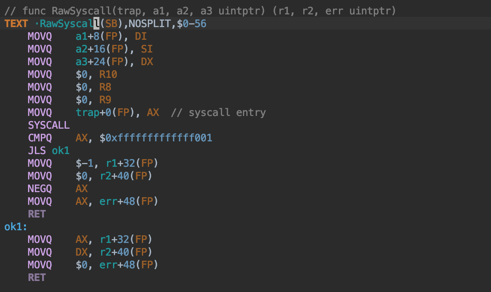
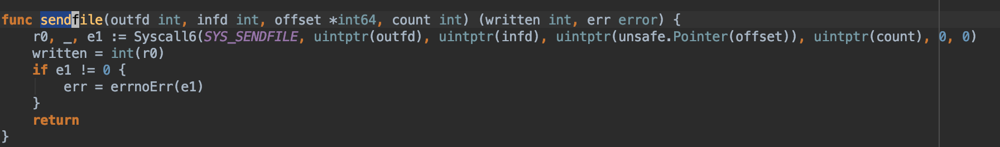

# 1 How go runtime handle syscall ?

最近遇到个线上服务频繁陷入系统调用导致go运行时创建了大量线程，影响到了服务质量，定位、解决问题之后，希望能进一步探究go运行时处理系统调用的过程，以便加深理解。参考了不少网友的分享，特别是知乎Golang Inernal专栏，结合个人的学习理解在此整理记录一下，与大家分享。

## 1.1 前言

在开始结合源码进行分析之前，先做下简单的介绍，方便先从整体上把握go对系统调用的处理过程，然后从第二部分开始，再结合源码介绍具体的细节。

系统调用分为阻塞系统调用、非阻塞系统调用，go里面对这些系统调用有归类整理，详见源文件：`/src/syscall/syscall_linux_amd64.go`。

如下图所示，sys开头的表示的是阻塞系统调用，会调用Syscall，以sysnb开头的是非阻塞系统调用，会调用RawSyscall，关于Syscall和RawSyscall的区别下面整理。阻塞型的系统调用本身会阻塞线程，为了避免线程阻塞导致协程不可调度，golang运行时要感知这样的系统调用并做特殊处理，非阻塞的系统调用直接调即可，不需要golang运行时参与。


Syscall定义在asm_linux_amd64.s里面，代码中有`runtime.entersyscall(SB)`和`runtime.exitsyscall(SB)`函数调用，这个是与golang运行时进行交互的，用于通知golang运行时我即将发起或者退出一个系统调用。

对于会导致阻塞的系统调用，都要通过Syscall来调用来通知golang运行时，以便golang运行时做处理，如创建新的物理线程调度器其它的goroutine，避免整个进程无线程可调度而最终被sysmon杀死进程。


对于某些非阻塞的系统调用，就不必再与golang运行时交互了，直接调用就可以，这样可以减少两次与golang运行时交互的函数调用开销，这里就掉的是RawSyscall：


网络io操作本来也是阻塞的，但是因为socket fd会被设置为non-blocking，系统调用虽然还是阻塞的系统调用，但是已经不会阻塞调用线程了，所以也无所谓了。

有个脚本mksyscall.pl根据syscall_linux_amd64.go里面定义的系通调用列表，就是第一张图那些带注释的部分，这个pl脚本会负责生成与之相关的系统调用函数，生成在syscall/zsyscall_linux_amd64.go里面。可以找几个有代表性的来看下生成的系统调用函数：

比如sendfile是阻塞的系统调用：


比如settimeofday是非阻塞的系统调用：


epoll相关的epollwait也是阻塞的，但是网络socket fd在go里面都统一设置为了nonblocking fd处理了，因此并不会阻塞。


## 1.2 开始分析源码

在讲述系统调用发生的协程调度之前，让我们看看go是如何进入系统调用的，理解了这个让我们不会对后面所说的一些东西感到很陌生。

golang对操作系统的系统调用作了封装，提供了syscall这样的库让我们执行系统调用。例如，Read系统调用实现如下：

```go
func Read(fd int, p []byte) (n int, err error) {
    n, err = read(fd, p)
    if raceenabled {
        if n > 0 {
            ......
        }
        ......
    }
    return
}

// 最终封装了Syscall
func read(fd int, p []byte) (n int, err error) {
    var _p0 unsafe.Pointer
    if len(p) > 0 {
        _p0 = unsafe.Pointer(&p[0])
    } else {
        _p0 = unsafe.Pointer(&_zero)
    }

    r0, _, e1 := Syscall(SYS_READ, uintptr(fd), uintptr(_p0), uintptr(len(p)))
    n = int(r0)
    if e1 != 0 {
        err = e1
    }
    return
}

// 我们只关心进入系统调用时调用的runtime·entersyscall
// 和退出时调用的runtime·exitsyscall
TEXT    ·Syscall(SB),NOSPLIT,$0-56
    CALL    runtime·entersyscall(SB)
    MOVQ 16(SP), DI
    MOVQ 24(SP), SI
    MOVQ 32(SP), DX
    MOVQ $0, R10 s
    MOVQ $0, R8
    MOVQ $0, R9
    MOVQ 8(SP), AX   // syscall entry
    SYSCALL
    CMPQ    AX, $0xfffffffffffff001
    JLS ok

    MOVQ    $-1, 40(SP) // r1
    MOVQ $0, 48(SP)  // r2
    NEGQ    AX
    MOVQ AX, 56(SP)  // errno

    CALL    runtime·exitsyscall(SB)
    RET
```

我们并不关心系统调用到底怎么实现。我们只关心系统调用过程与调度器相关内容，因为Golang自己接管系统调用，调度器便可以在进出系统调用时做一些你所不明白的优化，这里我要带你弄清楚调度器怎么做优化的。

## 1.3 进入系统调用前

我们前面说过，系统调用是一个相对耗时的过程。一旦P中的某个G进入系统调用状态而阻塞了该P内的其他协程。此时调度器必须得做点什么吧，这就是调度器在进入系统调用前call runtime·entersyscall目的所在。

>关于调度粘性（亲和性）问题，这里提一嘴：
>
>下文描述的时候有点偏故事性，关于GMP三者之间的关系，请务必注意goroutine、thread调度亲和性问题，这样就比较容易理解为什么G想再原来的M上执行，而M又想在原来的P上执行。
>
>p上有mcache、gFree，m上有tls，m运行g申请小于32K的内存是从p.mcache中分配，维持g、m、p之间的关系有助于复用之前p上建立的mcache，也有助于m创建新的g时复用p上之前维护的空闲g列表。
>
>当然可能还有一些其他的原因，这里暂时先不展开了 see：https://sourcegraph.com/github.com/golang/go/-/blob/src/runtime/runtime2.go#L613。

OK，我们继续讲运行时对系统调用的处理。

```go
void
·entersyscall(int32 dummy)
{
    runtime·reentersyscall((uintptr)runtime·getcallerpc(&dummy), runtime·getcallersp(&dummy));
}

void
runtime·reentersyscall(uintptr pc, uintptr sp)
{
    void (*fn)(void);

    // 为什么g->m->locks++?
    g->m->locks++;

    g->stackguard0 = StackPreempt;
    g->throwsplit = 1;

    // Leave SP around for GC and traceback.
    // save()到底在save什么？
    save(pc, sp);
    g->syscallsp = sp;
    g->syscallpc = pc;

    runtime·casgstatus(g, Grunning, Gsyscall);

    // 这些堆栈之间到底是什么关系？
    if(g->syscallsp < g->stack.lo || g->stack.hi < g->syscallsp)
    {
        fn = entersyscall_bad;
        runtime·onM(&fn);
    }

    // 这个还不知道是啥意思
    if(runtime·atomicload(&runtime·sched.sysmonwait)) {
        fn = entersyscall_sysmon;
        runtime·onM(&fn);
        save(pc, sp);
    }

    // 这里很关键：P的M已经陷入系统调用，于是P忍痛放弃该M
    // 但是请注意：此时M还指向P，在M从系统调用返回后还能找到P
    g->m->mcache = nil;

    g->m->p->m = nil;
    // P的状态变为Psyscall
    runtime·atomicstore(&g->m->p->status, Psyscall);

    if(runtime·sched.gcwaiting) {
        fn = entersyscall_gcwait;
        runtime·onM(&fn);
        save(pc, sp);
    }
    g->stackguard0 = StackPreempt;
    g->m->locks--;
}
```

上面与调度器相关的内容其实就是将M从P剥离出去，告诉调度器，我已经放弃M了，我不能饿着我的孩子们（G）。但是M内心还是记着P的，在系统调用返回后，M还尽量找回原来的P，至于P是不是另结新欢就得看情况了。

注意这时候P放弃了前妻M，但是还没有给孩子们找后妈（M），只是将P的状态标记为PSyscall，那么什么时候以及怎么样给孩子们找后妈呢？我们在后面详细阐述。

## 1.4 从系统调用返回后

从系统调用返回后，也要告诉调度器，因为需要调度器做一些事情，根据前面系统调用的实现，具体实现是：

```go
void
·exitsyscall(int32 dummy)
{
    void (*fn)(G*);

    // 这个g到底是什么？
    g->m->locks++;  // see comment in entersyscall

    if(runtime·getcallersp(&dummy) > g->syscallsp)
        runtime·throw("exitsyscall: syscall frame is no longer valid");

    g->waitsince = 0;
    // 判断能否快速找到归属
    if(exitsyscallfast()) {
        g->m->p->syscalltick++;

        // g的状态从syscall变成running，继续欢快地跑着
        runtime·casgstatus(g, Gsyscall, Grunning);

        g->syscallsp = (uintptr)nil;
        g->m->locks--;
        if(g->preempt) {
            g->stackguard0 = StackPreempt;
        } else {
            g->stackguard0 = g->stack.lo + StackGuard;
        }
        g->throwsplit = 0;
        return;
    }
    g->m->locks--;

    // Call the scheduler.
    // 如果M回来发现P已经有别人服务了，那只能将自己挂起
    // 等着服务别人。
    fn = exitsyscall0;
    runtime·mcall(&fn);
    ......
}

static bool
exitsyscallfast(void)
{
    void (*fn)(void);
    if(runtime·sched.stopwait) {
        g->m->p = nil;
        return false;
    }

    // 如果之前附属的P尚未被其他M,尝试绑定该P
    if(g->m->p && g->m->p->status == Psyscall && runtime·cas(&g->m->p->status, Psyscall, Prunning)) {
        g->m->mcache = g->m->p->mcache;
        g->m->p->m = g->m;
        return true;
    }

    // Try to get any other idle P.
    // 否则从空闲P列表中随便捞一个出来
    g->m->p = nil;

    if(runtime·sched.pidle) {
        fn = exitsyscallfast_pidle;
        runtime·onM(&fn);
        if(g->m->scalararg[0]) {
            g->m->scalararg[0] = 0;
            return true;
        }
    }
    return false;
}
```

G从系统调用返回的过程，其实就是失足妇女找男人的逻辑：

1. 首先看看能否回到当初爱人(P)的怀抱：找到当初被我抛弃的男人，我这里还存着它的名片(m->p)，家庭住址什么的我都还知道；
2. 如果爱人受不了寂寞和抚养孩子的压力已经变节（P的状态不再是Psyscall），那我就随便找个单身待解救男人从了也行；
3. 如果上面的1、2都找不到，那也没办法，男人都死绝了，老娘只好另想他法。

以上过程1和2其实就是exitsyscallfast()的主要流程，用怀孕了的失足妇女找男人再合适不过。 一个女人由于年轻不懂事失足，抛家弃子（家是P，子是P的G）。当浪子回头后，意欲寻回从前的夫君，只能有两种可能：

- 等了很久已然心灰意冷的夫君在家人的安排下另娶他人；
- 痴情的夫君已然和嗷嗷待哺的孩子们依然在等待她的归回。

当然第二种的结局比较圆满，这个女人从此死心塌地守着这个家，于是p->m又回来了，孩子们(g)又可以继续活下去了。 第一种就比较难办了，女人（m）心灰意冷，将产下的儿子（陷入系统调用的g）交于他人（全局g的运行队列）抚养，远走他乡，从此接收命运的安排（参与调度，以后可能服务于别的p）。 对于第二种可能性，只能说女人的命运比较悲惨了：

```go
static void
exitsyscall0(G *gp)
{
    P *p;
    runtime·casgstatus(gp, Gsyscall, Grunnable);
    dropg();
    runtime·lock(&runtime·sched.lock);
    // 这里M再次尝试为自己找个归宿P

    p = pidleget();
    // 如果没找到P，M讲自己放入全局的运行队列中
    // 同时将它的g放置到全局的P queue中进去，自己不管了
    if(p == nil)
        globrunqput(gp);
    else if(runtime·atomicload(&runtime·sched.sysmonwait)) {
        runtime·atomicstore(&runtime·sched.sysmonwait, 0);
        runtime·notewakeup(&runtime·sched.sysmonnote);
    }
    runtime·unlock(&runtime·sched.lock);
    // 如果找到了P，占有P并且开始执行P内的g，永不回头
    if(p) {
        acquirep(p);
        execute(gp);  // Never returns.
    }

    if(g->m->lockedg) {
        // Wait until another thread schedules gp and so m again.
        stoplockedm();
        execute(gp);  // Never returns.
    }
    // 找了一圈还是没找到，释放掉M当前执行环境，M不再做事
    // stopm会暂停当前M直到其找到了可运行的P为止
    // 找到以后进入schedule，执行P内的g
    stopm();

    // m从stopm()中返回以后，说明该m被绑定至某个P,可以开始
    // 继续欢快地跑了,此时就需要调度找到一个g去执行
    // 这就是调用schedule的目的所在
    schedule();  // Never returns.
}
```

话说到这里，其实这个M当前没有运行的价值了（无法找到p运行它），那么我们就将她挂起，直到被其他人唤醒。 m被挂起调用的函数是stopm()

```go
// Stops execution of the current m until new work is available.
// Returns with acquired P.
static void stopm(void)
{
    if(g->m->locks)
        runtime·throw("stopm holding locks");
    if(g->m->p)
        runtime·throw("stopm holding p");

    if(g->m->spinning) {
        g->m->spinning = false;
        runtime·xadd(&runtime·sched.nmspinning, -1);
    }
retry:
    runtime·lock(&runtime·sched.lock);
    // 将m插入到空闲m队列中，统一管理
    mput(g->m);
    runtime·unlock(&runtime·sched.lock);

    // 在这里被挂起，阻塞在m->park上，位于lock_futex.go
    runtime·notesleep(&g->m->park);

    // 从挂起被唤醒后开始执行
    runtime·noteclear(&g->m->park);
    if(g->m->helpgc) {
        runtime·gchelper();
        g->m->helpgc = 0;
        g->m->mcache = nil;
        goto retry;
    }

    // m->nextp是什么？
    acquirep(g->m->nextp);
    g->m->nextp = nil;
}
```

那么说到这里，其实很多事情都一目了然，当一个M从系统调用返回后，通过各种方式想找到可以托付的P(找前夫—>找闲汉)，求之不得最终只能将自己挂起，等待下次系统中有空闲的P的时候被唤醒。

## 1.5 sysmon

前面我们重点讲了一个m是如何陷入系统调用和如何返回的心酸之路。我们忽略了p的感情，因为他才是真正的受害者，它被剥夺了m，从此无人理会它嗷嗷待哺的孩子们(g)，并且状态还被变成了Psyscall，相当于贴上了屌丝标签，别无他法，只能等待陷入系统调用的m返回，再续前缘。 当然，这样做是不合理的，因为如果m进入系统调用后乐不思蜀，那P的孩子们都得饿死，这在现实社会中可以发生，但在数字世界里是决不允许的。 OK，组织绝对不会忽略这种情况的，于是，保姆（管家）出现了，它就是sysmon线程，这是一个特殊的m，专门监控系统状态。 sysmon周期性醒来，并且遍历所有的p，如果发现有Psyscall状态的p并且已经处于该状态超过一定时间了，那就不管那个负心的前妻，再次p安排一个m，这样p内的任务又可以得到处理了。

```go
func sysmon() {
    ......
    retake(now);
    ......
}

// 我们只摘取了sysmon中与P处理相关的代码分析：
static uint32
retake(int64 now)
{
    uint32 i, s, n;
    int64 t;
    P *p;
    Pdesc *pd;

    n = 0;
    // 遍历所有的P，根据其状态作相应处理，我们只关注Psyscall
    for(i = 0; i < runtime·gomaxprocs; i++) {
        p = runtime·allp[i];
        if(p==nil)
            continue;
        pd = &pdesc[i];
        s = p->status;
        if(s == Psyscall) {
            t = p->syscalltick;
            if(pd->syscalltick != t) {
                pd->syscalltick = t;
                pd->syscallwhen = now;
                continue;
            }
            if(p->runqhead == p->runqtail && runtime·atomicload(&runtime·sched.nmspinning) + runtime·atomicload(&runtime·sched.npidle) > 0 &&
                pd->syscallwhen + 10*1000*1000 > now)
                continue;
            incidlelocked(-1);

            // 因为需要将P重新安排m，所以状态转化为Pidle
            if(runtime·cas(&p->status, s, Pidle)) {
                n++;
                handoffp(p);
            }
           incidlelocked(1);
   ......
}
```

找到了处于Psyscall状态的P后，继续判断它等待的时间是否已经太长，如果是这样，就准备抛弃原来的还陷入syscall的m，调用handoff(p)，开始为p准备新生活。

我们接下来仔细分析下p是怎么过上新生活的，handoffp无非就是找一个新的m，将m与该p绑定，接下来将由m继续执行该p内的g。

handoffp()找到的新的m可能是别人以前的m(私生活好混乱)。由于这里获得的m是处于idle状态，处于wait状态（在stopm()中被sleep的），在这里，handoffp中会通过startm()来唤醒它，一个常见逻辑就是这个p里面还有g要执行那么就直接startm，这里的startm会通过mget获取一个空闲的m（如stopm暂停的m），获取不到就通过newm()创建一个m。

这里的startm以被唤醒的m为例继续说明，关于新创建的m被唤醒的m继续执行它被阻塞的下一条语句：

```go
stopm()
{
    ......
    // 从挂起被唤醒后开始执行
    runtime·noteclear(&g->m->park);
    if(g->m->helpgc) {
        runtime·gchelper();
        g->m->helpgc = 0;
        g->m->mcache = nil;
       goto retry;
    }

     // 将M和P绑定
    acquirep(g->m->nextp);
    g->m->nextp = nil;
}

// 由于m在sleep前的调用路径是exitsyscall0() –> stopm()，从stopm()中返回至exitsyscall0后，执行接下来的语句
func exitsyscall0(gp *g) {
    _g_ := getg()
    ......
    stopm()
    // m继续run起来后，执行一次schedule
    // 找到m->p里面可运行的g并执行
    schedule() // Never returns.
}

// One round of scheduler: find a runnable goroutine and execute it.
// Never returns.
func schedule() {
    _g_ := getg()
    ......
    if gp == nil {
        gp, inheritTime = runqget(_g_.m.p.ptr())
        if gp != nil && _g_.m.spinning {
            throw("schedule: spinning with local work")
        }
    }
    if gp == nil {
        gp, inheritTime = findrunnable()
        resetspinning()
    }

    if gp.lockedm != nil {
        // Hands off own p to the locked m,
        // then blocks waiting for a new p.
       startlockedm(gp)
       goto top
    }

    // 执行该gp
    execute(gp, inheritTime)
}
```

## 1.6 总结

本文介绍了go对系统调用的大致处理过程，感谢知乎网友[丁凯](https://www.zhihu.com/people/ding-kai-54/activities)在知乎的分享，结合个人理解，略作整理也分享给大家。
