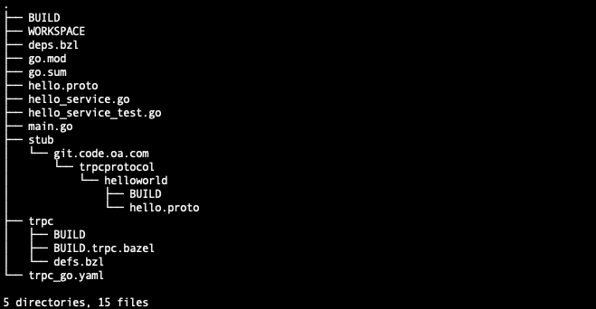
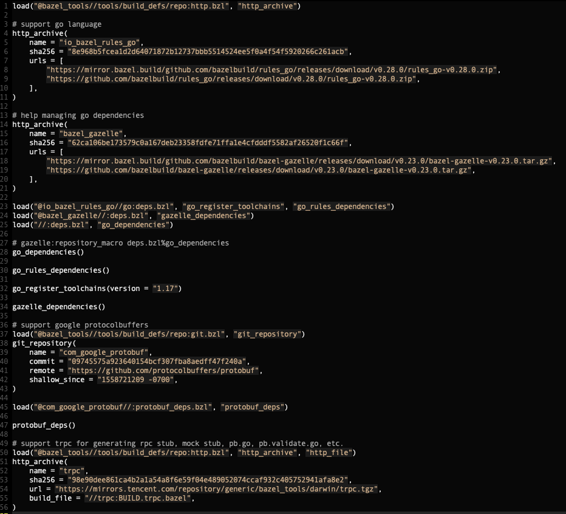
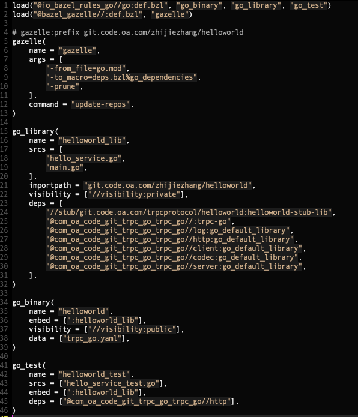
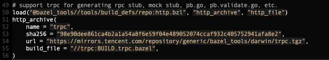

# **1 前言**

关于monorepo、multirepo的争论不绝于耳，至于采用哪种方式进行管理，要因地制宜地选择最合适的方案，要看到其优势，也要看到工具建设和迁移的成本。这里重点谈下各自的优势及什么时候适用Bazel构建。

## **1.1 monorepo**

如果团队采用的是希望改善代码复用、希望让烂代码无处遁形、希望构建一致的CI/CD标准并落地、希望更好地沉淀经验、希望更好地促进团队成员成长等等，考虑到这些，似乎monorepo是更好的代码管理方式。

但是也要考虑代码管理的规模、是否多语言技术栈、如何保证高效、封闭、可重复的构建。

虽然google、uber、twitter等很多国内外大厂都采用了monorepo方式进行管理，但是也要看到这背后投入的大量的基础工具、平台的建设，这些并不是每个公司、团队所能予以支持的。目前开源的技术方案也并非完整的解决方案。

谷歌为什么采用单仓：[Why Google Stores Billions of Lines of Code in a Single Repository](https://youtu.be/W71BTkUbdqE)

## **1.2 multirepo**

multirepo每个仓库代码规模小，灵活易管理，做什么调整也很方便，也不需要特别重的基础工具、平台的支持，当然如果有大规模代码检索等之类的工具加成，也算锦上添花。

对于小仓模式、大仓模式之争，微信同事曾经有专门做过一个具体的小仓模式实践分享。

## **1.3 构建系统**

这个世界就没有所谓的银弹，当我们企图用一种看似不错的方案解决问题时，这种方案本身也会重新引入一些新的问题。所以量体裁衣、因地制宜很重要，希望我们能结合自身情况（基础平台、工程素养现状、业务场景、业务迭代效率、产品定位等等）选择合适的方案。

ps：我认为，monorepo的规模至少要做到部门及以上级别，否则真的就是费力不讨好。

关于monorepo、multirepo的异同、优缺点这里就暂不讨论了，这里准备讨论下monorepo下的构建系统支持。

go一般用go module构建，java一般用gradle或者maven构建，c++一般用cmake或makefile构建…总之有很多类似的构建方式，现在是多语言同一个repo管理，如果依然各个语言各自一套构建系统的话，随着代码规模上升，会变得很难管理。

**一个好的构建系统必须需要解决如下几个问题：**

\- 如何建模待构建目标的依赖清单；

\- 如何实现高效地构建；

\- 如何保证可重复地构建；

\- 如何解决多语言构建问题；

目前来看，从互联网大厂及开源社区的反馈来看，谷歌开源的bazel应该是当前的主流方案。

# **2 Bazel基础**

本文后续讨论建立在开发团队基于“monorepo+multi-language”的背景下，应该如何使用bazel对trpc-go项目进行构建。与此无关的内容不予以讨论。

## **2.1 为什么用Bazel**

\- 代码管理方式：monorepo

\- repo中包含多种编程语言开发的projects；

\- 自定义rules、target来生成文件，如通过pb生成pb.go（不提交代码版本控制）；

\- 通过封闭构建，来保证可重复构建；

\- 希望能实现更细粒度的增量构建；

\- 希望能实现分布式构建；

\- 希望能利用构建缓存避免不必要地重复构建；

\- etc；

ps：if using multirepo && go build, forget bazel. it overkills your project.

## **2.2 Bazel核心概念**

bazel的上手成本相对熟悉go module的同学来说，还是有一定的学习成本的，学习bazel并不轻松，但是随着实践并陆续体会到monorepo+bazel带来的好处之后，会发现bazel是非常好的一个构建系统。当然，也可能体会不到 :(。

要想熟练使用bazel，理解其工作原理不可缺少的，我们先来了解下bazel构建的核心概念。

### **2.2.1 WORKSPACE**

WORKSPACE，是一个文本文件，位于repo根目录下，这样的repo也称bazel工作区。

WORKSPACE文件，定义了工作区下项目依赖的构建规则、外部依赖等，bazel构建targets时需要的输入、BUILD文件都在工作区下搜索，构建targets的输出也是存储在工作区中。

bazel运行过程中会在工作区根目录下生成名如“**bazel-\***”的多个目录，构建依赖、输出等就是存储在这些目录下。

### **2.2.2 BUILD**

BUILD，是一个文本文件，位于工作区根目录以及子目录下，用于定义package。BUILD文件用于描述待构建的targets，以及构建每个target的输入、输出。

### **2.2.3 TARGET**

TARGET，是构建目标的意思，它位于BUILD文件中，每个BUILD文件中可以有多个targets。

targets的类型是多种多样的，如cc_binary、cc_library、cc_test分别表示构建c++可执行程序、库、单元测试，java_binary、java_library、java_test分别表示构建java可执行程序、库、单元测试。

bazel内置支持的语言数量是有限的，只支持c++、java、python，其他语言要通过扩展rules来支持，比如rules_go提供了对go语言的构建支持，rules_go中定义了go_binary、go_library、go_test分别构建go可执行程序、库、单元测试。

同样地，我们也可以扩展rules来调用一些代码生成工具自动生成一些桩代码文件，比如根据pb文件自动生成pb.go、grpc.go，或针对trpc框架的pb.go、trpc.go、validate.pb.go、_mock.go文件等等。

### **2.2.4 RULES**

RULES，简言之就是一系列扩展规则，它允许我们扩展新的target类型。RULES的编写，是通过Starlark语言来完成的，Starlark是一门配置语言，特别适用于bazel rules的编写。后面我们会通过扩展rules来扩展trpc相关的target，以通过pb生成trpc框架需要的桩代码。

### **2.2.5 可见性**

编程语言提供了某些语言级别的可见性保证，如C语言可以利用static/extern来声明变量的链接属性（对编译单元内可见还是全局可见），C++、Java类提供了一些修饰符，Go提供了导出、非导出的支持。

Bazel内部定义了一些可见性的声明方式，允许在语言之上提供更进一步的控制。可能有些语言没有提供可见性保证，即便是语言提供了类似的保证，Bazel的这个能力也能使得我们对代码施加更进一步的控制。如Go package A导出了一个类型给package B使用（跨包，不得不导出，这是语言级别的限制），但是出于某种原因（如不打算长期维护）并不希望这个类型给更大范围的团队使用，就可以通过Bazel可见性来进行精细化约束。

### **2.2.6 封闭构建**

当开发人员写完代码本地编译成功了，代码提交后，其他人在自己的构建环境下却构建失败，可能原因有多种：

\- go版本不一致，如go1.13才引入了errors.Is/As/Unwrap等，他人构建环境可能是go1.12；

\- protoc及插件版本不一致，如protoc-gen-go旧版本不支持paths=source_relative选项可能导致生成的桩代码路径位置错误，编译时引用失败；

\- mockgen版本不一致，如新版本要求go.mod已初始化，反之则会mock桩代码生成失败，go test因为缺少必要mock代码而构建失败；

\- etc；

类似的原因还有很多，无法一一列举，我们应花功夫消除这些破坏可重复构建的因素。封闭构建，简言之就是保证构建环境的一致，并保证制品的可重复构建。

要实现封闭构建，就要识别当前构建中的这些破坏性行为，并予以消除，如将分散在各开发同学机器上的构建工具锁定一个稳定的版本并打包成构建依赖，在WORKSPACE中定义该依赖及版本，构建时自动拉取该依赖并用其进行构建。

## **2.3 Bazel构建实践**

理解了上述的一些Bazel核心概念之后，看几个使用Bazel来进行构建的工程实例，加深理解。

### **2.3.1 Bazel构建demo**

\- Building a C++ Project: https://docs.bazel.build/versions/4.2.1/tutorial/cpp.html

\- Building a Java Project: https://docs.bazel.build/versions/4.2.1/tutorial/java.html

\- Building a Android Project: https://docs.bazel.build/versions/4.2.1/tutorial/android-app.html

\- Building a iOS Project: https://docs.bazel.build/versions/4.2.1/tutorial/ios-app.html

把上述4个构建实例全部看完，应该已经大致掌握了Bazel的使用了。

有可能读者并不熟悉C++、Java、Android、iOS，有可能只熟悉Go呢？即便熟悉，要想直接从go module迁移到bazel构建也还是有相当大的成本的。所以我们还是要单独介绍下如何一步步从go module迁移到bazel构建，然后我们再介绍最终沉淀下来的trpc-go项目构建方案。

### **2.3.2 Bazel构建Go**

#### **Go语言支持**

不同于使用Bazel构建C++、Java，Bazel支持的内置语言不支持Go，需要引入扩展的rules来支持Go构建，即：https://github.com/bazelbuild/rules_go，参考bazelbuild/rules_go readme在WORKSPACE中增加相应的starlark脚本即可支持到。

BUILD文件中，也要从bazelbuild/rules_go中加载target定义，如go_binary、go_library、go_test，此时我们便可以在BUILD文件定义go相关的targets了。

#### **Go依赖管理**

go工具链有支持go的依赖管理，开发人员在写代码的时候，go工具链能够自动地协助开发人员更新go.mod、go.sum，是非常易用的。ps 当然关于go module的不足我们就不讨论了。

以go1.16为例，当我们代码中import了某个外部依赖，当我们编译的时候，为了保证可重复构建，go1.16要求我们显示地通过“go get $dependency”的方式将依赖添加到go.mod、go.sum中。这个过程比较严谨，开发人员在确认没有什么风险的时候，也会通过“go mod tidy”来批量将依赖更新到go.mod、go.sum中（只是为了方便）。

要知道，go mod对依赖的管理是基于源代码中的importpath分析来实现的，bazel中如果要描述go packages之间的依赖关系，也是要采取类似的方式的，但是谁来做这个工作呢？rules_go这个扩展的规则集。

一般来说，我们是要通过go_repository来定义外部依赖的（包括别名、importpath、版本、hash），然后在go_binary、go_library的deps属性中引用这些外部依赖，但是联想go get逐个添加的情况，逐个手写也bazel go依赖是会很啰嗦的。

能否像执行“go mod tidy”一样自动更新所有的依赖呢？gazelle！

gazelle，即：https://github.com/bazelbuild/bazel-gazelle。它能分析go源码中的importpath来自动更新deps.bzl（外部依赖）并自动生成go_binary、go_library、go_test，同时还能自动填充这些targets的deps属性。如果项目中同时支持go module、bazel构建，gazelle也可以通过go.mod、go.sum来更新deps.bzl以及targets的依赖。

#### **Go桩代码**

在微服务开发中，RPC通信模式是当下主流方式，通信双方基于同一份IDL生成rpcstub文件，如grpc框架需要基于pb文件生成pb.go、grpc.go。pb也不属于bazel官方支持的语言，也是需要通过引入额外的rules扩展来支持对pb相关的桩代码的生成。

rules_proto，即：https://github.com/bazelbuild/rules_proto，是对pb的扩展支持。

ps：大家可能会困惑，需要引入这么多扩展的rules？其实，这个只需要在WORKSPACE的根目录中配置一次就可以了，后续在工作区中开发，大家只关心BUILD文件编写就可以了。而且我们也会在工作区下放置一些shell脚本，运行脚本就能快速生成一个模板BUILD文件。这样使用起来就会方便多了。

#### **GRPC构建**

bazelbuild/codelabs，即：https://github.com/bazelbuild/codelabs，提供了一个比较完整的bazel构建demo，同一个WORKSPACE下包括了go、java、typescript、android、proto多个targets的构建，这也算个极简的monorepo了。

### **2.3.3 构建trpc服务**

我们将在第3节构建trpc服务中详细展开，我们推荐的目录组织方式、当前要做的工作，将来要进一步完善的工作。

这里我们先简单梳理下，使用bazel构建trpc服务（先考虑trpc-go），我们需要考虑哪些：

#### **go语言构建支持**

前面我们介绍了基于rules_go扩展了对go的支持，以及基于go_binary、go_library、go_test来定义不同类型targets的方式。这部分内容对我们不再是挑战。

#### **go module依赖管理**

前面我们介绍了基于rules_go扩展了对go的支持，以及基于go_repository定义外部依赖并通过targets的deps对依赖进行显示声明，也介绍了基于gazelle进行辅助依赖管理。这部分内容对我们不再是挑战。

#### **pb桩代码支持**

前面我们提到了rules_proto对pb桩代码进行支持，通过rules_proto扩展的target类型，我们能生成pb.go文件，通过proto grpc扩展规则，我们也能生成grpc.go文件。但是trpc有点不同的是，trpc相关的桩代码生成逻辑，是通过统一的一个trpc命令行工具来生成的，包括：

\- $pb.pb.go：trpc调用protoc-gen-go生成；

\- $pb.pb.validate.go：trpc调用protoc-gen-secv生成；

\- $pb.trpc.go：trpc生成的适配trpc框架的rpcstub，作用等同于grpc.go；

\- $pb_mock.go：trpc调用mockgen生成；

我们需要自定义新的规则集来支持trpc相关的代码生成逻辑，包括要定义对应的target类型，比如trpc_proto，其输入为pb文件，输出为对应的上述桩代码。trpc_proto该target应该作为trpc服务中go_binary、go_library、go_test的输入，准确地说是其trpc_proto的输出作为这几个target的输入。

ps：当然我们可以在将trpc_proto作为go_library的输入，让go_binary、go_test依赖go_library来完成与pb桩代码的链接，最终成功构建。

#### **现实比想象复杂**

bazel构建的掌握还是有一定学习成本的，当前公司里面，大范围采用monorepo+多语言开发的团队，采用bazel进行构建的实践并不多，借鉴加改进是必须的。

依赖管理，并不如前文介绍那么简单，实际工程中依赖管理要复杂一些，要求对bazel的工作原理、扩展的rules的实现有更加清晰、完整的认识，否则构建失败将是家常便饭。

trpc工具的工作方式，安装加载配置文件、模板依赖$USER、$HOME，违背了bazel的封闭构建原则，需要进行定制化改造，以在bazel中正常使用。

bazel构建，如果一不小心执行了bazel clean，那么后续再次构建将非常耗时，要拉取并构建大量的依赖工具，如protoc等等。大仓模式下，分布式增量构建、缓存是必须要开启的，否则与multirepo+go build相比构建效率严重下降。

接触bazel时间不长、实践经验偏少，折腾两周，现仍存在一些未知事项。bazel的掌握，可能需要在推行monorepo+bazelbuild的团队进行适当的培训，加以指导。

# **3 Bazel构建trpc**

这里介绍bazel构建trpc服务（如无特殊提及，这里的trpc服务均代指trpc-go服务），包括独立的trpc服务的构建、后续工程目录的组织方式、后续协议的托管方式，以及其他保证封闭构建、提高构建效率所需要做的工作。

## **3.1 构建trpc服务**

### **3.1.1 快速体验**

为演示如何使用bazel构建一个trpc服务，准备了一个demo，以截图的形式提供。

**项目目录结构如下图所示：**

 

**和trpc命令生成的模板工程有何不同？**

\- 根目录下多了两个文件：WORKSPACE、BUILD文件；

\- stub目录下多了BUILD文件；

\- stub目录下少了hello.proto相关的go文件、go.mod文件、go.sum文件；

**确保已经安装bazel（macOS可以brew install bazel），cd到项目根目录：**

\- 执行“bazel build //:helloworld”，即完成服务二进制程序的构建；

\- 执行“bazel run //:helloworld -- -conf=trpc_go.yaml”来启动程序；

\- 执行“bazel test //:helloworld_test”，将构建失败，现在还没有支持mock代码的生成；

 **FIXME** mockgen执行失败

### **3.1.2 配置WORKSPACE**

如下图所示，通过注释部分可以看到做了哪些工作：支持go语言、通过gazelle辅助go依赖管理、支持protobuf、支持我们自定义的trpc。需要注意的是自定义的trpc是放置到该示例工程的trpc目录下的，将来推行大仓时，我们可以将其放在monorepo的根目录下。

 

### **3.1.3 配置BUILD**

项目根目录下的BUILD中定义了该trpc服务的几个构建目标：

\- gazelle是为了辅助从go.mod文件自动更新依赖、targets中的deps属性的；

\- go_binary定义了要构建的可执行程序，它依赖helloworld_lib这个target，这个target由go_library定义，这里的这个定义实际上是所有源代码构建而成的一个库；

\- go_library定义了一个库，它被go_binary引用，它里面包含了一系列要构建的源文件，有工程内部的main.go、hello_service.go，也有外部依赖@repo//path-to:target，也有版本控制系统中未纳入的一些文件编译出的库，便是//stub/..../helloworld:helloworld-stub-lib，这个依赖在stub/..../helloworld/BUILD中定义，其实它把pb文件对应的pb.go、trpc.go编译成了可链接的库；

\- go_test定义了单测测试相关的构建，这里先不细看；

ok，现在我们先大致了解这几个target是怎么回事即可。

 

继续看下stub/..../helloworld/BUILD文件中的配置信息：

\- 加载了工作区根目录下的trpc/defs.bzl，其中定义了一个函数trpc_proto，这其实描述了一个新target类型的定义；

\- 使用trpc_proto定义了一个新的target，其输入为stub目录下的hello.proto文件，其输出当前由trpc_proto的生成文件列表决定，当前只生成pb.go、trpc.go；

\- 加载rules_go并通过go_library定义了一个新的target，这个target将trpc_proto的输出作为作为，同时该target也声明了一些外部依赖，该target编译出的库最终其导入路径为：脱敏处理，${importPath}/trpcprotocol/helloworld，通过这个importpath来帮助go编译器进行链接；

 

到这里，我们了解了WORKSPACE、BUILD文件的大致配置，应该能理解bazel编译过程中的大致工作方式了。

接下来我们再来看下我们自定义的trpc_proto target类型是如何定义的。

### **3.1.4 扩展RULES**

**load("//trpc:defs.bzl", "trpc_proto")**, trpc_proto实际上只是一个starlark编写的函数，就放在工作区根路径下的trpc/defs.bzl文件中。

 

可能读者对starlark不熟悉，但是阅读应该能知晓其含义的。trpc_proto这个函数就是将定义的target中的属性作为参数传入，然后执行。该函数确定了要输出的文件列表，然后调用trpc_create函数对pb文件进行处理。trpc_create函数内部调用了trpc命令完成对pb文件桩代码的生成逻辑。

但是这些工具从哪里来呢？通过trpc_create函数中引用的$$TRPC的值，可以确定trpc命令行即为//trpc:trpc，通过trpc/BUILD文件可以确定，//trpc:trpc指的就是//@trpc//:trpc。

 

那@trpc这个外部依赖是从哪里来的呢？@trpc这个外部依赖又包含了哪些内容呢？

外部依赖都是在WORKSPACE中定义的（或者由starlark函数从其他文件中加载而来），我们看下WORKSPACE文件中对该外部依赖trpc的定义，其实@trpc是引用的腾讯软件源上的一个压缩包，http_archive会下载该压缩包放到bazel-*临时目录中，并解压。

 

这个压缩包中包含的内容都有哪些呢？可以下载下来看看，包含了trpc、protoc等常用命令以及pb文件。这个压缩包的内容，实际上是由 https://{脱敏处理}/go-kits/bazelbuild下的publish.sh脚本构建并推送到腾讯软件源的。

上述http_archive中还有个配置项build_file，它表示将//trpc:BUILD.trpc.bazel作为该外部依赖@trpc的BUILD文件，这个文件干了什么呢？它定义了该package（BUILD对应package）的可见性，这样我们才能引用其下的一些trpc、protoc等二进制工具以及include/**下的pb文件。

## **3.2 沉淀构建脚本**

为方便编写WORKSPACE、BUILD文件，需定义几个shell脚本，帮助快速生成该类文件：

\- 沉淀常用的WORKSPACE配置到生成脚本generate_workspace.sh，放到公共库目录下；

\- 沉淀常用的BUILD配置到生成脚本generate_build.sh，放到公共库目录下；

开发人员不管是定义新的WORKSPACE，还是在现有WORKSPACE中编写BUILD，借助上述脚本可以快速生成对应的文件模板，稍加修改便是。

## **3.2 目录组织方式**

如果后续推行大仓，大致的目录组织方式是这样的（**红色部分与trpc构建相关**）：

\- monorepo根目录下放置上述WORKSPACE；

\- monorepo根目录下放置上述自定义的trpc相关的bazel定义；

\- monorepo根目录下组织子文件夹，如大仓是BG级规模，子文件夹可用来区分部门、业务；

\- 部门、子业务下的项目按projects维度进一步组织子文件夹；

\- project维度就可以对应到我们的trpc微服务了；

\- project下的文件夹（go package)对应bazel package，需编写BUILD文件；

\- project下的go.mod、go.sum其实都可以删除了，保留应该也可以；

\- project下的stub下仅保留pb文件；

\- project下不保留stub目录，协议托管在rick，通过go_repository下载，project下BUILD中增加原stub/..../helloworld/BUILD中target定义即可；

\- project下的go.mod、go.sum其实都可以删除了，保留应该也可以，辅助gazelle生成依赖；

\- @trpc常用工具，不再依赖开发个人、公共构建机上安装的资源，统一在软件源维护；

\- 其他；

## **3.3 协议托管方式**

### **3.3.1 随项目stub子目录**

这种方式前文已经演示过了，可以支持到。

### **3.3.2 协议管理平台托管**

协议管理平台也是托管到工蜂，可以通过go_repository下载，也可以支持到。

这两种协议托管方式都是可以支持到的。

## **3.4 保证封闭构建**

通过封闭构建来保证可重复构建，我们需要识别可能破坏封闭构建的一些行为，将其移除。

目前观察，trpc命令及其依赖的工具的一些工作方式，可能有违背封闭构建的行为，如强依赖$USER、$HOME来安装加载配置、模板信息。工具侧可能需要进行对应的改造。

## **3.5 改善构建效率**

如果推行大仓+bazelbuild，需要把bazel的分布式构建、增量构建、缓存优势发挥出来，bazel cluster需要提前做相应的规划。

掌握bazel构建和简单的go build管理起来，还是有一定的上手成本的 :)，想让大家使用monorepo+bazel build而非monorepo+go build，还是需要尽快做准备、优化bazel构建体验。说一千道一万，不如美好的初体验。

# **4 总结**

本文总结了Bazel构建的优势、核心概念、示例demo，以及使用Bazel构建trpc服务的一点实践总结，以及后续可行的目录组织、协议托管方式、其他相关工作。

对Bazel相关的最佳实践还需要进一步去学习、探索，以充分发挥Bazel构建的优势。

最后也感谢小伙伴等给予的反馈、提供的可供参考的bazelbuild工程。

# **5 参考内容**

1、官方bazelbuild文档

2、bazelbuild/codelabs

3、book: beginning bazel

4、PCG个别团队的go bazelbuild实践，[go项目bazel迁移](https://docs.qq.com/doc/DVGxWWEt0WHpwQnZh)

​     TEG个别团队的bazelbuild实践：https://脱敏处理/yak/yak2

5、其他km文章及外部分享

6、[Bazel学习笔记](https://blog.gmem.cc/bazel-study-note)