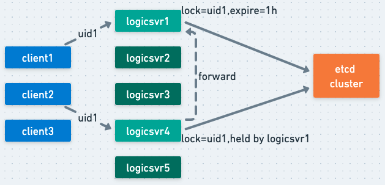
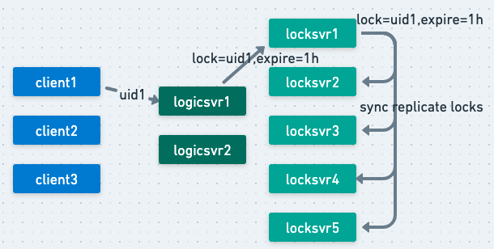
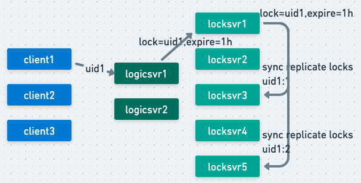

## 问题背景

在微服务架构下，经常面临一些事务性处理需要考虑一致性的场景，笔者工作过程中，很多场景最终都采取了可用性优先、数据最终一致的方案。最后我们可能也会结合一些对账之类的手段来发现异常并修复不一致的数据。

归根结底，是因为微服务架构下上述事务性处理方案没有保证刚性事务的ACID原则，其弱化了对A、C的控制，OK，这种方案并非不可接受的，只要业务场景适用即可。这里还有一点就是I（Isolation）的原则，如何保证微服务架构下事务处理的隔离性呢？

分布式锁，就是大家常用的方案，只不过关于对分布式锁的认识，可能大家认识的程度并没有自己认为的那么到位。

## 常见方案分类

分布式锁，归根究底是为了保证任务的排他性执行。但是为了排他性执行的初衷却可能是不同的，所以我们接下来会先按照要解决问题进行分类。然后呢，考虑到可用性、正确性，实现分布式锁的具体方法也是不同的，然后我们也可以按照实现方式进行分类。

### 按解决问题分类

- **解决效率类问题**：为了避免资源浪费，如每天统计下业务下所有服务接口成功率数据，这类定时任务也是多机部署的避免单点问题，但是只要一台机器执行就行了，属于解决效率类问题。没有必要多台机器执行，但是即便都执行了也没啥影响，只是后面执行的覆盖掉前面的执行了，仅此而已。
- **解决正确性问题**：任务必须排他性执行，如果并发执行则存在正确性问题。比如用户购买游戏道具时需要读取玩家金币数、扣金币、写回，这里涉及到典型的Read、Modify、Write的问题，如果这个操作时序不是排他性的，就掺杂着重置、送礼等各种可能修改金币的操作时序，则会导致正确性问题。

### 按实现方式分类

- 基于缓存实现：比如利用redis、memcache等实现，分布式缓存一般提供了get、set的能力，允许给key、value指定版本、排他性、过期时间属性，来实现分布式锁。
- 基于共识算法实现：比如etcd、zk这类底层有raft、zab共识算法支撑的组件，借助他们可以比较可靠的实现分布式锁，至少能保证分配锁时不会导致client错误持有锁。

在实际实现、使用分布式锁时，我们多数时候是冲着正确性去的，但是方案本身其实是不完备的，但是我们却将其当做了“正确的”。

## 常见方案介绍

### 基于redis单机版

比较常见的就是单机版的redis实现版本，如下所示：

```bash
# 加锁操作
SET resource_name my_random_value NX PX 30000

# 解锁操作
if redis.call("get",KEYS[1]) == ARGV[1] then
    return redis.call("del",KEYS[1])
else
    return 0
end
```

实际情况是单机版redis存在单点问题，为了解决这个问题，通常又会给redis master挂个slave来备份数据，但是redis的备份机制是异步的，所以仍然存在主备切换时丢失锁数据而导致的错误加锁情况，解决不了正确性。

### 基于redis集群版

集群版的redis，用的比较多的是redlock算法。redlock算法主要是解决单点故障问题，它的主要思想是，假设集群中有N个（建议值5）master节点，这些master节点及其replicas各自维护一些不相干的keyslots。加锁时，client先获取本地时间，然后串行地向N个节点发起请求，是串行的。

至于详细的实现，redis官网上有这些推荐实现的github repo链接，可以自己去找找看。

其实这个算法也解决不了网络波动、分区极端场景下，依然会导致client错误持有锁的情况，比如1、2、3、4、5个节点，一开始网络正常client1持有了1、2、3上的锁，后面网络波动导致client只能访问3、4、5，并且3发生了主备切换而备份上缺少数据，client依然能在3、4、5上获得相同锁。

> 尽管redlock算法提出了一些可以缓解正确性被破坏的想法，但是仍然不能保证分配锁时的正确性。

### 基于etcd实现

etcd本身是基于raft算法实现的副本的状态复制，是有可靠的共识理论支撑的工程实现，另外etcd号称其raft算法实现有着比paxos算法更好的性能（这个没求证，多数情况下paxos算法可能性能更优点，也不一定非得有master节点），感兴趣的可以自行了解。

基于etcd的分布式锁实现，已经内置在etcd中了，直接使用即可。

因为示例代码的篇幅原因、go.mod设置等，我们就不在这里占用太多篇幅了，感兴趣的可以直接查看这里的示例代码：https://github.com/hitzhangjie/codemaster/blob/master/distlock/main.go。

### 思考下

我们从解决效率问题的分布式锁，到解决正确性问题的分布式锁，对锁分配正确性的要求提升了一档，关于其实现方案，也从基于redis、redis集群版的方案，也过渡到了基于raft算法的etcd实现（其他的基于paxos、zab共识算法的类似就不介绍了），我们解决了锁服务分配锁时的正确性问题，但是这样就能保证任务排他性执行了吗？

不能！client在使用锁的时候，可能会出现如下情况：

- client出现了崩溃、逻辑bug，导致锁没有被正确地释放掉，如果锁没有过期时间，将导致其他client加锁时出现死锁；
- client加锁时设置过期时间，但是过期时间可能设置的过短，锁过期被etcd清理然后又重新分配给了其他client，然后旧client还以为自己别锁保护的临界区内还可以肆意妄为，导致并发执行错误；
- client加锁时设置了合理的过期时间，但是自身因为其他原因出现了一定时间阻塞，恢复后继续执行，但是锁实际已经过期被释放；
- client执行操作时锁确实是有效的，但是在其发起对下游的请求后，下游继续处理期间锁过期，其他client持有了锁并发继续执行操作；

看到没，即便是锁分配是正确的，client使用锁时依然无法100%保证正确性，这个问题能100%解决吗？不能，但是可以尽可能缓解，比如合理设置锁过期时间，比如请求方调用下游服务时，把锁信息带给下游让下游能够去锁服务校验锁有效性。

## google chubby

chubby是谷歌内部的专用的锁服务，没有对外部开源，但是通过其发表的论文，开源社区实现了zookeeper。这里只简单介绍下chubby的核心思想。

- 易用性：以锁服务api的形式方便业务接入
- 容错设计：
  - 副本机制：锁服务节点，加解锁操作通过 paxos复制到副本。避免节点故障数据丢失问题，同时paxos复制保证了数据的同步准确性；
  - 锁过期机制：锁服务分配的锁都是有过期时间的，过期的锁会被清理掉。避免client锁持有者因为逻辑错误、崩溃、阻塞等导致锁长期未释放导致的死锁问题；
  - 锁清理机制：client锁持有者有可能出现崩溃，锁服务和client之间维持着一个会话，当检测到对端不可用时，锁服务会主动清理该client申请添加成功的锁。避免相关的锁不能及时被释放（不必等到锁过期，chubby锁是粗粒度锁，可长达几个小时）；
  - 锁序号机制：只有client、server、锁服务全部参与进来，才能尽可能保证任务执行的排他性，锁服务可以保证锁分配的正确性，但是毕竟是建议性锁，client应该尽可能在锁有效期内完成所有操作，而下游server应该在执行操作前校验client传递的持有锁信息的有效性，校验是在server和锁服务之间完成的，这里的锁信息主要指的就是锁的序号（类似版本号的玩意）；
  - 持久化机制：每个节点挂掉后可能恢复，恢复后它的数据是全部丢失还是可以恢复回来？一般是要借助合适的存储手段对这些数据进行存储，然后节点后恢复可以快速恢复。chubby是如何做的，感兴趣的可以自己查下。

我们看到google chubby确实考虑的比较周全，但是它也有自身的局限性。它适合用来做粗粒度的锁服务，比如锁持有时间长达几十分钟、几个小时这种，对于细粒度锁，比如小于1s，这种就不太合适了，为什么这么说呢？

chubby是基于paxos来做的，paxos能保证状态复制的正确性，是基于多轮rpc通信来保证的，而rpc有网络通信开销，对于延迟敏感的处理路径，业务不一定能接受这个开销。而且chubby是有主节点的（paxos本身支持无主节点，但是代价是更多的消息交换），有主节点瓶颈的。因此，google内部也是将其用作粗粒度锁的，比如一些分布式系统的选主。

## 如何方案选型

业务中如果希望引入分布式锁，选型的时候可以思考下自己到底是解决哪类问题？

- 如果是为了解决效率类问题，直接用redis方案就挺不错的，考虑到单点问题可以挂个slave，也没啥问题；
- 如果是为了解决正确性问题，也可以用redis redlock方案，但是要明白其可能存在的风险，业务能否接受；
- 如果对正确性非常重视，对于并发写冲突的情况完全不可接受，反而可以接受一些可用性损失，那我建议直接用etcd、zk等方案更合适；
- 如果业务更追求可用性，同时尽最大可能保证正确性，那也不妨考虑redis redlock，如果也不想引入额外组件增加运维工作量，也不妨考虑自研一个分布式锁；

## 自研分布式锁

### 方案1：和业务紧密结合的经济使用方案

现在只想优先保证业务可用性前提下，尽最大程度保证正确性。可以考虑如下方案，结合下图进行一下简单说明：



client（上游服务）访问一个下游逻辑服务时，如果uid相同的话，为了尽可能并发对同一个用户的数据做并发RMW操作时出错，需要分布式锁进行排他性控制。

分布式锁的分配，可以考虑etcd来分配保证锁分配的正确性，但是之前考虑到etcd也是基于共识算法的，其大概率也不适合做细粒度锁支持，另外其failover时间一般是要10~20s左右的，如果业务中请求量很大，这么长时间不可用是不可接受的。

我们可以进行这样的优化：

- 锁分配还是由etcd来分配，但是我分配的是一把大锁，什么意思呢？
- 当某个uid1请求到来，client1希望请求logicsvr集群做某种操作时，这里client1通过一致性hash的方式，将uid=uid1请求发到节点logicsvr1处理，logicsvr1现在要rmw uid1的数据，为了保证排他性执行的正确性，它向etcd申请加锁，这个锁有效期比较长，比如1h，以后所有uid1的请求都会通过一致性发送到logicsvr1来处理，因为这个锁一直被logicsvr1持有着，不会有其他logicsvr和它并发rmw，但是？
- 当client1请求发生路由漂移，请求发到了不是logicsvr1而是logicsvr3之后，logicsvr3发现自己没有锁，怎么办，肯定是要先申请加锁，此时etcd告诉它锁已经存在了不能加锁，etcd主节点的读操作效率是可以的，所以这种路由漂移情境下量也不会很多，对etcd加锁请求的开销是不用太担心的。
  - 此时logicsvr3知道锁当前是logicsvr1持有，它可以转发请求给logicsvr1去处理；
  - 大多数情况下转发过去logicsvr1会处理成功，因为此时只是路由漂移导致的，并不是logicsvr1挂掉了；
  - 如果logicsvr1挂掉了，etcd也会清理掉起持有的锁，此时logicsvr3加锁成功，自己做处理就可以了；

这个方法可以应对：

- 正常情况下的排他性执行问题，避免了每个操作都申请锁的开销；

- 异常情况之一，logicsvr扩缩容等其他原因导致的路由漂移时的排他性执行问题；

这个方法解决不了：

- 如果logicsvr内部发生了网络波动，导致内部节点间转发等出现问题，就会退化为全部向etcd申请加锁的情况，可能会导致链路处理latency上升，etcd负载加重。

### 方案2：稍微通用点的分布式锁方案

再一种方案，就更容易想到些，我们可以基于多数派投票的方式来完成复制，每当申请加锁时，我们直接在当前locksvr加完锁后，同步地复制到其他locksvr实例节点，多数成功才认为成功并返回给client（如果失败可以异步地发起清理）。



这种缺点就是每个locksvr节点相当于复制了完整的锁数据，且集群中消息量会比较多。

那我们可以用一致性hash复制的方法来完成复制，比如locksvr收到请求lock(uid1)之后，可以拿这几个做key：uid1:0、uid1:1、uid1:2，分别计算一致性hash对应的节点，假设为locksvr1、locksvr3、locksvr5，那么写入即可，多数成功就认为成功。



当然考虑到并发写入时有助于减少latency，也可以把这个请求加锁、复制锁的操作全部由locksvr来发起，那最大延迟就取决于响应最慢的哪个locksvr节点。

这个方法可以应付：

- 锁方案比较通用，不用在logicsvr内部写那些加锁后判断锁持有者、转发请求给锁持有者处理的特殊逻辑；
- 大部分正常场景可以应付；
- locksvr本身内部的扩缩容、故障导致的路由漂移，可以应付（除非uid1对应的所有写入节点全挂掉了）；
- 锁数据存储全部是内存内计算，性能应该是没问题的；
- 也不需要引入额外的什么组件；

## 总结

最终需要什么样的方案，还是取决于实际的业务场景，没有什么方案可以以不变应万变。

## 参考内容

[0] 如何实现分布式锁, https://martin.kleppmann.com/2016/02/08/how-to-do-distributed-locking.html

[1] 分布式锁需要各参与者参与, https://hazelcast.com/blog/long-live-distributed-locks/

[2] 谷歌锁服务chubby论文, https://github.com/hitzhangjie/distributed-system-series/blob/master/papers/distributed%20lock%20-%20chubby.pdf

[3] 伸缩性更好的层级chubby, https://github.com/hitzhangjie/distributed-system-series/blob/master/papers/distributed%20lock%20-%20hierarchical%20chubby.pdf

[4] etcd实现分布式锁, https://medium.com/@felipedutratine/distributed-lock-with-etcd-in-go-d21e7df145bc

[5] redis分布式锁redlock, https://redis.io/docs/reference/patterns/distributed-locks/

[6] 分布式锁jepsen验证框架, https://github.com/dist-sys-dev/jepsen

[7] 根据论文实现的chubby, https://github.com/dist-sys-dev/chubby

[8] 层级chubby实现, https://github.com/dist-sys-dev/Hierarchical-Chubby


