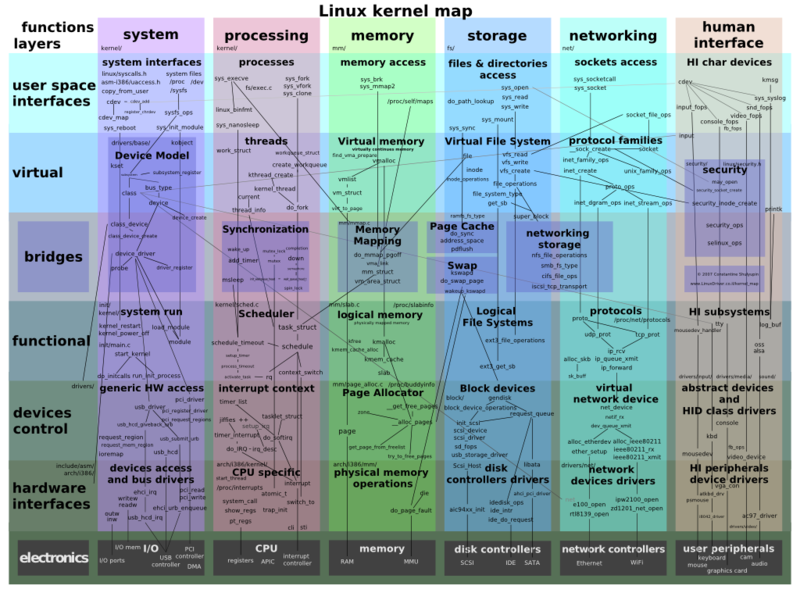

### 问题背景

c10k, c100k甚至c10m，这些问题大家已经不再陌生，聊起来可能显得有点枯燥？新技术层出不穷，至少我自己对这些问题有了些新的认识，需要更新沉淀下我的“小宇宙”。

### c10k问题, 1999, 1Gbps Ethernet

> The **C10k problem** is the problem of optimizing [network sockets](https://en.wikipedia.org/wiki/Network_socket) to handle a large number of clients at the same time.[[1\]](https://en.wikipedia.org/wiki/C10k_problem#cite_note-C10K-1) The name C10k is a [numeronym](https://en.wikipedia.org/wiki/Numeronym) for [concurrently](https://en.wikipedia.org/wiki/Concurrent_computing) handling ten thousand connections.[[2\]](https://en.wikipedia.org/wiki/C10k_problem#cite_note-Liu-Deters-2) Handling many concurrent connections is a different problem from handling many [requests per second](https://en.wikipedia.org/wiki/Requests_per_second): the latter requires high throughput (processing them quickly), while the former does not have to be fast, but requires efficient scheduling of connections.

就是说，**c10k解决的是1w连接的高效调度处理问题，而非请求吞吐量问题**。

> The problem of socket server optimisation has been studied because a number of factors must be considered to allow a web server to support many clients. This can involve a **combination of operating system constraints and web server software limitations**. According to the scope of services to be made available and the capabilities of the operating system as well as hardware considerations such as multi-processing capabilities, a multi-threading model or a [single threading](https://en.wikipedia.org/wiki/Single_threading) model can be preferred. Concurrently with this aspect, which involves considerations regarding memory management (usually operating system related), strategies implied relate to the very diverse aspects of I/O management.

### 性能制约瓶颈

要让服务支持大量客户端连接，受到操作系统、服务本身实现等的多种限制：

- 操作系统
  - 允许进程打开的最大fd数量，通常较小，需通过`ulimit -n`设置
  - 默认进程、线程栈大小，偏大且进程数、线程数多的话，容易OOM
  - 那个时代有些可观存在的限制：
    - glibc2.1以下版本使用16-bit数字记录句柄数，仅支持32767个
    - 有的系统使用16位记录进程ID、现成ID，so可能创建不了太多进程、线程
    - 有的系统预分配了太大的thread-local存储，比如1MB，假设虚地址空间2GB，那么最多创建2000个线程
  - 内核本身存在问题
    - select、poll、epoll的改进
    - thundering herd（惊群）问题
- 服务实现
  - 网络IO管理机制，同步、异步
  - 服务采用的并发处理模型（ppc、tpc、cpc）
  - 框架实现
    - zero-copy问题，了解收一个网络包的旅程，从网卡端口、驱动中buffer、内核协议栈、应用程序缓冲区，可借助系统调用来减少拷贝开销，推荐[常见的零拷贝技术](https://www.hitzhangjie.pro/blog/2021-09-09-%E5%B8%B8%E8%A7%81%E7%9A%84%E9%9B%B6%E6%8B%B7%E8%B4%9D%E4%BC%98%E5%8C%96%E6%8A%80%E6%9C%AF/)
    - 使用writev避免发送小包，writev+iovec（scatter、gather分散读、聚集写）
    - 使用TCP_CORK避免发送小包，将多个小包合并达到MSS后发送, see [TCP_CORK](https://stackoverflow.com/a/19995579)
    - 过载保护机制，过载时拒绝新连接，降低错误率。如使用IO ready的客户端数量来作为负载评估指标
  - caching技术
- 硬件能力
  - CPU
  - 内存
  - 网卡

### 解决c10k问题

我们就只关注服务实现过程中与之相关的部分。如果对网络编程、网络框架有清晰认识的话，一定对连接管理以及不同的编程模型有所认识。简单总结下了，不同连接管理方式对应着不同的编程模型：

- PPC（per process per connection），这类代表就是早期的Apache服务器，每个客户端入连接，都是fork一个cgi进程进行处理，进程是资源分配的单位，分配、进程调度的开销要大的多，性能差很容易理解。好处是进程隔离性强，一个进程崩了不影响其他进程；
- TPC（per thread per connection），每个客户端入连接，都创建一个独立的线程来对其进行处理，包括网络IO、事件处理。多线程模型相比多进程模型要好一些，操作系统的写时复制（copy on write）能避免不必要的资源分配，线程上下文切换也更加轻量。但在Linux下线程依然是轻量级进程（LWP），大量线程切换时的上下文开销依然不可忽视；
- CPC（per coroutine per connection），请求的处理不只是网络IO、syscall也有一些程序层面的同步，进程、线程级别的同步机制重、开销大，有没有更加轻量化的实现来最大化CPU资源利用率呢？比如当前代码执行序列现在要等待某个事件完成需要在执行上挂起，但是并不是IO或者阻塞性系统调用，线程能否先去处理其他请求，必要时再把当前位置的代码唤醒呢，而不是阻塞整个线程或者只能创建新线程来承载更多请求呢？可以，这就是协程方案（coroutine）；

说到这里，就不得不提下为什么要多个进程、多个线程，为了并发提高资源利用率。程序执行操作时，有些操作会阻塞程序执行导致其让出CPU，比如进行网络IO处理，或者执行一些其他的阻塞型的syscalls。

针对网络IO处理，大家应该了解过同步阻塞、同步非阻塞、异步IO，我们就直说当前最成熟的、顶大梁的方案，同步非阻塞。Linux下通过epoll可以实现同步非阻塞IO，实现高效地IO事件处理。

这种情况下，其实一定程度上可以将服务器程序中的线程分为两类：

- 连接IO事件管理线程
- 请求处理线程
- 请求处理协程

比如cpu是8c的，可以分配8个线程专门负责连接事件管理，连接上IO事件就绪后读取请求转发给请求处理线程处理，响应也由请求处理线程发送给IO处理线程，IO处理线程负责回包，数据的传递可以通过无锁内存队列来传递。IO处理线程可以指定一个线程池大小，允许最少空闲线程数（待命）、最大线程数，不能没有限制否则可能影响稳定性甚至OOM挂掉，服务器应该优先保证服务的健壮性，保证对上游承诺的SLA指标。

腾讯曾经有一个服务器编程框架SPP就是大致这么解决的，它虽然是多进程架构，但是思路差不多：sppproxy单进程单线程负责连接管理，sppworker进程（多个，一般是单线程+协程方案）负责进行请求处理，它们之间通过共享内存队列传递数据。

通过这种方式可以有效解决c10k问题，c10k问题也不再是个难以解决的问题！

参考文中 the c10k problem给出了一些当时解决此类问题的示例：

- [select based servers](http://www.kegel.com/c10k.html#examples.nb.select)
- [/dev/poll based servers](http://www.kegel.com/c10k.html#examples.nb./dev/poll)
- [epoll-based servers](http://www.kegel.com/c10k.html#examples.nb.epoll)
- [kqueue-based servers](http://www.kegel.com/c10k.html#examples.nb.kqueue)
- [rtsig based servers](http://www.kegel.com/c10k.html#examples.nb.sigio)
- [thread-based servers](http://www.kegel.com/c10k.html#examples.threaded)
- [in-kernel servers](http://www.kegel.com/c10k.html#examples.kio) 把服务器实现搬进了内核中 :)

如果感觉陌生，不妨先读读我前些年总结的[Linux常见IO模型](https://www.hitzhangjie.pro/blog/2017-05-02-linux-common-io-model/)。

### 解决c10m问题, 2010, 10Gbps Ethernet

> 我们直接无视了c100k问题，其实可能没有这种提法，毕竟它和c10k只是10倍的差距，不是什么大的挑战，而c10m和c10k比是1000倍的差距，可能工程师们还是喜欢2^10这样的倍数关系，这样才算的上挑战吧。

ok，c10k相比c10m是上个10年的事情，那么到了2010年，大家是如何解决c10m问题的呢？要单机支持1000w并发连接数，即便是现在2024年，让一个工程师把个中技术讲个明白，也可以拿个不错的offer了吧 :)

The c10m problem! 依靠内核是不能胜任这个问题的，内核恰恰是问题所在！

除了解决c10k的哪些可借鉴之处，这里整理了 Robert David Graham 2013 年分享中的一些要点 [c10m: defending the Internet at scale](https://www.youtube.com/watch?v=73XNtI0w7jA)。

- packet scaling：内核提供的收包机制太重了，自定义网卡驱动，接管对网卡的管理，将收到的包直接递交给应用程序缓冲区，而不是传给内核协议栈，像这样的实现包括：

  - PF_RING
  - Netmap
  - Intel DPDK

  ps：现在有了一种相比较之下更好的技术，基于eBPF的高性能网络。

- multi-core scaling

  spinlock,mutex,critical section,semaphores?

  - no waiting
  - un-synchonization
    - core local data
    - ring buffers
    - RCU (read-copy-update)
  - atomics
    - cmpxchg
    - lock add
  - lockfree data structures
  - thread models
    - pipeline
    - worker
  - taskset
  - thread affinity

- CPU and memory

  - co-locate data

    - don't: data structures all over memory connected via pointers

    - do: all the data together in one chunk of memory

      ps：每次follow一个pointer都是一个cache miss，考虑访存延迟! 假设你的数据是A->B->C->D，4个cache miss，如过组织成A|B|C|D，那么就可以减少到4次cache miss。

  - compress data

    - bit-fields instead of large integers
    - indexes (1, 2 bytes) instead of pointers (8 bytes)
    - get rid of padding in data structures

  - cache efficient data structures

    B+ tree over Binary Search Tree, etc. 减少访存次数

  - NUMA

    double the main memory access time

  - memory pools

    - per object
    - per thread
    - per socket
    - defend against resource exhaustion

  - hyper-threading

    threads > cores, 一个thread阻塞了其他thread可以继续跑，充分利用cpu

  - linux bootparam

    - hugepages

ps：这里纯粹是听分享整理的，内容不是很详实。待过几天时间宽裕后再继续完善。

### 本文小结

我们可以联想下自己使用的一些编程语言、服务框架、部署机器等等，覆盖了上述哪些要点，或者又引入了哪些其他没提到的方案，是否能胜任c10k、c10m问题。当然对于一个普通后台微服务（可能前段有lb、gateway拦着）也不会管理这么多连接，但是可以想一想，如果直接对接clients，能不能抗的住，如果抗不住问题会出现在哪里，如果能扛得住又是因为什么 :) 权当学习一下。

### 参考文献

1. c10k, https://en.wikipedia.org/wiki/C10k_problem
2. the c10k problem, http://www.kegel.com/c10k.html
3. 2million connections by single box, https://web.archive.org/web/20140501234954/https://blog.whatsapp.com/196/1-million-is-so-2011
4. TCP_NODELAY and TCP_CORK, https://stackoverflow.com/a/19995579
5. 常见零拷贝技术, https://www.hitzhangjie.pro/blog/2021-09-09-%E5%B8%B8%E8%A7%81%E7%9A%84%E9%9B%B6%E6%8B%B7%E8%B4%9D%E4%BC%98%E5%8C%96%E6%8A%80%E6%9C%AF/
6. Linux常见IO模型, https://www.hitzhangjie.pro/blog/2017-05-02-linux-common-io-model/
7. 解决c10m问题, http://highscalability.com/blog/2013/5/13/the-secret-to-10-million-concurrent-connections-the-kernel-i.html
8. c10m: defend the Internet at scale, https://www.youtube.com/watch?v=73XNtI0w7jA
