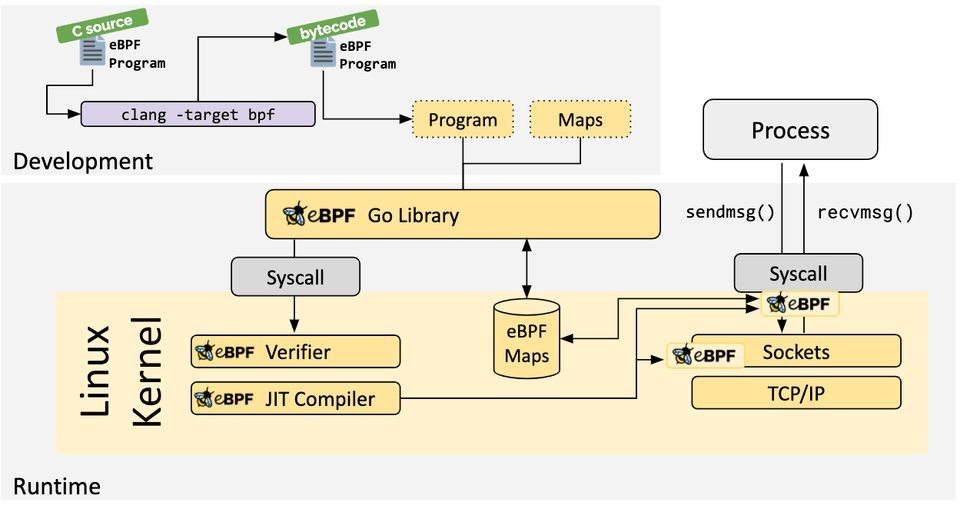

## 怎么写eBPF程序

目前写eBPF程序的话，一般要通过C语言来写，python、golang写的都是用户态的部分，涉及到内核部分的操作都是要借助C语言来写，然后通过编译器将C部分编译成字节码，用户态部分只是借助bpf()系统调用将字节码程序提交给了eBPF子系统去运行。

实际上任何高级语言都可以写用户态部分，但是写内核态部分的eBPF程序需要写C语言，编译器会将C语言部分编译成target=ebpf的字节码，所以现在有很多框架比如BCC+python以及Cilium+golang等，都是对eBPF字节码操作、系统调用操作的一些封装。

ps：如果你是用Rust的话，那么确实可以直接写eBPF程序，不用依靠C，一般常用的是Rust aya这个框架。

## 从0开始写eBPF程序

前面多次提到了eBPF程序编写、执行的大致过程，但是介绍的还是太粗略了，也不打算在这么几个简单的总结性文档中，把细节都介绍清楚。

我们可以先看下，如果手把手从0开始写eBPF程序，大致需要经历哪些操作，看图：



需要被简化的一些操作：

- 用C语言先写eBPF程序，然后使用编译器（如clang）将其编译为target为bpf的字节码程序，然后通过系统调用将其提交给eBPF子系统执行。这一步如果没有BCC这样的框架封装下的话，那么操作起来就有一点啰嗦。
- 还有你编译eBPF程序时要用到的很多头文件之类的设置，可能就比较麻烦。
- 还有eBPF程序执行时，那些结果存储到不同的数据结构，和不同语言的类型系统如何对接，如何方便的读取，全部自己从0开始搞也很麻烦。
- 其他的；

所以现在有BCC、Cilium、Aya这样的一些eBPF框架来简化这一些工作，我们可以先从BCC开始，这个项目比较早、成熟，用的人也多，也被集成到了Linux YUM源中，可以直接安装bcc、bcc-tools包来尝鲜。

## 从helloworld开始

现在就开始使用BCC来写几个helloworld，让大家了解下一个简单的eBPF程序大致是如何写的，熟悉下其结构，后面虽然不一定自己写，但是了解已有的这些工具的实现细节，以及如何调整来满足自己需要，还是有帮助的。

file: helloworld.py

```python
#!/usr/bin/python3
from bcc import BPF

program = r"""
int hello(void *ctx) {
    bpf_trace_printk("Hello World!");
    return 0;
}
"""

b = BPF(text=program)
syscall = b.get_syscall_fnname("execve")
b.attach_kprobe(event=syscall, fn_name="hello")

b.trace_print()
```

分析下其结构：

- 导入bcc中的bpf
- program是一段c语言程序，b = BPF(text=program)，我们执行这个脚本时bcc框架会自动将其编译为字节码
  它定义了一个hello函数，bpf_trace_printk会向ebpf子系统中的一个临时文件或者什么数据结构中打印hello world字符串
- syscall = b.get_syscall_fnname是获得exeve函数调用的一个hook point
- b.attach_kprobe是在execve这个系统调用入口处通过kprobe系统调用创建一个探针，当执行到这里时会触发trap，内核会回调函数hello去执行，这里的hello就是上面C语言中定义的函数
- b.trace_print会从取出前面打印的hello world字符串取出来打印出来。

这就是一个极简的helloworld的示例，当我们执行它时，它就会跟踪所有的execve的系统调用，每次触发这个系统调用时，就会打印上述helloworld字符串信息。

ps：执行ebpf程序时，需要使用root权限。

## 执行上述示例

ebpf程序运行需要用到debugfs，这个需要先挂载下，然后再执行，会看到打印很多helloworld：

```bash
root $ sudo mount -t debugfs debugfs /sys/kernel/debug

root $ ./helloworld.py
b'           <...>-14182   [004] d...1 89191.905245: bpf_trace_printk: Hello World!'
b'           <...>-14184   [001] d...1 89191.913364: bpf_trace_printk: Hello World!'
b'           <...>-14183   [005] d...1 89191.913975: bpf_trace_printk: Hello World!'
b'           <...>-14185   [005] d...1 89193.942389: bpf_trace_printk: Hello World!'
b'           <...>-14187   [002] d...1 89193.951579: bpf_trace_printk: Hello World!'
b'           <...>-14186   [001] d...1 89193.952179: bpf_trace_printk: Hello World!'
```

系统中很多地方都会执行系统调用execve，比如执行shell命令ls，shell会先创建子shell然后execve替换text为ls的text（指令），所以这里也是会触发打印helloworld。

## 本文小结

本文介绍了下ebpf程序开发的一个大致过程，以及结合BCC+Python给了一个简单的helloworld的实例，这个实例过于简单但是能让读者知道大致的过程。后面会结合一个具体的案例gofuncgraph来详细介绍ebpf程序开发。