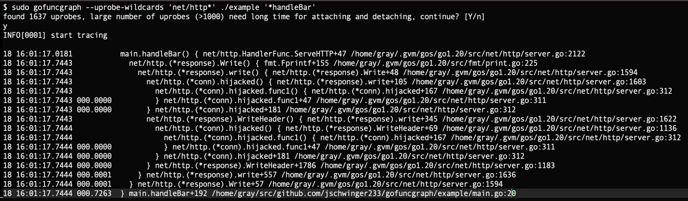

## 前言

可观测性（observability）是这几年开始被频繁提及的一个词，特别是在微服务领域可观测性已经成为了微服务治理的一项关键的平台化技术手段，在CNCF孵化的项目中我们看到Opentelemetry如火如荼的发展背后也逐渐出现了一些成熟的解决方案。在腾讯内部也有类似天机阁、蓝鲸、wxg等不同的解决方案。这些往往配合框架解决了微服务RPC层面 的可观测性问题，实际上借助eBPF这项革命性技术，我们还可以做更多。

## 故事背景

不久前，在做一个关于序列化方面的优化工作，先说下项目情况：项目中使用的go框架采用了pb+protoc-gen-gogofast来生成桩代码，RPC通信的时候使用pb序列化。另外呢，为了方便开发人员查看pb message对应的log信息，项目的日志库使用了pbjson将pb message格式化为json后输出到log，RPC interceptor也会使用相同的方式序列化req、rsp后将其上报到链路跟踪系统。

大致就是这样一个问题，当时对比了pbjson序列化、stdlib encoding/json序列化，segmentio/encoding/json序列化，以及bytedance/sonic序列化。哈哈，这个顺序其实就是由慢到快的一个顺序，bytedance/sonic凭借优化反射、simd等技术“遥遥领先”其他集中方案。除了benchmark的手段，我还想看看上线前后的一些详细的优化效果，比如不同包大小（比如按1KB分桶）的序列化耗时（纳秒）分布。

摆在我面前有两个办法：

- 改源码，统计下序列化前后的执行耗时，然后打log，写个工具分析下log；
- 改源码，统计下序列化前后的执行耗时，然后上报到监控，看看统计直方图；

其实都可以，但是我有点懒，我既不想去改源码（更不用说改很多）去写log、报监控，分析完了还需要再把这堆代码删掉。改完代码我还需要编译、发布，我们每次编译发布流程都要10min左右，我很不想去干这些事。

总之我既想要灵活的分析工具（能灵活指定函数名称），又不侵入业务代码，调研之后发现有开发者实现了这样的工具，[jschwinger233/gofuncgraph](https://jschwinger233/gofuncgraph)，它借鉴了内核函数图跟踪工具[ftrace](https://en.wikipedia.org/wiki/Ftrace)的设计，执行效果大致如下。借助funcgraph，很快解决了我的问题。

## gofuncgraph

## 函数图跟踪

