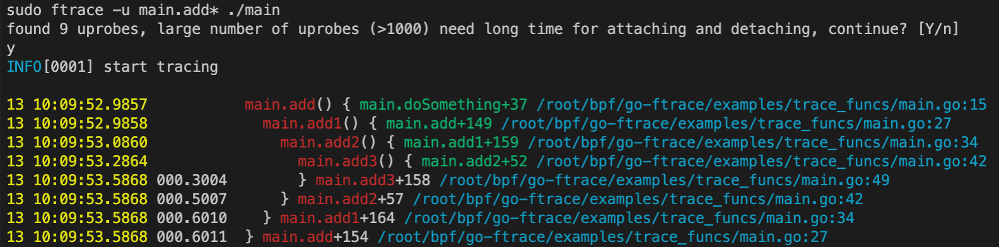

<style>
img {
    width: 680px;
    padding-bottom: 1rem;
}
</style>

## 前言

不久前在团队内部做了点eBPF相关的技术分享，过程中介绍了下eBPF的诞生以及在安全、高性能网络、可观测性、tracing&profiling等领域的实践以及巨大潜力。另外，在我们项目开发测试过程中，也希望对go程序的性能有更好的把控，所以对“上帝视角”的追求是会上瘾的，所以我们也探索了下如何基于eBPF技术对go程序进行无侵入式地观测。

分享过程中也演示了下我现阶段开发的go函数调用可观测性工具。下面是我的分享PPT，感兴趣的话可以打开阅读：https://docs.qq.com/slide/DYlhHZ25rSHdRbWd0，欢迎一起学习交流。

## 基础知识

本文重点不在于eBPF扫盲，但是如果有eBPF的基础知识的话，再看本文对go-ftrace的介绍会事半功倍。所以如果对eBPF没什么了解，建议可以先看看我的分享PPT，或者其他资料，知道个大概。

go-ftrace主要是对go程序中的函数调用进行跟踪并统计其耗时信息，也可以获取函数调用过程中的参数信息，这样结合起来，你可以看到不同输入下的处理耗时的差异。

我们在前一篇文章里介绍了如何使用go-ftrace来跟踪go程序中的某些函数，甚至获取其执行过程中的函数参数信息。本文来详细介绍下go-ftrace的设计实现。

### 内核视角

自打1993年bpf（berkeley packet filter）技术出现以来，这种CFG-based（control flow graph）的字节码指令集+虚拟机的方案就取代了当时的Tree-based cspf （cmu/standford packet filter）技术，而后几年在Linux内核中引入了bpf，定位是用来做些tcpdump之类的包过滤分析，在后来Linux内核中引入了kprobe技术，允许用户在内核模块中通过kprobe跟踪内核中的一些函数来进行观测、分析，此后的很多年，bpf技术一直在改进，逐渐演化成一个独立的eBPF子系统，kprobe、uprobe也可以直接回调eBPF程序，使得整个Linux内核变得可编程，而且是安全的。

从跟踪角度来看，有静态跟踪、动态跟踪两种方式，静态跟踪主要是Linux内核中的一些tracepoints，动态跟踪主要是借助kprobe、uprobe技术。如果你阅读过我之前写的调试器的书籍（还未100%完成），你肯定会“指令patch”技术有所了解，其实kprobe、uprobe技术的工作原理也是借助指令patch。

1. 当我们通过系统调用bpf通知内核在指令地址pc处添加一个kprobe或者uprobe时，内核会将对应地址处的指令（有可能是多个字节）用一个一字节指令Int 3 (0xcc)代替，并在内核数据结构中记录下原指令内容，以及这个地址处是否是一个kprobe、uprobe。
2. 当内核执行到这个指令0xcc时，它会触发一个异常，进而会执行linux内核中断服务程序对齐进行处理，内核会检查这个地址pc处是否有相关的kprobe、uprobe，有的话就跳过去执行，每个kprobe、uprobe实际上包含了prehandler、原指令、posthandler。先执行prehandler，如果返回码ok则继续执行原指令，再执行posthandler；如果prehandler返回错误码，那就不往后执行了，通过这个办法也可以拦截某些系统调用，如seccomp-bpf技术。

大致就是这样的一个过程，仔细深究的话kprobe、uprobe工作起来稍微有点差异。

- 对于注册kprobe你只需要告诉内核一个符号即可，比如一个系统调用名，内核会自己计算出这个符号对应的指令地址；
- 而注册一个uprobe的话，举个例子过程需中的main.main函数，内核是不认识这个符号的，它也不知道main.main的地址改如何计算出来，就需要我们自己先算出来它的地址，然后再传给内核；

### 调试知识

那么针对不同的编程语言写的程序，如果指定一个符号来计算出对应的指令地址呢？这就是挑战点之一，不过在调试领域这早就是已经解决的问题了，我们可以借鉴调试领域相关的知识来解决如何计算main.main对应的指令地址的问题。

[DWARF](https://dwarfstd.org/doc/DWARF5.pdf)，是一种调试信息标准，目前是使用最广泛的调试信息格式。其实有多种调试信息格式，但是从对不同编程语言、不同特性、数据编解码效率的优势来看，它确实更胜一筹，所以现在主流编程语言生成的调试信息基本都是支持DWARF或者优先考虑DWARF。

以go语言为例，当我们执行go build编译一个可执行程序时，以ELF文件为例，编译器、链接器会生成一些.[z]debug_开头的sections，这些sections中的数据就是调试信息。

**常见的ELF sections及其存储的内容如下:**

- .debug_abbrev, 存储.debug_info中使用的缩写信息；

- .debug_arranges, 存储一个加速访问的查询表，通过内存地址查询对应编译单元信息；

- .debug_frame, 存储调用栈帧信息；

- .debug_info, 存储核心DWARF数据，包含了描述变量、代码等的DIEs；

- .debug_line, 存储行号表程序 (程序指令由行号表状态机执行，执行后构建出完整的行号表)

- .debug_loc, 存储location描述信息；

- .debug_macinfo, 存储宏相关描述信息；

- .debug_pubnames, 存储一个加速访问的查询表，通过名称查询全局对象和函数；

- .debug_pubtypes, 存储一个加速访问的查询表，通过名称查询全局类型；

- .debug_ranges, 存储DIEs中引用的address ranges；

- .debug_str, 存储.debug_info中引用的字符串表，也是通过偏移量来引用；

- .debug_types, 存储描述数据类型相关的DIEs；

以我们的go-ftrace为例，我们想跟踪某个函数的执行，就得先通过函数名找到对应的地址，怎么找呢？就是借助前面提到的这些.debug_ sections。简单说就是我们可以通过这些不同的调试信息构建起对go源码层面的全局视图，并且能在源码和内存中表示（包括指令地址）之间建立起一种映射关系。

这样我们就可以知道每个函数的第一条指令地址是多少，然后告诉内核分别在函数进入、退出的位置给设置uprobes，然后我们为这两个uprobe分别编写对应的eBPF回调函数，在进入的时候记录下此时的时间戳，在退出的时候也记录下时间戳，然后就可以计算耗时信息。

当然在实现过程中，有很多细节是需要考虑的，绝对不是轻描淡写一笔可以带过的。篇幅原因，本文就不展开了。

尽管对DWARF一点也不了解也不妨碍阅读理解本文的大意，但是想能定制化go-ftrace这样的工具，不了解DWARF是基本不可能做到的。如果你想了解这方面内容，建议阅读[DWARF文档](https://dwarfstd.org/doc/DWARF5.pdf)，或者阅读我的电子书[golang-debugger-book 里关于DWARF的相关章节](https://www.hitzhangjie.pro/debugger101.io/8-dwarf/)。目前DWARF v5出来不久，v5的特性使用还没有那么广泛，v4应用最广泛。

## 设计目标

假定存在如下go代码，逻辑很简单，循环doSomething。为了演示trace跟踪时也能跟踪目标函数内部对其他函数的调用，示例代码中添加了add、add1、add2、add3，为了展示对函数执行耗时的统计，在不同函数内部加了sleep来模拟各函数的执行耗时。为了避免内联优化对DWARF分析函数位置的影响，我们在上述函数前面加了`//go:inline`，随着go编译工具链对内联函数生成的DWARF信息的优化，后续应该也可以去掉内联。不过现在加上最稳妥。

```go
func main() {
        for {
                doSomething()
        }
}

func doSomething() {
        add(1, 2)
				...
        time.Sleep(time.Second)
}

//go:noinline
func add(a, b int) int {
        fmt.Printf("add: %d + %d\n", a, b)
        return add1(a, b)
}

//go:noinline
func add1(a, b int) int {
        fmt.Printf("add1: %d + %d\n", a, b)
        time.Sleep(time.Millisecond * 100)
        return add2(a, b)
}

//go:noinline
func add2(a, b int) int {
        time.Sleep(time.Millisecond * 200)
        return add3(a, b)
}

//go:noinline
func add3(a, b int) int {
        fmt.Printf("add3: %d + %d\n", a, b)
        time.Sleep(time.Millisecond * 300)
        return a + b
}
```

然后希望执行 `ftrace -u main.add* ./main`时，函数调用跟踪及耗时统计可以达到这样的效果，能展示函数执行进入、退出的时间戳、耗时，函数调用发生的位置，甚至函数实参信息。



## 实现过程

下面按照程序执行流程，对流程中涉及到的技术细节进行下详细介绍。

### 解析启动参数

为了更方便使用POSIX风格的命令行选项参数（长选项、短选项），这里还是使用的spf13/cobra来开发这个程序，原作者用的另外一个库，但是我使用起来感觉不太方便，所以这部分进行了重写，也方便我后续扩展其他功能。

主要参数有这几个：

```go
// 是否排除vendor/定义的函数
rootCmd.Flags().BoolP("exclude-vendor", "x", true, "exclude vendor")
// 指定要跟踪的函数名匹配模式
rootCmd.Flags().StringSliceP("uprobe-wildcards", "u", nil, "wildcards for code to add uprobes")
// 将参数-u设置为必填参数
rootCmd.MarkFlagRequired("uprobe-wildcards")
```

当我们执行命令时就可以像下面这样使用：

```bash
# 跟踪binary中main包下所有的函数、方法，而且可以多次使用-u指定多个匹配模式
ftrace [-u|--uprobe-wildcards] main.* <binary>

# 也可以指定-x来排除vendor下定义的函数、方法
ftrace -u github.com/* [-x|--exclude-vendor] <binary> 

# 也可以自定参数来描述如何获取指定函数的参数信息
ftrace -u main.Add <binary> 'main.Add(p1=expr1:type1, p2=expr2:type2)'
```

spf13/cobra是一个很好用的命令行工具开发框架，感兴趣的可以了解不再赘述。大致知道为什么我们选择它就可以：支持POSIX风格选项解析（长选项、短选项）、方便扩展命令、选项、自动生成help信息、自动生成shell补全脚本。

### 匹配函数获取

以我们指定的`main.*`这个匹配表达式为例，我们如何找到所有匹配的函数名呢？我们是拿不到源代码信息的，我们能拿到的只有已经编译构件号的go二进制程序。其实编译器、链接器已经生成了一些.symtab, .strtab，我们的函数名就存在于这些section中，并且对于一个Symbol，除了名字，还记录了这个符号表示的对象类型，比如“函数”。

看下下面的示例代码：获取所有函数命名形如 `main.*`的函数。

```go
// 首先打开一个elf文件，其中的.symtab, .strtab没有被stripped
f, err := elf.Open("testdata/helloworld")

// 取出所有的symbols
syms, err := f.Symbols()
var funcs []string
for _, s := range syms {
  // 如果不是函数类型跳过
  if elf.ST_TYPE(s.Info) == elf.STT_FUNC {
    continue
  }
  // 如果命名不匹配main.*跳过
  if !strings.Contains(s.Name, "main.") {
    continue
  }
  // 记录下函数名
  funcs.append(funcs, s.Name)
}
```

在go-ftrace里面，为了实现方便组合使用了go-delve/delve下的DWARF相关package，以及标准库debug/elf，原理和上面是一致的。这样下来我们就获得了所有匹配模式`main.*`的待跟踪函数列表。

### 函数地址转换

有了这些带跟踪的函数名列表之后，我们希望程序执行时进入、退出函数时能生成一个事件并回调自定义的回调函数，回调函数里我们分别统计开始执行时间、介绍执行时间，这样就能计算出这个函数的耗时信息。

要想在函数进入、退出时产生回调特定函数，就要利用到eBPF+uprobe了，我们用eBPF写uprobe的回调函数，再通过bpf系统调用通知内核将某个uprobe和eBPF程序attach起来之前，我们得先创建uprobe。在创建uprobe之前，我们得先知道每个待跟踪函数的入口指令的地址，以及返回指令的地址，这里的地址后面用pc(程序计数器)代替。

ps: 学过组成原理的话，应该了解到pc=cs:ip，其实就是下条待执行指令的地址，但是我们这里用pc代指了函数入口指令地址、返回指令地址。

#### 函数入口添加uprobe

获得函数入口指令地址，也并不困难，下面是获取入口指令地址、offset（相对于ELF文件开始位置）的示例代码：

```go
sym, err := elf.ResolveSymbol(funcname)
if err != nil {
    return nil, err
}

// 函数入口偏移量
entOffset, err := elf.FuncOffset(funcname)
if err != nil {
    return nil, err
}

uprobes = append(uprobes, Uprobe{
    Funcname:  funcname,
    Location:  AtEntry,
    Address:   sym.Value, // 指令地址
    AbsOffset: entOffset, // 相对偏移量
    RelOffset: 0,		  // 相对入口指令偏移量，当然是0
})
```

那`elf.FuncOffset(funcname)`是如何实现的呢？

```go
// 返回函数定义在ELF文件中的偏移量
func (e *ELF) FuncOffset(name string) (offset uint64, err error) {
    sym, err := e.ResolveSymbol(name)
    if err != nil {
        return
    }
    section := e.Section(".text")
    return sym.Value - section.Addr + section.Offset, nil
}
```

有几个地方要说明下：

- symbol.Value：符号表示的对象（变量、类型、函数等）在进程虚地址空间中的地址；
- section.Addr：如果不为0表示会被加载到内存，它表示该section第一字节在进程虚地址空间中的地址；
- section.Offset：表示该section第一字节在ELF文件中的偏移量；

所以 `sym.Value - section.Addr + section.Offset`表示该符号在ELF文件中的偏移量。这可能和我们预期的“虚拟内存地址pc”有点偏差。或者说，当执行系统bpf系统调用设置uprobe时，我们实际传入的位置信息：

- 是一个相对于ELF文件开头的偏移量呢？
- 还是一个相对于.text section开头的偏移量呢？
- 还是一个虚拟内存地址呢？

go-ftrace执行bpf操作是利用了cilium/bpf工程提供的封装，``github.com/cilium/ebpf/link.Uprobe|Uretprobe()`，这几个函数也是允许指定symbol，那前面获取这些符号地址有啥作用呢？是这样的，Uprobe、Uretprobe只能处理非共享库、且语言是CC++之类的场景，如果是共享库或者是其他语言的，需通过`UprobeOptions{Offset: ...}`来说明uprobe位置（ELF文件中指令相对于文件开头的偏移量）。

所以你看我前面计算了很多AbsOffset偏移量（相对于ELF文件开头），最终就是利用这些偏移量来设置的。如果进一步了解下cilium使用的系统调用perf_event_open，会了解的更清楚。perf_event_open，该系统调用允许接受一个perf_event_attr的参数来设置kprobe、uprobe。

>$ man 2 perf_event_open
>
>...
>
>kprobe_func, uprobe_path, kprobe_addr, and probe_offset
>
>These fields describe the kprobe/uprobe for dynamic PMUs kprobe and uprobe.  
>
>- For kprobe: use kprobe_func and probe_offset, or use  kprobe_addr and leave kprobe_func as NULL. 
>- For uprobe: use uprobe_path and probe_offset.

再看cilium中对此系统调用的使用过程，看下它是怎么设置perf_event_attr参数的：

```go
func pmuProbe(typ probeType, args probeArgs) (*perfEvent, error) {
	...
	var (
		attr unix.PerfEventAttr
		sp   unsafe.Pointer
	)
	switch typ {
	case kprobeType:
		...
	case uprobeType:
		sp, err = unsafeStringPtr(args.path)
		if err != nil {
			return nil, err
		}
		...
		attr = unix.PerfEventAttr{
			Size:   unix.PERF_ATTR_SIZE_VER1,
			Type:   uint32(et),          // PMU event type read from sysfs
			Ext1:   uint64(uintptr(sp)), // Uprobe path（二进制文件）
			Ext2:   args.offset,         // Uprobe offset （相对于ELF文件）
			...
		}
	}

	rawFd, err := unix.PerfEventOpen(&attr, args.pid, 0, -1, unix.PERF_FLAG_FD_CLOEXEC)
    ...
}
```

通过`man perf_event_open`查看attr结构体定义，实际上上述代码中Ext1、Ext2分别对应uprobe_path和probe_offset，刚好对上。uprobe_path实际上就是我们的二进制程序的路径信息，而probe_offset就是要设置uprobe的指令处在ELF文件中的偏移量信息。

之后，内核会读取并解析uprobe_path对应ELF文件的headers信息，计算probe_offset处指令对应的uprobe地址，然后注册uprobe。

> ps：不禁要问，内核为什么不直接要一个逻辑地址来描述uprobe的位置呢？考虑下来可能就是为了一致性、简单性、可理解性。用逻辑地址可以吗？实现肯定能实现，但是看到这种参数开发者要去理解地址映射逻辑、加载逻辑，至少会去“仔细”确认这些信息吧。内核中其他系统调用在处理类似场景时可能也是更倾向于使用offset，应该也有一致性的考虑。先知道这个就行了。

#### 函数返回前添加uprobe

函数返回时比较特殊，它可能存在多个返回语句，这个也比较好理解。多个返回语句，也就是多条返回指令，每个返回指令地址处都应该添加uprobe。

```go
// 函数返回指令偏移量
retOffsets, err := elf.FuncRetOffsets(funcname)

for _, retOffset := range retOffsets {
    uprobes = append(uprobes, Uprobe{
        Funcname:  funcname,
        Location:  AtRet,
        //Address: 
        AbsOffset: retOffset,             // 返回指令的偏移量（相对于ELF文件）
        RelOffset: retOffset - entOffset, // 返回指令的偏移量（相对函数入口）
    })
}

// FuncRetOffsets returns the offsets of RET instructions of function `name` in ELF file
//
// Note: there may be multiple RET instructions in a function, so we return a slice of offsets
func (e *ELF) FuncRetOffsets(name string) (offsets []uint64, err error) {
	insts, _, offset, err := e.FuncInstructions(name)
	if err != nil {
		return
	}

	for _, inst := range insts {
		if inst.Op == x86asm.RET {
			offsets = append(offsets, offset)
		}
		offset += uint64(inst.Len)
	}
	return
}
```

注意到，在设置函数入口的uprobe时，我们是设置了Uprobe.Address字段的，但是设置函数退出的uprobe时却没有，为什么呢？

- 在注册uprobe时，确实只需要指令地址相对于ELF文件的偏移量（前面已解释过）；
- 在设置函数入口Uprobe.Address，主要是为了用来设置eBPF maps中的配置信息，如我们跟踪的某个函数是否需要获取参数之类的，而这之需要设置函数入口处的uprobe就够了，函数返回处的uprobe就不需要再计算并设置其地址信息了。

DWARF中函数的lowpc、highpc的指令地址，这个地址是指令的逻辑地址，上述实现FuncRetOffset(name string)中做了从逻辑地址向ELF文件开头的偏移量的转换。

> ps：函数的lowpc实际上是函数被编译后第一条指令的逻辑地址，highpc是最后一条指令的逻辑地址。函数定义在DWARF中是以DIE（Debugging Information Entry）的形式存储在.[z]debug_info中的，对于描述函数的DIE，其Tag会表明它是一个TagSubprogram（函数），同时它会包含相关的AttrLowpc、AttrHighpc来描述函数包含的指令集合的逻辑地址范围。了解这写些就可以了，不再继续展开。

### 参数寻址规则

如果我们需要获取函数的参数信息，该怎么办？很简单，其实只要知道参数在内存中的起始地址，以及数据类型信息就可以了。这样我们就可以按照指定的数据类型的大小从内存读取一定数量的bytes，然后再将其解析成对应的数据类型即可。

ps：当然这里的参数也可能是一个寄存器中的立即数，这样就简单了很多。

这里的寻址规则，我们可以自己设计一个，比如借鉴下计算机组成原理的有效地址（EA，Effective Address）的寻址方式的写法，这里我们为了实现起来简单，又便于理解，自己设计了一种写法。

```go
// 基本写法
functionName(argument1=(expr1):type1, argument2=(expr2):type2, argument3=(expr3):type3)
```

- argument1~3: 这是我们为要捕获的参数自定义的一个标识符名
- expr1~3: 这是参数值实际存储的有效地址，必须先从有效地址处读取数据，然后才能解析成期望类型（也可能是一个寄存器立即数）
- type1~3: 这是参数值对应的数据类型，'s|u' for 整数, 'c' for 字符串
  - s64 表示64位 有符号整数
  - u64 表示64位 无符号整数
  - c64 表示共8字节的字符串

以这个为例，我们解释下它的含义：

```go
main.(*Student).String(s.name=(*+0(%ax)):c64, s.name.len=(+8(%ax)):s64, s.age=(+16(%ax)):s64)
```

其中`main.(*Student).String()`的定义如下：

```go
// go代码Student定义
type Student {
    name string
    age  int
}
```

实际上pahole分析出的它的内存布局：

```c
$ ../scripts/offsets.py --bin ./main --expr 'main.Student'

struct main.Student {
    struct string              name;                 /* 0    16 */
    int                        age;                  /* 16    8 */

    /* size: 24, cachelines: 1, members: 2 */
    /* last cacheline: 24 bytes */
};
```

对于String()方法，其第一个参数是其接收器类型main.(*Student)，它的起始地址将通过AX寄存器传递，在规则中我们使用%ax代表物理寄存器RAX or EAX，然后呢Student.age相对于Student对象起始的偏移量是16字节，所以规则 `s.age=(+16(%ax)):s64`指出了age的有效地址+16(%ax)，以及数据类型s64。规则中的`()`只起到分组、增强可读性的作用，并不像计算机组成原理中那样用来取数据（取寄存器或者内存单元中的数据）。

类似地，对Student.name我们也可以这样分析，只不过对于string类型比较特殊：

```go
$ ../scripts/offsets.py --bin ./main --expr 'main.Student->name'

Member(name='name', type='string', is_pointer=False, offset=0)
struct string {
        uint8 *str;                  /*     0     8 */
        int                        len;                  /*     8     8 */

        /* size: 16, cachelines: 1, members: 2 */
        /* last cacheline: 16 bytes */
};
```

string本身就是一个struct来表述的，它底层数组的起始地址，以及长度信息。其实main.Student的起始地址就是main.Student.name.str成员的起始地址，但是这里的str是一个指针，可以理解成它指向一个长度为len的byte数组。main.Student.name.str成员的起始地址并不是EA，*(main.Student.name.str)才是EA，所以规则里`s.name=(*+0(%ax)):c64`读者应该看懂了吧。获取name字符串长度的操作`s.name.len=(+8(%ax)):s64`也不难明白了。

ps：有时候传参是通过寄存器传递的立即数，这种规则就更简单了，比如`your_arg=(%si):u64`。这里些的比较简短，如果你想详细了解，可以阅读这里的[FetchArgRule 获取参数的规则](https://github.com/hitzhangjie/go-ftrace/blob/master/docs/FetchArgRule.zh_CN.md)。

### 获取协程goid

TODO

### 加载BPF程序

前面讲了如何获取函数定义入口的指令地址、返回指令的指令地址相对ELF文件的偏移量问题。并且也提到了Linux系统调用perf_event_open的参数perf_event_attr如何来设置uprobe的位置信息（uprobe需要通过uprobe_path、probe_offset）。但是在注册uprobe时，我们不光要指定待跟踪的位置信息，还需要指定当程序执行到这个位置时，应该如何反应。所以我们前面又描述了一些自定义的uprobe的回调函数的内容，也就是我们eBPF程序。

这里我们描述下eBPF程序的加载，加载过程归根究底是利用了系统调用bpf(2)来完成，此时只是提交给内核一个eBPF程序，该程序已经通过`clang -target=bpf`编译成了bpf字节码指令，提交给内核后eBPF子系统中的验证器开始工作，它会检查该eBPF程序是否符合要求，比如是否很复杂、是否有无穷或者次数很多的循环、是否有内存越界等行为，只有符合要求的程序才会通过验证并加载。eBPF子系统还会调用JIT编译期将bpf字节码指令进一步转换为native指令，使其执行效率接近原生指令效率。

接下来，我们就看下go-ftrace里面是如何加载eBPF程序的，它没有直接调用bpf系统调用，而是使用了cilium/bpf中对该系统调用的封装。


### 注册uprobes


### 轮询事件信息

### 打印函数耗时

