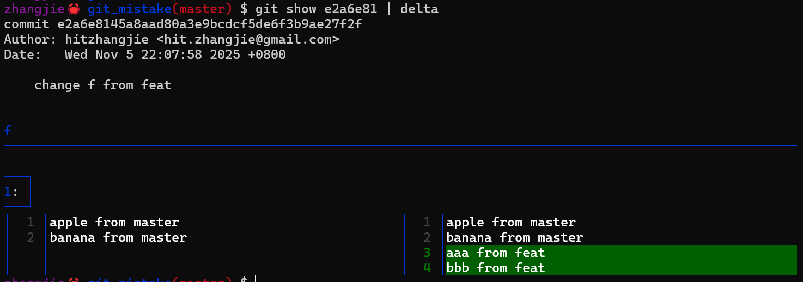
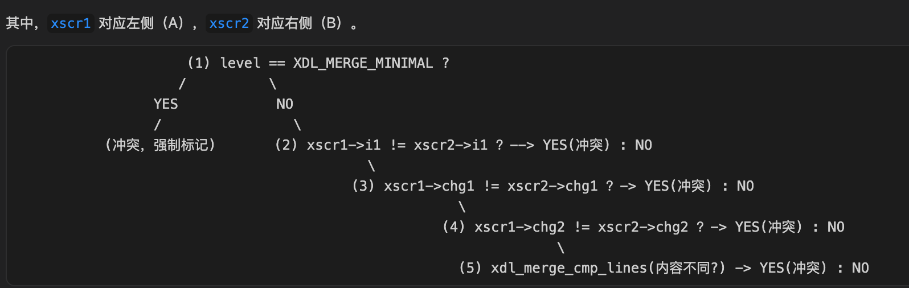

# git鬼故事 - How `git cherrypick` Works

## 1. 问题背景

项目组内部同事想合并一个线上版本分支的一系列bugfix到下个待发布分支，于是执行了分支merge操作：`git merge <branch>`。由于存在多分支同时修改的情况，所以预料之中会出现一些合并冲突问题（merge conflicts），git设计上希望能减少认为干预，尽可能启发式地、自动化地去解决一些冲突，尽管如此我们已经有心理准备。

OK，这里我们暂时不去讨论git分支策略上的一些最佳实践或者不良实践，这里我们想讨论一个让人头疼的问题，“git merge”“git cherrypick”究竟靠谱、不靠谱？

之所以提出这个问题，是因为出现了一个出乎我们所有人意料的情况，`git merge <branch>`后：

- 有一个源文件中**同样的处理逻辑（注意两次的代码稍有不同）竟然被追加了两次**。
- 这两个分支独立修改(插入)后的内容在**行号范围上是有重叠的，git没有报冲突**。
- `git merge <branch>`, `git cherrypick <commit>`都会导致相同的问题。

如果说合并一个差异很大的分支不是一个常规操作，cherrypick相比较之下则是使用更加频繁的一个操作，不管是从master cherrypick提交到其他分支，还是线上分支的bugfix backport到master分支，经常用到。巧的是，我们执行 `git cherrypick <commit>`也会导致上述问题。ps：这里的 `<commit>`就是涉及到重复的处理逻辑的提交号。

wtf，这直接挑战了很多10年git使用经验的开发者们，发生了什么，连gitd都不住了么？禁不住会问，git是如何设计的，merge、cherrypick乃至rebase、apply是如何工作的。接下来我会用几篇文章解释清楚。

## 2. 测试准备

尽管项目组的代码也没什么特别的分享价值，但是写分享还是要注意脱敏，所以我构造了一个可以复现这个问题的极简git仓库。
您可以通过以下脚本来重建这个测试用的git仓库 (git cp, cc, ck分别是git cherry-pick，git commit, git checkout的alias）：

```bash
#!/bin/bash -e

mkdir git_mistake && cd git_mistake
git init

# master branch
touch f
echo "apple from master" > f
echo "banana from master" >> f
git add f && git cc -m 'add f from master'

# feat branch (insert after line 2, [3,4] inserted )
git ck -b feat
echo "aaa from feat" >> f
echo "bbb from feat" >>f
git add . && git cc -m 'change f from feat'

# feat branch (insert after line 1,  [2,3] inserted)
# we may expect a conflict here with the change on feat,
# but no conflict reported.
git ck master
cat>f<<EOF
apple from master
xxxx from master
xxxx from master
banana from master
EOF
git add f && git cc -m 'change f from master'

# try following operations, and the result will be:
# - not merged （Expected: two sides changes aren't identical)
# - no conflict (NotExpected: two sides' changes overlapped)
# - code concatenated (NotExpected: should report conflict)
# git ck master && git merge feat, or
# git ck master && git cp <commitOnFeat>
```

执行上述脚本后，将创建一个提交历史如下所示的repo，后面我们就用这个来进行测试：


## 3. 复现问题

我们先执行 `git merge feat` 的操作，注意没有冲突：

```bash
zhangjie🦀 git_mistake(master) $ git merge feat
Auto-merging f
Merge made by the 'ort' strategy.
 f | 2 ++
 1 file changed, 2 insertions(+)
```

我们看下merge后f中的内容：

```bash
$ cat -n f
     1  apple from master
     2  xxxx from master    // master上后续插入的行
     3  xxxx from master    // master上后续插入的行
     4  banana from master  
     5  aaa from feat        // feat上后续插入的行
     6  bbb from feat        // feat上后续插入的行
```

但是，我们心理上的预期应该是这样的，即feat、master多线修改，且修改后内容有重叠，对吧？前者是3,4行，后者是2,3行，如果是从修改后版本来看，难道不应该报个冲突吗？




我们再执行git cherrypick e2a6e81的操作：

```bash
zhangjie🦀 git_mistake(master) $ git reset --hard HEAD~1
HEAD is now at a6304ef change f from master

zhangjie🦀 git_mistake(master) $ git cp e2a6e81
Auto-merging f
[master 0fb81d9] change f from feat
 Date: Wed Nov 5 22:07:58 2025 +0800
 1 file changed, 2 insertions(+)

zhangjie🦀 git_mistake(master) $ cat -n f
     1  apple from master
     2  xxxx from master
     3  xxxx from master
     4  banana from master
     5  aaa from feat
     6  bbb from feat
```

可以看到执行 `git cherrypick`时，也是没有报冲突的！这里的git出乎预料的行为，让我们很多人摸不着头脑！也很担心后续会不会犯错。所以准备先搞清楚git cherrypick怎么工作的，否则不当操作对我们项目质量而言是个巨大的风险点。

ps：也许你10年工作经验都没有踩到过这个坑，但是只要踩到一次，有可能就会颠覆你对git固有的认知，或者给项目质量埋雷。这当然是我们不能容忍的。

## 4. 问题复盘

遇到这个问题后，我们尝试了解原因，进行了如下尝试：

- 先尝试调查清楚为什么没有发生冲突，花了一些时间看了一些博客、issues、practices，但是这些材料没有涉及到我们遇到的问题，或者说遇到了类似诡异问题但是没有解释。
- 被迫准备看下源码，借助AI、调试器lldb跟踪下执行过程，精准定位问题源头。
- 除了搞清楚git cherrypick，也要搞清楚git merge，git rebase，git apply。
- 重新思考，我们是错在git分支策略上，还是错在多线修改上，还是单纯错在git cherrypick某些选项使用上，还是自始至终对git设计理念理解有误区。
- 后续应该如何改进研发流程，如分支策略，如是否应该多线修改，如果有多线修改应该如何进行cherrypick。
- 其他问题讨论。

## 5. 基线版本及合并策略

先说结论，实际上git merge, git cherrypick, git rebase, git apply在确定基线版本时有差异（see process_entry)。其中git rebase现在的实现逻辑是建立在cherrypick的机制上的，详细请看：How `git rebase` Works。

在确定了基线版本、head、next版本后，后续处理逻辑是几乎一致的：

1.判断当前commit对file的修改是否是单边修改，是则直接应用单边修改；

2.判断是否需要走三路归并逻辑handle_content_merge->merge_3way，以及：

- 判断双边修改是否是完全相同的修改，如果是可以直接合并；
- 如果双边修改时有冲突的修改，则需要报冲突错误、要求人工介入处理；

ps：篇幅原因对于git merge, git rebase的介绍在其他文章中进行，请参考文末链接。

## 6. 调试"故障"

git代码非常庞杂，这可是一个有着几十年历史的项目，如果想直接阅读源码来了解其全貌以及各种选项的作用、各种cornercases，简直难如登天。我虽然有10年工作经验，但是git操作中有很多选项我都还不了解、还没使用过，更不用说去看代码了。

即使现在有AI加持，阅读理解代码也是一个非常费时费力的工作，所以我们需要针对我们这个场景，快速收敛下问题代码路径，以方便我们快速梳理清楚问题发生过程。这个时候，就是调试器大显身手的时候了。

ps：很多人会说，嗯，我的职业生涯中基本没用过调试器 …… 嗯，it depends！因为我很久之前就认识到了调试器的强大，所以我从来不随便说，我不需要一个调试器，事实上，我非常需要调试器，因为我经常钻研一些“人迹罕至”的东西。

### 源码构建git

- **克隆源码**：`git clone https://github.com/git/git`，
- **编译构建**：`make CFLAGS="-g -O0" prefix=$(pwd) bindir=$(pwd)/bin install`

  > ps：注意选项-g生成调试符号，-O0禁用优化。
  >

### 测试执行git

测试下我们源码构建的git能否正常执行，有没有错误。执行测试：`/path-to/git/bin/git cherry-pick <commit>`。

### lldb调试git

有非常多的调试器，如gdb、lldb或者其他的，我使用的是lldb，因为gdb目前不支持m1、m4处理器架构，在mbp14上没法使用gdb，所以转而使用lldb，lldb也很强大。

- **执行调试**

  ```bash
  cd git_mistake
  lldb /path-to/git/bin/git -- cherry-pick `<commit>`
  ```
- **关键函数**：

  ```c
  cmd_cherry_pick: revert.c
    |> run_sequencer
       |> single_pick
          |> do_pick_commit
             |> do_recursive_merge
                |> merge_ort_nonrecursive_internal
                   |> collect_merge_info
                   |> process_entries
                      |> process_entry
                         |> handle_content_merge
                            |> merge_3way
                               |> ll_merge
                                  |> fn := find_ll_merge_driver
                                  |> driver->fn(...)
  ```

我们需要再调试器启动后，先对上述关键函数调用序列添加断点，`b <funcName>`，然后可以continue执行对应位置，查看函数参数、阅读源码、咨询AI，理解git的执行逻辑、设计理念。

在调试期间，可能经常需要查看commit hash、tree hash、blob hash，这些hash往往存储在一个叫做oid的变量或者成员字段里，执行lldb操作call oid_to_hex(oid)，能够将hex字符数组转为更易阅读的十六进制字符串，便于和git log、git cat-file配合使用。

## 7. git底层存储

在对git执行过程进行调试之前，因为调试过程中不只是看它执行到哪行代码了，我们得理解这行代码什么意思，比如说执行到merge_3way这个函数时，这个函数的参数是什么意思？这里的merge_3way定义是：

```c
static int merge_3way(struct merge_options *opt,
   const char *path,
   // a,b的基线版本
   // - 对cherrypick是parentOf(b)
   // - 对merge是a，b的公共祖先
   const struct object_id *o,
   // a，比如当前分支HEAD
   const struct object_id *a,
   // b，比如feat分支或者特定提交号
   const struct object_id *b,
   const char *pathnames[3],
   const int extra_marker_size,
   mmbuffer_t *result_buf)
```

ps: 注意git cherrypick是基于parentOf(cherrypickCommit)这个基线版本进行的，git apply < patchfile，是基于要应用patchfile分支的parent of HEAD进行的。

那这里的o,a,b时什么意思呢？git中很多代码都没有注释，如果仅凭调试过程中查看o,a,b的内容，我们很可能以为它是一个git commit hash，实际上不是它是一个tree hash。

如果你对git底层存储没有一点了解，那可能调试过程根本无从谈起，你都不知道git底层存储的什么，你怎么知道这里的参数是指的谁跟谁呢？这里要介绍清楚可能也要占用一定的篇幅，不详细展开，只简单总结：

- commit，执行commit时创建，每个commit都有关联的tree，通过tree中内容再找到每个文件的blob版本或者其他子目录对应的tree版本。
  执行以下命令可以找到commit对应的tree hash:

  ```bash
  git rev-parse commitHash^{tree}
  ```
- tree，对应的是目录中的文件列表或者子目录列表，对这些内容做hash，前两位用来作为.git/objects/目录名，剩下的作为文件名，文件内容就是目录结构信息，每个文件或者子目录在当前这个版本的hash。
  执行以下命令可以找到这个tree hash对应的目录结构信息：

  ```bash
  git cat-file -p treeHash
  ```
- blob，每个版本文件内容计算hash，内容存储在以这个hash为文件名的文件中，hash前两位会被用来作为.git/objects/目录名，剩下的作为文件名。
  执行以下命令可以查看这个版本的文件内容：

  ```bash
  git cat-file blob blobHash
  ```
- tag, 略

ps：如果我们想知道任意一个.git/objects下面对象的对象类型，可以通过下面命令，注意这里的hash，是.git/objects/目录名+文件名。

```bash
git cat-file -t hash
```

如果想通过tree hash反查引用它的commit hash：

```bash
git log --all --pretty=raw | grep -B treeHash
```

由此可知，git每一个commit都是一个完整的快照，不像有些版本控制系统那样每个commit是一个修改文件内容的diff列表。所以使用git可以快速切换分支、可以执行shallow clone、可以执行partial clone、可以去中心化的工作（即使已经离线）。

ps：如果你想进一步理解git底层存储，或者测试，可以查看这里的demo和解释:

- [git object database - part1](https://github.com/hitzhangjie/chat_with_ai/blob/master/git_how_obj_stores.md)
- [git object database - part2](https://github.com/hitzhangjie/chat_with_ai/blob/master/git_objects_database.md)

## 8. git源码分析

前面提到关键函数调用序列，最终会执行到driver->fn，该函数对应的实际上是：


```c
ll_xdl_merge
    |> xdl_merge
        |> xdl_do_diff(orig, mf1, xpp, &xe1)
        |> xdl_do_diff(orig, mf2, xpp, &xe2)
           ...
        |> status = xdl_do_merge(&xe1, xscr1, &xe2, xscr2, xmp, result)
```

计算完a,b与基线版本的diff后，就开始执行这里的xdl_do_merge逻辑：

```c
static int xdl_do_merge(
   xdfenv_t *xe1, xdchange_t *xscr1, // a与基线版本的diff
   xdfenv_t *xe2, xdchange_t *xscr2, // b与基线版本的diff
   xmparam_t const *xmp, mmbuffer_t *result) // 算法选项及结果
```

通过调试器lldb对上述过程进行跟踪，直到跟踪到后续冲突检测，及合并逻辑，我们逐渐了解到：

- xscr1通过xscr1->next形成一个链表，记录了从 "基线版本...HEAD of currentbranch" 所有diff块；
- xscr2通过xscr2->next形成一个链表，记录了从 "基线版本...cherrypickCommit" 所有diff块；

OK，这里xscr1、xscr2中的修改diff块都是按照对基线版本的修改行号进行排序的，行号从小到大。接下来就是逐一比较，看看xscr1、xscr2中的修改哪些是单边修改，哪些是共同修改。单边修改可以直接应用到结果，共同修改就要看是否是完全一致的修改，如果是就合并，如果不是就要报冲突、人工介入解决冲突。

看下面这个函数之前，先了解s_xdchange的定义及字段含义，注意 .chg1, .chg2什么时候==0，什么时候>0：


下面就是xdl_do_merge执行version o,a,b的三路合并逻辑了：


## 9. 案例分析

### 还原问题过程

前面我提供了一个脚本用来复现存在这类问题的极简repo，您如果感兴趣想调试一下了解下详细的git执行过程，您可以使用上述工程、调试说明进行调试。

这里的真实案例分析，我就不基于前面构造的工程来说明了，我直接使用项目中的case进行说明，由于这里粘贴的代码片段极少，对项目构不成威胁。也节省我个人重新整理一遍材料的时间。

ok，这里有两个分支she3分支、she4分支，现在要把she3分支上的一个commit给cherrypick到she4分支去。基线版本 = parentOf (she3_pickcommit)。

**git diff 基线版本 she4_head**，注意改动了哪些行号位置：81, 98, 103, 108, 111


**git diff 基线版本 she3_pickcommit**，注意改动了哪些行号位置：110


有了这些行号位置处she3、she4分别做的修改，有个直观概念，后续调试器跟踪时就简单了，这个疑问和误判的原因也就清楚了：“为什么she3commit的修改”和“she4的修改”在111行左右处为什么是没有冲突的？

- 位置：81，98，103位置认为是she4分支独有的修改，不存在冲突，直接使用she4分支修改，这个没有疑问的

  ```c
  // 仅有HEAD(she4)指向分支的单边修改，直接使用单边修改
  if (xscr1->i1 + xscr1->chg1 < xscr2->i1) { 
     ... 
  }
  ```
- 位置：108，108这个位置是冲突的开始（xscr->next是按xscr-i1基线变更的行号排序的，没有问题），至少是我们预期的冲突的开始，因为she3 commit修改后的110~139行与she4这里的111~139行存在重叠的修改，且不完全一样。预期应该报个冲突。
  此时的状态是：
  

  此时还是走到了第一个分支，认为是she4单方面的修改，直接使用she4修改（ok，如果下次应用she3 commit时能发现冲突也行，继续看）

  ```c
  // 仅有HEAD(she4)指向分支的单边修改，直接使用单边修改
  if (xscr1->i1 + xscr1->chg1 < xscr2->i1) { 
     ... 
  }
  ```
- 位置：111，这个修改实际上走到了第二个判断分支，此时:
  

  此处认为是she3 commit单方面对基线版本的这个文件111行进行了修改，此时直接应用she3 commit的提交。

  ```c
  // 待合入分支或者commit(she4 or she4 commit)的单边修改，直接使用单边修改
  if (xscr2->i1 + xscr2->chg1 < xscr1->i1) { 
     ... 
  }
  ```

  上面xscr2 = xscr2->next 执行后，xscr2==NULL，she3分支就1个commit且只有一个文件的修改块，没有其他的了跳出这个大循环。
- 预期中的检测到冲突的逻辑并没有执行到

  ```c
  if (level == XDL_MERGE_MINIMAL || xscr1->i1 != xscr2->i1 ||
   xscr1->chg1 != xscr2->chg1 ||
   xscr1->chg2 != xscr2->chg2 ||
   xdl_merge_cmp_lines(xe1, xscr1->i2, 
     xe2, xscr2->i2,
     xscr1->chg2, xpp->flags)) {
     ...   
   }
  ```

  这段代码大致是这个意思：

  

### 是现象而非结果

OK，现在我们这么跟着调试器执行过程走了一遍，知道为什么没报冲突了，但是目前还只能说是一个现象！

我们还没有真正搞清楚：

- 这是git的一个bug吗？
- 还是git设计者有意为之？
- 这难道不会让人踩坑吗？
- 我们错在哪里？分支管理策略，多线修改本身，人不够细心，不了解git理念？

在搞清楚这些疑惑之前，到现在我们顶多说了解了这个现象是怎么发生的，而没有拿到我们想要的结果。

## 10. 我们错在哪里

### 追问及建议

忍不住继续追问下面几个问题：

- 为什么上述判断条件兜不住我们这个case？

  
- 我们有真的认识到git cherrypick的真正意图吗？
- git设计上允许我们“随意”pick一个commit到其他分支吗？

  
- 开源项目大佬们，是如何看待这个问题的，是如何实践的？

  
  

  see: https://thedevopstooling.com/git-cherry-pick-secrets/
- git cherrypick为什么有些人评价说“Never use git cherrypick”
- 有其他人踩过类似的坑吗？

  下面两篇文章介绍了一个大佬的踩坑记，也有提及过我们这里的case但没展开：

  - Stop cherry-picking, start merging, Part 1: The merge conflict, https://devblogs.microsoft.com/oldnewthing/20180312-00/?p=98215
  - Stop cherry-picking, start merging, Part 2: The merge conflict that never happened (but should have)，https://devblogs.microsoft.com/oldnewthing/20180313-00/?p=98225

  look，他的文章中提到了下面几个git cherrypick时容易犯错的问题：

  - 代码合并冲突问题
  - 代码merge1个分支多次，出现aba问题
  - 同一个类似的修改被cherrypick时代码出现重复

### git设计哲学

git设计上是希望能够自动化地、启发式地解决冲突问题，倾向于减少人为的干预。试想下，如果两个分支对同一个文件有一丁点共同修改就报冲突，是不是也很抓狂？

git的冲突检测逻辑是基于对基线版本的修改的，对基线版本同一个文件的不同行位置插入这种case，是允许的正常多线修改行为，git能正确识别并将两边的插入修改同时合并到最终结果中。尽管在某些多线编辑场景下，比如我们本文这个case，可能会导致两份近似的修改逻辑被添加了两次而表现出逻辑上的重复。

归根究底，这是由于我们不了解git工作原理，也没有良好的分支管理策略、没有良好的git工作流（形式上的靠记忆或者直觉的，或者gitflow工具等强制的），然后在我们这个需要同时长时间维护1个线上版本分支、1个主干集成分支、1个下版本开发分支过程中，针对同一个特性feat or bugfix，我们没有选择合适的git操作来应对这个问题。

### 应该如何操作

- 好的分支管理策略：尽量避免多线开发，比如主干开发，然后git cherrypick、merge到其他版本分支去。用其他分支管理策略也行。注意得了解git原理，不能胡操作。
- 人最后的兜底逻辑：如果不能避免多线开发，执行git cherrypick时请注意查看这个commit相关的文件列表，review代码是否符合预期；
- 更激进地检测逻辑：除了人肉review，如果我确实想更加激进一点地检测冲突，那么可以通过自定义merge driver来解决，详见 https://docs.qq.com/doc/DYkpFcWpEdk1SZnNo  。我们自定义的merge driver可以根据o,a,b版本来计算a，b相对于基线版本是否共同修改了同一个文件，如果有（而不用关心改了哪些行范围）就直接报冲突，让人工介入处理。

## 11. 其他思考

ABA问题：关于git cherrypick, git merge时的ABA问题，根本原因也是多线修改，但是又对git工作原理了解太浅导致。git cherrypick, git merge都是对快照做diff、合并时并不会考虑提交的时间先后问题，仅考虑o,a,b 3个快照diff情况，如果某个分支上的修改diff完包含修改ABA，并且另一个分支快照diff包含修改B，那么合并过来后结果就是B而不是预期中的A。大伙把这种修改结果被改回旧结果的现象称为ABA。

## 12. 阅读更多

1. [git鬼故事系列 - how git merge works](https://docs.qq.com/doc/DYkpFcWpEdk1SZnNo)
2. [git鬼故事系列 - how git rebase works](https://docs.qq.com/doc/DYmhCZXNiYXhLVHFK)
